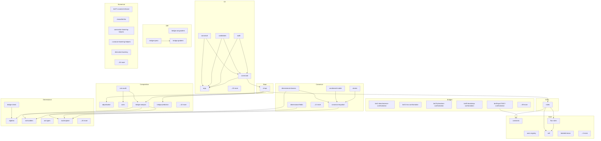

# universal-physics-tensor - Dependency Graph

**Version**: 0.40.0 | **Last Updated**: 2026-07-05

This document provides a comprehensive dependency graph of all files, components, imports, functions, and variables in the codebase.

---

## Table of Contents

1. [Overview](#overview)
2. [Bridges Dependencies](#bridges-dependencies)
3. [Canonical Dependencies](#canonical-dependencies)
4. [Cli Dependencies](#cli-dependencies)
5. [Root Dependencies](#root-dependencies)
6. [Composition Dependencies](#composition-dependencies)
7. [Core Dependencies](#core-dependencies)
8. [Diff Dependencies](#diff-dependencies)
9. [Dimensional Dependencies](#dimensional-dependencies)
10. [Entry Dependencies](#entry-dependencies)
11. [Numerical Dependencies](#numerical-dependencies)
12. [Dependency Matrix](#dependency-matrix)
13. [Circular Dependency Analysis](#circular-dependency-analysis)
14. [Visual Dependency Graph](#visual-dependency-graph)
15. [Summary Statistics](#summary-statistics)

---

## Overview

The codebase is organized into the following modules:

- **bridges**: 74 files
- **canonical**: 17 files
- **cli**: 24 files
- **root**: 1 file
- **composition**: 47 files
- **core**: 11 files
- **diff**: 3 files
- **dimensional**: 31 files
- **entry**: 1 file
- **numerical**: 39 files

---

## Bridges Dependencies

### `src/bridges/be11-decoherence-confrontation.ts` - BE-11 × matter-wave interferometry — confront the decoherence master equation

**Internal Dependencies:**
| File | Imports | Type |
|------|---------|------|
| `./observations/types.js` | `ObservationProvenance` | Import (type-only) |

**Exports:**
- Interfaces: `CollisionalDecoherenceObservation`, `BE11ConfrontationResult`
- Functions: `confrontBE11`
- Constants: `DECOHERENCE_EXPERIMENTAL_TOLERANCE`, `COLLISIONAL_HORNBERGER_2003`

---

### `src/bridges/be21-kss-confrontation.ts` - BE-21 × QGP — confront the KSS viscosity bound with the quark-gluon plasma.

**Internal Dependencies:**
| File | Imports | Type |
|------|---------|------|
| `./observations/types.js` | `ObservationProvenance` | Import (type-only) |

**Exports:**
- Interfaces: `QGPViscosityObservation`, `BE21ConfrontationResult`
- Functions: `confrontBE21`
- Constants: `KSS_BOUND`, `QGP_BMB19`

---

### `src/bridges/be23-planckian-confrontation.ts` - BE-23 × overdoped-cuprate Planckian dissipation — the second

**Internal Dependencies:**
| File | Imports | Type |
|------|---------|------|
| `../core/types.js` | `PhysicalConstants` | Import |
| `./equations/be-23-syk-planckian.js` | `evaluateSYKResistivity` | Import |

**Exports:**
- Interfaces: `PlanckianObservation`, `BE23ConfrontationResult`, `BE23ConfrontationWithUncertainty`
- Functions: `confrontBE23`, `confrontBE23WithUncertainty`
- Constants: `PLANCKIAN_CUPRATES`, `PLANCKIAN_O1_BAND`

---

### `src/bridges/be35-bootstrap-confrontation.ts` - BE-35 × 3D Ising — confront the conformal-bootstrap prediction of the 3D Ising

**Internal Dependencies:**
| File | Imports | Type |
|------|---------|------|
| `./observations/types.js` | `ObservationProvenance` | Import (type-only) |
| `./observations/types.js` | `residualInSigma` | Import |

**Exports:**
- Interfaces: `IsingExponentObservation`, `BE35ConfrontationResult`
- Functions: `confrontBE35`
- Constants: `BOOTSTRAP_NU`, `BOOTSTRAP_NU_SIGMA`, `ISING_PELISSETTO_VICARI_2002`

---

### `src/bridges/be36-gw170817-confrontation.ts` - BE-36 × GW170817 — the first real-data confrontation (v0.8.0 T5,

**Internal Dependencies:**
| File | Imports | Type |
|------|---------|------|
| `../core/constants.js` | `C_SI` | Import |
| `./equations/be-36-gw-speed-bound.js` | `GW170817_SPEED_BOUND` | Import |

**Exports:**
- Interfaces: `GWSpeedObservation`, `BE36ConfrontationResult`, `BE36ConfrontationWithUncertainty`
- Functions: `confrontBE36`, `confrontBE36WithUncertainty`
- Constants: `GW170817`

---

### `src/bridges/be37-cassini-confrontation.ts` - BE-37 × Cassini — confront the Shapiro-delay bridge with the Cassini

**Internal Dependencies:**
| File | Imports | Type |
|------|---------|------|
| `./observations/types.js` | `ObservationProvenance` | Import (type-only) |
| `./observations/types.js` | `residualInSigma` | Import |

**Exports:**
- Interfaces: `CassiniObservation`, `BE37ConfrontationResult`
- Functions: `confrontBE37`
- Constants: `CASSINI`

---

### `src/bridges/be48-collapse-confrontation.ts` - BE-48 × LISA-Pathfinder — confront the GRW mass-amplified localization

**Internal Dependencies:**
| File | Imports | Type |
|------|---------|------|
| `./observations/types.js` | `ObservationProvenance` | Import (type-only) |
| `./equations/be-48-grw-localization.js` | `evaluateGRWLocalization` | Import |

**Exports:**
- Interfaces: `CollapseBoundObservation`, `BE48ConfrontationResult`
- Functions: `confrontBE48`
- Constants: `LISA_PATHFINDER_CSL`

---

### `src/bridges/be51-lensing-confrontation.ts` - BE-51 × VLBI — confront the gravitational-lensing bridge with the modern

**Internal Dependencies:**
| File | Imports | Type |
|------|---------|------|
| `./observations/types.js` | `ObservationProvenance` | Import (type-only) |
| `./observations/types.js` | `residualInSigma` | Import |
| `./gravitational-lensing.js` | `evaluateGravitationalLensing` | Import |

**Exports:**
- Interfaces: `VLBIDeflectionObservation`, `BE51ConfrontationResult`
- Functions: `confrontBE51`
- Constants: `VLBI_LAMBERT_2009`

---

### `src/bridges/be52-mercury-confrontation.ts` - BE-52 × Mercury — confront the GR perihelion-precession bridge with the

**Internal Dependencies:**
| File | Imports | Type |
|------|---------|------|
| `./perihelion-precession.js` | `evaluatePerihelionPrecession` | Import |

**Exports:**
- Interfaces: `PerihelionObservation`, `BE52ConfrontationResult`
- Functions: `confrontBE52`
- Constants: `MERCURY`

---

### `src/bridges/be55-quantum-hall-confrontation.ts` - BE-55 × quantum-Hall universality — confront the TOPOLOGICAL quantization by

**Internal Dependencies:**
| File | Imports | Type |
|------|---------|------|
| `./observations/types.js` | `ObservationProvenance` | Import (type-only) |

**Exports:**
- Interfaces: `QHUniversalityObservation`, `BE55ConfrontationResult`
- Functions: `confrontBE55`
- Constants: `QH_UNIVERSALITY_JANSSEN_2012`

---

### `src/bridges/be55-quantum-hall.ts` - Bridge Equation 55 — Integer Quantum Hall effect / TKNN (topology ↔ transport).

**Internal Dependencies:**
| File | Imports | Type |
|------|---------|------|
| `../core/constants.js` | `H_SI, E_SI` | Import |

**Exports:**
- Interfaces: `QuantumHallInputs`, `QuantumHallResult`
- Functions: `evaluateQuantumHall`
- Constants: `VON_KLITZING_SI`

---

### `src/bridges/be56-casimir-confrontation.ts` - BE-56 × Casimir force — confront the quantum-vacuum force against measurement.

**Internal Dependencies:**
| File | Imports | Type |
|------|---------|------|
| `./observations/types.js` | `ObservationProvenance` | Import (type-only) |

**Exports:**
- Interfaces: `CasimirAgreementObservation`, `BE56ConfrontationResult`
- Functions: `confrontBE56`
- Constants: `CASIMIR_MOHIDEEN_ROY_1998`

---

### `src/bridges/be56-casimir.ts` - Bridge Equation 56 — Casimir effect (quantum vacuum ↔ classical force).

**Internal Dependencies:**
| File | Imports | Type |
|------|---------|------|
| `../core/constants.js` | `HBAR_SI, C_SI` | Import |

**Exports:**
- Interfaces: `CasimirInputs`, `CasimirResult`
- Functions: `evaluateCasimir`

---

### `src/bridges/be57-unruh.ts` - Bridge Equation 57 — Unruh effect (acceleration/kinematics ↔ quantum-thermal).

**Internal Dependencies:**
| File | Imports | Type |
|------|---------|------|
| `../core/constants.js` | `HBAR_SI, C_SI, K_B_SI` | Import |

**Exports:**
- Interfaces: `UnruhInputs`, `UnruhResult`
- Functions: `evaluateUnruh`

---

### `src/bridges/be58-johnson-nyquist-confrontation.ts` - BE-58 × Johnson Noise Thermometry — confront S_V = 4 k_B T R against data.

**Internal Dependencies:**
| File | Imports | Type |
|------|---------|------|
| `./observations/types.js` | `ObservationProvenance` | Import (type-only) |

**Exports:**
- Interfaces: `JNTObservation`, `BE58ConfrontationResult`
- Functions: `confrontBE58`
- Constants: `K_B_CODATA_2014`, `JNT_FLOWERS_JACOBS_2017`

---

### `src/bridges/be58-johnson-nyquist.ts` - Bridge Equation 58 — Johnson-Nyquist noise / fluctuation-dissipation

**Internal Dependencies:**
| File | Imports | Type |
|------|---------|------|
| `../core/constants.js` | `K_B_SI` | Import |

**Exports:**
- Interfaces: `JohnsonNyquistInputs`, `JohnsonNyquistResult`
- Functions: `evaluateJohnsonNyquist`

---

### `src/bridges/bridge-equations.ts` - `BridgeEquations` — a convenience facade over the per-bridge evaluators.

**Internal Dependencies:**
| File | Imports | Type |
|------|---------|------|
| `./equations/be-11-decoherence-master.js` | `evaluateDecoherenceRate` | Import |
| `./equations/be-12-coherence-length.js` | `evaluateThermalDeBroglie` | Import |
| `./equations/be-13-einstein-trace.js` | `evaluateEinsteinTrace` | Import |
| `./equations/be-14-ryu-takayanagi.js` | `evaluateRyuTakayanagi, evaluateRyuTakayanagiNatural` | Import |
| `./equations/be-15-emergence.js` | `evaluateCoarseningLength, evaluateCoarseningLengthSquared` | Import |
| `./equations/be-16-landauer.js` | `evaluateLandauerEnergy` | Import |
| `./equations/be-17-einstein-cartan.js` | `evaluateBE17SpinDensitySquared` | Import |
| `./equations/be-18-higgs-mass.js` | `evaluateHiggsMass` | Import |
| `./equations/be-19-quantum-bounce.js` | `evaluateQuantumBounce` | Import |
| `./equations/be-20-vacuum-energy.js` | `evaluateCosmologicalConstantDensity` | Import |
| `./equations/be-21-kss-bound.js` | `evaluateKSSBound` | Import |
| `./equations/be-22-topological-entanglement.js` | `evaluateTEE` | Import |
| `./equations/be-23-syk-planckian.js` | `evaluateSYKResistivity` | Import |
| `./equations/be-24-foerster-fret.js` | `evaluateFRETEfficiency` | Import |
| `./equations/be-25-iit-phi.js` | `evaluateIntrinsicInformation` | Import |
| `./equations/be-26-dna-tunneling.js` | `evaluateDNATunneling` | Import |
| `./equations/be-27-effective-temperature.js` | `evaluateEffectiveTemperature` | Import |
| `./equations/be-28-onsager-entropy-production.js` | `evaluateOnsagerEntropyProduction` | Import |
| `./equations/be-29-jarzynski.js` | `evaluateJarzynski` | Import |
| `./equations/be-30-flm-first-law.js` | `evaluateBekensteinBound, evaluateFLMFirstLaw` | Import |
| `./equations/be-31-causal-set-bd.js` | `evaluateBenincasaDowker` | Import |
| `./equations/be-32-quantum-reference-frame.js` | `evaluateQRFOverlap` | Import |
| `./equations/be-33-hertz-millis.js` | `evaluateHertzMillis` | Import |
| `./equations/be-34-kibble-zurek.js` | `evaluateKibbleZurek` | Import |
| `./equations/be-35-conformal-bootstrap.js` | `evaluateCrossingResidual` | Import |
| `./equations/be-36-gw-speed-bound.js` | `evaluateGWSpeedRatio` | Import |
| `./equations/be-37-shapiro-delay.js` | `evaluateShapiroDelay` | Import |
| `./equations/be-38-mond.js` | `evaluateMONDForce` | Import |
| `./equations/be-39-asymptotic-safety.js` | `evaluateBetaG, evaluateBetaLambda` | Import |
| `./equations/be-40-composite-higgs.js` | `evaluateCompositeHiggs` | Import |
| `./equations/be-41-swampland.js` | `evaluateSwampland` | Import |
| `./equations/be-42-hawking-temperature.js` | `evaluateHawkingTemperature` | Import |
| `./equations/be-43-er-epr.js` | `evaluateEREPRBound` | Import |
| `./equations/be-44-soft-hair.js` | `evaluateBE44SoftHairCharge` | Import |
| `./equations/be-45-tcc.js` | `evaluateTCC` | Import |
| `./equations/be-46-multiverse-measure.js` | `evaluateWeinbergVilenkinP` | Import |
| `./equations/be-47-bbn-dark-sector.js` | `evaluateBBNDark` | Import |
| `./equations/be-48-grw-localization.js` | `evaluateGRWLocalization` | Import |
| `./equations/be-49-quantum-darwinism.js` | `evaluateQuantumDarwinism` | Import |
| `./equations/be-50-wheeler-feynman.js` | `evaluateWFTimeSymmetry` | Import |
| `./equations/be-53-yang-mills-beta.js` | `evaluateYangMillsBeta` | Import |
| `./equations/be-54-randall-sundrum-brane.js` | `evaluateRandallSundrumH2` | Import |
| `./gravitational-lensing.js` | `evaluateGravitationalLensing` | Import |
| `./perihelion-precession.js` | `evaluatePerihelionPrecession` | Import |

**Exports:**
- Constants: `BridgeEquations`

---

### `src/bridges/catalog-adapter.ts` - Catalog adapter: ingests the 44-entry `BRIDGE_EQUATIONS` array into

**Internal Dependencies:**
| File | Imports | Type |
|------|---------|------|
| `./index.js` | `BridgeEquationEntry` | Import (type-only) |
| `../core/cell.js` | `BridgeCell, CellConfidence` | Import (type-only) |
| `../core/tensor.js` | `UniversalTensor` | Import (type-only) |
| `../core/flux-rules.js` | `FluxDiagnostic, FluxReport` | Import (type-only) |
| `../dimensional/bridge-check.js` | `EXPECTED_DIMENSION_BY_BRIDGE` | Import |
| `../dimensional/algebra.js` | `format` | Import |
| `../core/types.js` | `PhysicalScale, TensorIndices` | Import (type-only) |

**Exports:**
- Classes: `CatalogIngestionError`
- Interfaces: `CatalogEntryStatus`, `CatalogIngestionReport`
- Functions: `catalogToCells`, `scanCatalog`, `ingestCatalog`, `ingestionReportToFluxReport`

---

### `src/bridges/confrontation-coverage.ts` - Empirical-spine coverage audit (Direction 4).

**Internal Dependencies:**
| File | Imports | Type |
|------|---------|------|
| `./index.js` | `BRIDGE_EQUATIONS` | Import |
| `../composition/catalog-graph.js` | `CATALOG_GRAPH` | Import |
| `./confrontations.js` | `CONFRONTATIONS` | Import |

**Exports:**
- Functions: `auditCoverage`
- Constants: `DATA_CONFRONTED_IDS`

---

### `src/bridges/confrontations.ts` - Confrontation registry — maps a bridge id to a normalized

**Internal Dependencies:**
| File | Imports | Type |
|------|---------|------|
| `./observations/types.js` | `ConfrontationOutcome, ObservationKind` | Import (type-only) |
| `./observations/types.js` | `residualInSigma` | Import |
| `./be52-mercury-confrontation.js` | `confrontBE52` | Import |
| `./be37-cassini-confrontation.js` | `confrontBE37` | Import |
| `./be36-gw170817-confrontation.js` | `confrontBE36` | Import |
| `./be23-planckian-confrontation.js` | `confrontBE23` | Import |
| `./be48-collapse-confrontation.js` | `confrontBE48` | Import |
| `./be51-lensing-confrontation.js` | `confrontBE51` | Import |
| `./be21-kss-confrontation.js` | `confrontBE21` | Import |
| `./be35-bootstrap-confrontation.js` | `confrontBE35` | Import |
| `./be11-decoherence-confrontation.js` | `confrontBE11` | Import |
| `./be55-quantum-hall-confrontation.js` | `confrontBE55` | Import |
| `./be56-casimir-confrontation.js` | `confrontBE56` | Import |
| `./be58-johnson-nyquist-confrontation.js` | `confrontBE58` | Import |

**Exports:**
- Interfaces: `ConfrontationEntry`
- Functions: `listConfrontations`, `runConfrontation`
- Constants: `CONFRONTATIONS`

---

### `src/bridges/descriptor.ts` - Unified per-bridge descriptor — one lookup that JOINS the catalog's three

**Internal Dependencies:**
| File | Imports | Type |
|------|---------|------|
| `./index.js` | `BRIDGE_EQUATIONS, BridgeEquationEntry` | Import |
| `./rhs-registry.js` | `BRIDGE_RHS_BY_ID, parseBridgeId` | Import |
| `../composition/catalog-graph.js` | `CATALOG_GRAPH` | Import |
| `../composition/edge.js` | `BridgeEdge` | Import (type-only) |
| `../dimensional/validator.js` | `ExprNode` | Import (type-only) |

**Exports:**
- Functions: `getBridge`
- Constants: `BRIDGE_DESCRIPTORS`

---

### `src/bridges/equations/be-11-decoherence-master.ts` - Bridge Equation 11 — Decoherence Master Equation (Lindblad form).

**Internal Dependencies:**
| File | Imports | Type |
|------|---------|------|
| `../../dimensional/validator.js` | `ExprNode, DimensionValidationReport` | Import (type-only) |
| `../../dimensional/types.js` | `FREQUENCY, DIMENSIONLESS` | Import |
| `./_be-helpers.js` | `sym, validateFiniteInputs, validateBEDimensions` | Import |

**Exports:**
- Interfaces: `DecoherenceRateInputs`
- Functions: `evaluateDecoherenceRate`, `validateDecoherenceRateDimensions`
- Constants: `DECOHERENCE_RATE_RHS`

---

### `src/bridges/equations/be-12-coherence-length.ts` - Bridge Equation 12 — Mesoscopic Coherence Length (canonical thermal

**Internal Dependencies:**
| File | Imports | Type |
|------|---------|------|
| `../../dimensional/validator.js` | `ExprNode, DimensionValidationReport` | Import (type-only) |
| `../../dimensional/types.js` | `DIMENSIONLESS, LENGTH, MASS, TEMPERATURE` | Import |
| `../../dimensional/constants.js` | `hbar, k_B` | Import |
| `../../core/types.js` | `PhysicalConstants` | Import |
| `./_be-helpers.js` | `sym, validateFiniteInputs, validateBEDimensions` | Import |

**Exports:**
- Functions: `evaluateThermalDeBroglie`, `validateBE12Dimensions`
- Constants: `BE12_COHERENCE_LENGTH_RHS`, `BE12_COHERENCE_LENGTH_LHS`

---

### `src/bridges/equations/be-13-einstein-trace.ts` - Bridge Equation 13 — Trace of Einstein equations (Jacobson 1995

**Internal Dependencies:**
| File | Imports | Type |
|------|---------|------|
| `../../dimensional/validator.js` | `ExprNode, DimensionValidationReport` | Import (type-only) |
| `../../dimensional/types.js` | `Dimension, DIMENSIONLESS` | Import |
| `../../dimensional/constants.js` | `c, G` | Import |
| `../../core/types.js` | `PhysicalConstants` | Import |
| `../../dimensional/tensor-trace.js` | `TensorTraceNode` | Import (type-only) |
| `../../dimensional/stress-energy-validators.js` | `StressEnergyTensorNode` | Import (type-only) |
| `./_be-helpers.js` | `sym, validateFiniteInputs, validateBEDimensions` | Import |

**Exports:**
- Functions: `evaluateEinsteinTrace`, `validateBE13Dimensions`
- Constants: `RICCI_SCALAR_DIM`, `BE13_EINSTEIN_TRACE_RHS`, `BE13_EINSTEIN_TRACE_LHS`, `BE13_STRESS_ENERGY_NODE`, `BE13_T_TRACE_NODE`

---

### `src/bridges/equations/be-14-ryu-takayanagi.ts` - Bridge Equation 14 — Ryu-Takayanagi (Quantum Error Correction Holographic Mapping).

**Internal Dependencies:**
| File | Imports | Type |
|------|---------|------|
| `../../dimensional/validator.js` | `ExprNode, DimensionValidationReport` | Import (type-only) |
| `../../dimensional/types.js` | `AREA, DIMENSIONLESS, ENTROPY` | Import |
| `../../dimensional/constants.js` | `k_B, c, G, hbar` | Import |
| `../../core/types.js` | `PhysicalConstants` | Import |
| `./_be-helpers.js` | `sym, validateFiniteInputs, validateBEDimensions` | Import |

**Exports:**
- Functions: `evaluateRyuTakayanagi`, `evaluateRyuTakayanagiNatural`, `validateRyuTakayanagiDimensions`
- Constants: `RYU_TAKAYANAGI_RHS`

---

### `src/bridges/equations/be-15-emergence.ts` - Bridge Equation 15 — Universal Emergence Equation (Hohenberg-Halperin

**Internal Dependencies:**
| File | Imports | Type |
|------|---------|------|
| `../../dimensional/validator.js` | `ExprNode, DimensionValidationReport` | Import (type-only) |
| `../../dimensional/types.js` | `Dimension, TIME, AREA` | Import |
| `./_be-helpers.js` | `sym, validateFiniteInputs, validateBEDimensions` | Import |

**Exports:**
- Functions: `evaluateCoarseningLength`, `evaluateCoarseningLengthSquared`, `validateBE15Dimensions`
- Constants: `BE15_MOBILITY`, `BE15_TIME`, `BE15_COARSENING_LENGTH_SQUARED_RHS`, `BE15_COARSENING_LENGTH_SQUARED_LHS`

---

### `src/bridges/equations/be-16-landauer.ts` - Bridge Equation 16 — Complexity-Entropy Production Relation

**Internal Dependencies:**
| File | Imports | Type |
|------|---------|------|
| `../../dimensional/validator.js` | `ExprNode, DimensionValidationReport` | Import (type-only) |
| `../../dimensional/types.js` | `DIMENSIONLESS, ENERGY, TEMPERATURE` | Import |
| `../../dimensional/constants.js` | `k_B` | Import |
| `./_be-helpers.js` | `sym, validateFiniteInputs, validateBEDimensions` | Import |

**Exports:**
- Functions: `evaluateLandauerEnergy`, `validateBE16Dimensions`
- Constants: `BE16_BOLTZMANN`, `BE16_TEMPERATURE`, `BE16_LN2`, `BE16_LANDAUER_RHS`, `BE16_LANDAUER_LHS`

---

### `src/bridges/equations/be-17-einstein-cartan.ts` - Bridge Equation 17 — Einstein-Cartan torsion-spin coupling

**Internal Dependencies:**
| File | Imports | Type |
|------|---------|------|
| `../../dimensional/validator.js` | `ExprNode, DimensionValidationReport` | Import (type-only) |
| `../../dimensional/types.js` | `Dimension` | Import |
| `../../dimensional/tensor.js` | `tsym, contract` | Import |
| `./_be-helpers.js` | `sym, validateFiniteInputs, validateBEDimensions` | Import |

**Exports:**
- Functions: `evaluateBE17SpinDensitySquared`, `validateBE17Dimensions`
- Constants: `BE17_TORSION_CONTRACTION`, `BE17_COUPLING_PREFACTOR_SQUARED`, `BE17_SPIN_DENSITY_SQUARED_RHS`, `BE17_SPIN_DENSITY_SQUARED_LHS`

---

### `src/bridges/equations/be-18-higgs-mass.ts` - Bridge Equation 18 — Higgs-like dark-fermion mass generation

**Internal Dependencies:**
| File | Imports | Type |
|------|---------|------|
| `../../dimensional/validator.js` | `ExprNode, DimensionValidationReport` | Import (type-only) |
| `../../dimensional/types.js` | `DIMENSIONLESS, ENERGY` | Import |
| `./_be-helpers.js` | `sym, validateFiniteInputs, validateBEDimensions` | Import |

**Exports:**
- Functions: `evaluateHiggsMass`, `validateBE18Dimensions`
- Constants: `BE18_HIGGS_MASS_RHS`, `BE18_HIGGS_MASS_LHS`

---

### `src/bridges/equations/be-19-quantum-bounce.ts` - Bridge Equation 19 — Quantum Bounce (LQC modified Friedmann).

**Internal Dependencies:**
| File | Imports | Type |
|------|---------|------|
| `../../dimensional/validator.js` | `ExprNode, DimensionValidationReport` | Import (type-only) |
| `../../dimensional/types.js` | `Dimension, DIMENSIONLESS` | Import |
| `../../dimensional/constants.js` | `G` | Import |
| `../../core/types.js` | `PhysicalConstants` | Import |
| `../../dimensional/friedmann-equation.js` | `FriedmannEquationNode` | Import (type-only) |
| `../../dimensional/klein-gordon-equation.js` | `ScalarFieldNode` | Import (type-only) |
| `./_be-helpers.js` | `sym, validateFiniteInputs, validateBEDimensions` | Import |

**Exports:**
- Functions: `evaluateQuantumBounce`, `validateQuantumBounceDimensions`
- Constants: `QUANTUM_BOUNCE_RHS`, `BE19_LQC_FRIEDMANN_STRUCTURAL`

---

### `src/bridges/equations/be-20-vacuum-energy.ts` - Bridge Equation 20 — Observed cosmological-constant mass density

**Internal Dependencies:**
| File | Imports | Type |
|------|---------|------|
| `../../dimensional/validator.js` | `ExprNode, DimensionValidationReport` | Import (type-only) |
| `../../dimensional/stress-energy-validators.js` | `CosmologicalConstantNode` | Import (type-only) |
| `../../dimensional/types.js` | `Dimension, DIMENSIONLESS` | Import |
| `../../dimensional/constants.js` | `c, G` | Import |
| `../../dimensional/algebra.js` | `power` | Import |
| `../../dimensional/types.js` | `LENGTH` | Import |
| `../../core/types.js` | `PhysicalConstants` | Import |
| `./_be-helpers.js` | `sym, validateFiniteInputs, validateBEDimensions` | Import |

**Exports:**
- Functions: `evaluateCosmologicalConstantDensity`, `validateBE20Dimensions`
- Constants: `MASS_DENSITY`, `BE20_VACUUM_ENERGY_RHS`, `BE20_VACUUM_ENERGY_LHS`

---

### `src/bridges/equations/be-21-kss-bound.ts` - Bridge Equation 21 — Kovtun-Son-Starinets (KSS) viscosity-to-entropy

**Internal Dependencies:**
| File | Imports | Type |
|------|---------|------|
| `../../dimensional/validator.js` | `ExprNode, DimensionValidationReport` | Import (type-only) |
| `../../dimensional/types.js` | `Dimension, DIMENSIONLESS, TIME, TEMPERATURE` | Import |
| `../../dimensional/constants.js` | `hbar, k_B` | Import |
| `../../core/types.js` | `PhysicalConstants` | Import |
| `./_be-helpers.js` | `sym, validateBEDimensions` | Import |

**Exports:**
- Functions: `evaluateKSSBound`, `validateBE21Dimensions`
- Constants: `VISCOSITY_OVER_ENTROPY_DENSITY`, `BE21_KSS_RHS`, `BE21_KSS_LHS`

---

### `src/bridges/equations/be-22-topological-entanglement.ts` - Bridge Equation 22 — Topological Entanglement Entropy

**Internal Dependencies:**
| File | Imports | Type |
|------|---------|------|
| `../../dimensional/validator.js` | `ExprNode, DimensionValidationReport` | Import (type-only) |
| `../../dimensional/types.js` | `Dimension, DIMENSIONLESS, LENGTH` | Import |
| `./_be-helpers.js` | `sym, validateFiniteInputs, validateBEDimensions` | Import |

**Exports:**
- Functions: `evaluateTEE`
- Constants: `BE22_AREA_TERM`, `BE22_TOPOLOGICAL_TERM`, `BE22_TOPOLOGICAL_ENTANGLEMENT_RHS`

---

### `src/bridges/equations/be-23-syk-planckian.ts` - Bridge Equation 23 — Strange-Metal / Black-Hole duality (SYK

**Internal Dependencies:**
| File | Imports | Type |
|------|---------|------|
| `../../dimensional/validator.js` | `ExprNode, DimensionValidationReport` | Import (type-only) |
| `../../dimensional/types.js` | `Dimension, DIMENSIONLESS, LENGTH, MASS, TEMPERATURE` | Import |
| `../../dimensional/algebra.js` | `multiply, power` | Import |
| `../../dimensional/constants.js` | `hbar, k_B, e` | Import |
| `../../core/types.js` | `PhysicalConstants` | Import |
| `./_be-helpers.js` | `sym, validateFiniteInputs, validateBEDimensions` | Import |

**Exports:**
- Functions: `evaluateSYKResistivity`, `validateBE23Dimensions`
- Constants: `BE23_SYK_THERMAL_TERM`, `BE23_SYK_RESISTIVITY_RHS`, `BE23_SYK_RESISTIVITY_LHS`

---

### `src/bridges/equations/be-24-foerster-fret.ts` - Bridge Equation 24 — Förster Resonance Energy Transfer (FRET) efficiency.

**Internal Dependencies:**
| File | Imports | Type |
|------|---------|------|
| `../../dimensional/validator.js` | `ExprNode, DimensionValidationReport` | Import (type-only) |
| `../../dimensional/types.js` | `DIMENSIONLESS, LENGTH` | Import |
| `./_be-helpers.js` | `sym, validateFiniteInputs, validateBEDimensions` | Import |

**Exports:**
- Functions: `evaluateFRETEfficiency`, `validateBE24Dimensions`
- Constants: `BE24_FRET_EFFICIENCY_RHS`, `BE24_FRET_EFFICIENCY_LHS`

---

### `src/bridges/equations/be-25-iit-phi.ts` - Bridge Equation 25 — Consciousness ↔ Information Integration (IIT Φ).

**Internal Dependencies:**
| File | Imports | Type |
|------|---------|------|
| `../../dimensional/validator.js` | `ExprNode, DimensionValidationReport` | Import (type-only) |
| `../../dimensional/types.js` | `DIMENSIONLESS` | Import |
| `./_be-helpers.js` | `sym, validateFiniteInputs, validateBEDimensions` | Import |

**Exports:**
- Functions: `evaluateIntrinsicInformation`, `validateBE25Dimensions`
- Constants: `BE25_P_CONDITIONAL`, `BE25_P_MARGINAL`, `BE25_LOG_RATIO_ARG`, `BE25_LOG2_FACTOR`, `BE25_INTRINSIC_INFORMATION_RHS`, `BE25_INTRINSIC_INFORMATION_LHS`

---

### `src/bridges/equations/be-25-orch-or.ts` - closes the v0.7.3-deferred "BE-25 archive-or-delete" decision).

**Internal Dependencies:**
| File | Imports | Type |
|------|---------|------|
| `../../dimensional/validator.js` | `ExprNode, DimensionValidationReport` | Import (type-only) |
| `../../dimensional/types.js` | `TIME, MASS, LENGTH` | Import |
| `../../dimensional/constants.js` | `hbar, c, l_P` | Import |
| `../../core/types.js` | `PhysicalConstants` | Import |
| `./_be-helpers.js` | `sym, validateFiniteInputs, validateBEDimensions` | Import |

**Exports:**
- Functions: `evaluateOrchOR`, `validateOrchORDimensions`
- Constants: `ORCH_OR_RHS`

---

### `src/bridges/equations/be-26-dna-tunneling.ts` - Bridge Equation 26 — DNA Mutation Quantum Tunneling Rate.

**Internal Dependencies:**
| File | Imports | Type |
|------|---------|------|
| `../../dimensional/validator.js` | `ExprNode, DimensionValidationReport` | Import (type-only) |
| `../../dimensional/types.js` | `DIMENSIONLESS, FREQUENCY, MASS, LENGTH, ENERGY` | Import |
| `../../dimensional/constants.js` | `hbar` | Import |
| `../../core/types.js` | `PhysicalConstants` | Import |
| `./_be-helpers.js` | `sym, validateFiniteInputs, validateBEDimensions` | Import |

**Exports:**
- Functions: `evaluateDNATunneling`, `validateDNATunnelingDimensions`
- Constants: `DNA_TUNNELING_WKB_ARG`, `DNA_TUNNELING_RHS`

---

### `src/bridges/equations/be-27-effective-temperature.ts` - Bridge Equation 27 — Cugliandolo-Kurchan effective temperature

**Internal Dependencies:**
| File | Imports | Type |
|------|---------|------|
| `../../dimensional/validator.js` | `ExprNode, DimensionValidationReport` | Import (type-only) |
| `../../dimensional/types.js` | `DIMENSIONLESS, ENERGY, TEMPERATURE` | Import |
| `../../dimensional/constants.js` | `k_B` | Import |
| `../../core/types.js` | `PhysicalConstants` | Import |
| `./_be-helpers.js` | `sym, validateFiniteInputs, validateBEDimensions` | Import |

**Exports:**
- Functions: `evaluateEffectiveTemperature`, `validateBE27Dimensions`
- Constants: `BE27_TEFF_RHS`, `BE27_TEFF_LHS`

---

### `src/bridges/equations/be-28-onsager-entropy-production.ts` - Bridge Equation 28 — Maximum Entropy Production Principle

**Internal Dependencies:**
| File | Imports | Type |
|------|---------|------|
| `../../dimensional/validator.js` | `ExprNode, DimensionValidationReport` | Import (type-only) |
| `../../dimensional/types.js` | `Dimension` | Import |
| `./_be-helpers.js` | `sym, validateFiniteInputs, validateBEDimensions` | Import |

**Exports:**
- Functions: `evaluateOnsagerEntropyProduction`, `validateBE28Dimensions`
- Constants: `BE28_FORCE_FLUX_PRODUCT`, `BE28_ENTROPY_PRODUCTION_RHS`, `BE28_ENTROPY_PRODUCTION_LHS`

---

### `src/bridges/equations/be-29-jarzynski.ts` - Bridge Equation 29 — Jarzynski free-energy difference (canonical

**Internal Dependencies:**
| File | Imports | Type |
|------|---------|------|
| `../../dimensional/validator.js` | `ExprNode, DimensionValidationReport` | Import (type-only) |
| `../../dimensional/types.js` | `DIMENSIONLESS, ENERGY, TEMPERATURE` | Import |
| `../../dimensional/constants.js` | `k_B` | Import |
| `../../core/types.js` | `PhysicalConstants` | Import |
| `./_be-helpers.js` | `sym, validateFiniteInputs, validateBEDimensions` | Import |

**Exports:**
- Functions: `evaluateJarzynski`, `validateBE29Dimensions`
- Constants: `BE29_BETAW_ARG`, `BE29_JARZYNSKI_RHS`, `BE29_JARZYNSKI_LHS`

---

### `src/bridges/equations/be-30-flm-first-law.ts` - Bridge Equation 30 — FLM first law of entanglement entropy

**Internal Dependencies:**
| File | Imports | Type |
|------|---------|------|
| `../../dimensional/validator.js` | `ExprNode, DimensionValidationReport` | Import (type-only) |
| `../../dimensional/types.js` | `DIMENSIONLESS` | Import |
| `../../core/types.js` | `PhysicalConstants` | Import |
| `./_be-helpers.js` | `sym, validateFiniteInputs, validateBEDimensions` | Import |

**Exports:**
- Functions: `evaluateFLMFirstLaw`, `evaluateBekensteinBound`, `validateBE30Dimensions`
- Constants: `BE30_FLM_RHS`, `BE30_FLM_LHS`

---

### `src/bridges/equations/be-31-causal-set-bd.ts` - Bridge Equation 31 — Causal Set Continuum Limit (Benincasa-Dowker

**Internal Dependencies:**
| File | Imports | Type |
|------|---------|------|
| `../../dimensional/validator.js` | `ExprNode, DimensionValidationReport` | Import (type-only) |
| `../../dimensional/types.js` | `Dimension, DIMENSIONLESS, LENGTH` | Import |
| `./_be-helpers.js` | `sym, validateFiniteInputs, validateBEDimensions` | Import |

**Exports:**
- Functions: `evaluateBenincasaDowker`, `validateBE31Dimensions`
- Constants: `BE31_CAUSAL_SET_BD_RHS`, `BE31_CAUSAL_SET_BD_LHS`

---

### `src/bridges/equations/be-32-quantum-reference-frame.ts` - Bridge Equation 32 — Quantum Reference Frame (QRF) overlap probability.

**Internal Dependencies:**
| File | Imports | Type |
|------|---------|------|
| `../../dimensional/validator.js` | `ExprNode, DimensionValidationReport` | Import (type-only) |
| `../../dimensional/types.js` | `DIMENSIONLESS` | Import |
| `./_be-helpers.js` | `sym, validateFiniteInputs, validateBEDimensions` | Import |

**Exports:**
- Functions: `evaluateQRFOverlap`
- Constants: `BE32_REAL_PART_SQUARED`, `BE32_IMAG_PART_SQUARED`, `BE32_QRF_OVERLAP_RHS`

---

### `src/bridges/equations/be-33-hertz-millis.ts` - Bridge Equation 33 — Quantum-Classical Critical Point Mapping

**Internal Dependencies:**
| File | Imports | Type |
|------|---------|------|
| `../../dimensional/validator.js` | `ExprNode, DimensionValidationReport` | Import (type-only) |
| `../../dimensional/types.js` | `DIMENSIONLESS, LENGTH, TEMPERATURE` | Import |
| `./_be-helpers.js` | `sym, validateFiniteInputs, validateBEDimensions` | Import |

**Exports:**
- Functions: `evaluateHertzMillis`, `validateBE33Dimensions`
- Constants: `BE33_HERTZ_MILLIS_RHS`, `BE33_HERTZ_MILLIS_LHS`

---

### `src/bridges/equations/be-34-kibble-zurek.ts` - Bridge Equation 34 — Kibble-Zurek Mechanism in Curved Spacetime.

**Internal Dependencies:**
| File | Imports | Type |
|------|---------|------|
| `../../dimensional/validator.js` | `ExprNode, DimensionValidationReport` | Import (type-only) |
| `../../dimensional/types.js` | `DIMENSIONLESS, TIME, MASS, TEMPERATURE` | Import |
| `../../dimensional/constants.js` | `c, k_B` | Import |
| `../../core/types.js` | `PhysicalConstants` | Import |
| `./_be-helpers.js` | `sym, validateFiniteInputs, validateBEDimensions` | Import |

**Exports:**
- Functions: `evaluateKibbleZurek`, `validateKibbleZurekDimensions`
- Constants: `KIBBLE_ZUREK_EXP_ARG`, `KIBBLE_ZUREK_RHS`

---

### `src/bridges/equations/be-35-conformal-bootstrap.ts` - Bridge Equation 35 — Conformal Bootstrap (crossing-symmetry residual).

**Internal Dependencies:**
| File | Imports | Type |
|------|---------|------|
| `../../dimensional/validator.js` | `ExprNode, DimensionValidationReport` | Import (type-only) |
| `../../dimensional/types.js` | `DIMENSIONLESS` | Import |
| `./_be-helpers.js` | `sym, validateFiniteInputs, validateBEDimensions` | Import |

**Exports:**
- Functions: `evaluateCrossingResidual`
- Constants: `BE35_FORWARD_BLOCK`, `BE35_CROSSED_BLOCK`, `BE35_CROSSING_RESIDUAL_RHS`

---

### `src/bridges/equations/be-36-gw-speed-bound.ts` - Bridge Equation 36 — GW170817 graviton-speed bound (post Wave Y

**Internal Dependencies:**
| File | Imports | Type |
|------|---------|------|
| `../../dimensional/validator.js` | `ExprNode, DimensionValidationReport` | Import (type-only) |
| `../../dimensional/types.js` | `DIMENSIONLESS, VELOCITY` | Import |
| `../../core/types.js` | `PhysicalConstants` | Import |
| `./_be-helpers.js` | `sym, validateFiniteInputs, validateBEDimensions` | Import |

**Exports:**
- Functions: `evaluateGWSpeedRatio`, `satisfiesGW170817Bound`, `validateBE36Dimensions`
- Constants: `BE36_GW_SPEED_RATIO_RHS`, `BE36_GW_SPEED_RATIO_LHS`, `GW170817_SPEED_BOUND`

---

### `src/bridges/equations/be-37-shapiro-delay.ts` - Bridge Equation 37 — Variable Speed of Light Cosmology

**Internal Dependencies:**
| File | Imports | Type |
|------|---------|------|
| `../../dimensional/validator.js` | `ExprNode, DimensionValidationReport, MetricTensorNode, TensorSymbolNode` | Import (type-only) |
| `../../dimensional/types.js` | `Dimension, DIMENSIONLESS, TIME, MASS, LENGTH` | Import |
| `../../dimensional/constants.js` | `G, c` | Import |
| `../../dimensional/tensor.js` | `tsym, contract` | Import |
| `../../dimensional/metric.js` | `metric, pderiv` | Import |
| `../../numerical/index.js` | `evaluateNumerical` | Import |
| `../../numerical/types.js` | `NumericalInputs` | Import (type-only) |
| `../../numerical/null-ray-integrator.js` | `integrateRK4` | Import |
| `../../core/constants.js` | `C_SI, G_SI` | Import |
| `./_be-helpers.js` | `sym, validateFiniteInputs, validateBEDimensions` | Import |

**Exports:**
- Interfaces: `ShapiroInputs`
- Functions: `evaluateShapiroDelay`, `validateBE37Dimensions`, `validateBE37EikonalDimensions`, `evaluateBE37EikonalNumerical`
- Constants: `BE37_G`, `BE37_M`, `BE37_C`, `BE37_C_CUBED`, `BE37_PREFACTOR`, `BE37_R_FAR`, `BE37_R_NEAR`, `BE37_LOG_RATIO_ARG`, `BE37_LOG_FACTOR`, `BE37_SHAPIRO_DELAY_RHS`, `BE37_SHAPIRO_DELAY_LHS`, `BE37_EIKONAL_LHS`, `BE37_EIKONAL_RHS_ZERO`

---

### `src/bridges/equations/be-38-mond.ts` - Bridge Equation 38 — Modified Newtonian Dynamics (MOND), canonical

**Internal Dependencies:**
| File | Imports | Type |
|------|---------|------|
| `../../dimensional/validator.js` | `ExprNode, DimensionValidationReport` | Import (type-only) |
| `../../dimensional/types.js` | `DIMENSIONLESS, ACCELERATION, FORCE, MASS` | Import |
| `./_be-helpers.js` | `sym, validateFiniteInputs, validateBEDimensions` | Import |

**Exports:**
- Functions: `evaluateMONDForce`, `validateBE38Dimensions`
- Constants: `BE38_MOND_NU_ARG`, `BE38_MOND_FORCE_RHS`, `BE38_MOND_FORCE_LHS`

---

### `src/bridges/equations/be-39-asymptotic-safety.ts` - Bridge Equation 39 — Asymptotic Safety in Quantum Gravity (functional

**Internal Dependencies:**
| File | Imports | Type |
|------|---------|------|
| `../../dimensional/validator.js` | `ExprNode, DimensionValidationReport` | Import (type-only) |
| `../../dimensional/types.js` | `DIMENSIONLESS` | Import |
| `../../dimensional/rg-flow.js` | `BetaFunctionNode, RGCouplingNode` | Import (type-only) |
| `../../dimensional/rg-flow.js` | `rgCoupling` | Import |
| `./_be-helpers.js` | `sym, validateFiniteInputs, validateBEDimensions` | Import |

**Exports:**
- Functions: `evaluateBetaG`, `evaluateBetaLambda`, `validateBE39Dimensions`
- Constants: `BE39_BETA_G_RHS`, `BE39_BETA_G_LHS`, `BE39_BETA_LAMBDA_RHS`, `BE39_BETA_LAMBDA_LHS`, `BE39_COUPLING_G`, `BE39_COUPLING_LAMBDA`, `BE39_BETA_G_STRUCTURAL`, `BE39_BETA_LAMBDA_STRUCTURAL`

---

### `src/bridges/equations/be-40-composite-higgs.ts` - Bridge Equation 40 — Composite Higgs Potential

**Internal Dependencies:**
| File | Imports | Type |
|------|---------|------|
| `../../dimensional/validator.js` | `ExprNode, DimensionValidationReport` | Import (type-only) |
| `../../dimensional/types.js` | `Dimension, DIMENSIONLESS, ENERGY` | Import |
| `../../dimensional/algebra.js` | `power` | Import |
| `./_be-helpers.js` | `sym, validateFiniteInputs, validateBEDimensions` | Import |

**Exports:**
- Functions: `evaluateCompositeHiggs`, `validateBE40Dimensions`
- Constants: `BE40_HIGGS_DIMLESS_ARG`, `BE40_COMPOSITE_HIGGS_RHS`, `BE40_COMPOSITE_HIGGS_LHS`

---

### `src/bridges/equations/be-41-swampland.ts` - Bridge Equation 41 — Swampland Distance Conjecture.

**Internal Dependencies:**
| File | Imports | Type |
|------|---------|------|
| `../../dimensional/validator.js` | `ExprNode, DimensionValidationReport` | Import (type-only) |
| `../../dimensional/types.js` | `DIMENSIONLESS, MASS` | Import |
| `./_be-helpers.js` | `sym, validateFiniteInputs, validateBEDimensions` | Import |

**Exports:**
- Functions: `evaluateSwampland`, `validateSwamplandDimensions`
- Constants: `SWAMPLAND_EXP_ARG`, `SWAMPLAND_RHS`

---

### `src/bridges/equations/be-42-hawking-temperature.ts` - Bridge Equation 42 — Hawking temperature (canonical 1975 derivation,

**Internal Dependencies:**
| File | Imports | Type |
|------|---------|------|
| `../../dimensional/validator.js` | `ExprNode, DimensionValidationReport` | Import (type-only) |
| `../../dimensional/types.js` | `DIMENSIONLESS, MASS, TEMPERATURE` | Import |
| `../../dimensional/constants.js` | `hbar, c, G, k_B` | Import |
| `../../core/types.js` | `PhysicalConstants` | Import |
| `./_be-helpers.js` | `sym, validateFiniteInputs, validateBEDimensions` | Import |

**Exports:**
- Interfaces: `HawkingTemperatureInputs`
- Functions: `evaluateHawkingTemperature`, `validateBE42Dimensions`
- Constants: `BE42_HAWKING_TEMPERATURE_RHS`, `BE42_HAWKING_TEMPERATURE_LHS`

---

### `src/bridges/equations/be-43-er-epr.ts` - Bridge Equation 43 — ER=EPR Wormhole-Entropy Bound (canonical

**Internal Dependencies:**
| File | Imports | Type |
|------|---------|------|
| `../../dimensional/validator.js` | `ExprNode, DimensionValidationReport` | Import (type-only) |
| `../../dimensional/types.js` | `AREA, DIMENSIONLESS, ENTROPY` | Import |
| `../../dimensional/constants.js` | `k_B, l_P` | Import |
| `../../core/types.js` | `PhysicalConstants` | Import |
| `./_be-helpers.js` | `sym, validateFiniteInputs, validateBEDimensions` | Import |

**Exports:**
- Functions: `evaluateEREPRBound`, `validateBE43Dimensions`
- Constants: `BE43_ER_EPR_RHS`, `BE43_ER_EPR_LHS`

---

### `src/bridges/equations/be-44-soft-hair.ts` - Bridge Equation 44 — Soft Hair on Black Holes (Hawking-Perry-Strominger

**Internal Dependencies:**
| File | Imports | Type |
|------|---------|------|
| `../../dimensional/validator.js` | `ExprNode, DimensionValidationReport` | Import (type-only) |
| `../../dimensional/types.js` | `Dimension, LENGTH, TIME` | Import |
| `../../dimensional/algebra.js` | `divide, multiply` | Import |
| `./_be-helpers.js` | `sym, validateFiniteInputs, validateBEDimensions` | Import |

**Exports:**
- Functions: `evaluateBE44SoftHairCharge`, `validateBE44Dimensions`
- Constants: `SOFT_HAIR_SQUARED`, `BE44_NEWS_TENSOR`, `BE44_NEWS_SQUARED`, `BE44_SOFT_HAIR_INTEGRAL_RHS`, `BE44_SOFT_HAIR_CHARGE_SQUARED_LHS`

---

### `src/bridges/equations/be-45-tcc.ts` - Bridge Equation 45 — Trans-Planckian Censorship Conjecture (TCC) bound

**Internal Dependencies:**
| File | Imports | Type |
|------|---------|------|
| `../../dimensional/validator.js` | `ExprNode, DimensionValidationReport` | Import (type-only) |
| `../../dimensional/types.js` | `DIMENSIONLESS, ENERGY` | Import |
| `./_be-helpers.js` | `sym, validateFiniteInputs, validateBEDimensions` | Import |

**Exports:**
- Functions: `evaluateTCC`, `validateBE45Dimensions`
- Constants: `BE45_LOG_RATIO_ARG_MP_HINF`, `BE45_LOG_RATIO_ARG_R`, `BE45_TCC_RHS`, `BE45_TCC_LHS`

---

### `src/bridges/equations/be-46-multiverse-measure.ts` - Bridge Equation 46 — Multiverse Measure Problem

**Internal Dependencies:**
| File | Imports | Type |
|------|---------|------|
| `../../dimensional/validator.js` | `ExprNode, DimensionValidationReport` | Import (type-only) |
| `../../dimensional/types.js` | `DIMENSIONLESS` | Import |
| `./_be-helpers.js` | `sym, validateFiniteInputs, validateBEDimensions` | Import |

**Exports:**
- Functions: `evaluateWeinbergVilenkinP`, `validateBE46Dimensions`
- Constants: `BE46_EXP_ARGUMENT`, `BE46_EXP_FACTOR`, `BE46_NORMALIZATION`, `BE46_ANTHROPIC_PROBABILITY_RHS`, `BE46_ANTHROPIC_PROBABILITY_LHS`

---

### `src/bridges/equations/be-47-bbn-dark-sector.ts` - Bridge Equation 47 — BBN Dark-Sector-Coupling Boltzmann ODE.

**Internal Dependencies:**
| File | Imports | Type |
|------|---------|------|
| `../../dimensional/validator.js` | `ExprNode, DimensionValidationReport` | Import (type-only) |
| `../../dimensional/types.js` | `Dimension, DIMENSIONLESS, TIME, FREQUENCY` | Import |
| `./_be-helpers.js` | `sym, validateFiniteInputs, validateBEDimensions` | Import |

**Exports:**
- Functions: `evaluateBBNDark`, `validateBBNDarkDimensions`
- Constants: `BBN_DARK_DYDT_TERM`, `BBN_DARK_HUBBLE_TERM`, `BBN_DARK_SM_TERM`, `BBN_DARK_DARK_TERM`, `BBN_DARK_LHS`, `BBN_DARK_RHS`

---

### `src/bridges/equations/be-48-grw-localization.ts` - Bridge Equation 48 — GRW mass-amplified localization rate

**Internal Dependencies:**
| File | Imports | Type |
|------|---------|------|
| `../../dimensional/validator.js` | `ExprNode, DimensionValidationReport` | Import (type-only) |
| `../../dimensional/types.js` | `FREQUENCY, MASS` | Import |
| `./_be-helpers.js` | `sym, validateFiniteInputs, validateBEDimensions` | Import |

**Exports:**
- Functions: `evaluateGRWLocalization`, `validateBE48Dimensions`
- Constants: `BE48_GRW_LOCALIZATION_RHS`, `BE48_GRW_LOCALIZATION_LHS`

---

### `src/bridges/equations/be-49-quantum-darwinism.ts` - Bridge Equation 49 — Quantum Darwinism redundancy / mutual-information

**Internal Dependencies:**
| File | Imports | Type |
|------|---------|------|
| `../../dimensional/validator.js` | `ExprNode, DimensionValidationReport` | Import (type-only) |
| `../../dimensional/types.js` | `DIMENSIONLESS` | Import |
| `./_be-helpers.js` | `sym, validateFiniteInputs, validateBEDimensions` | Import |

**Exports:**
- Functions: `evaluateQuantumDarwinism`, `validateBE49Dimensions`
- Constants: `BE49_QUANTUM_DARWINISM_RHS`, `BE49_QUANTUM_DARWINISM_LHS`

---

### `src/bridges/equations/be-50-wheeler-feynman.ts` - Bridge Equation 50 — Wheeler-Feynman absorber theory / time-symmetric

**Internal Dependencies:**
| File | Imports | Type |
|------|---------|------|
| `../../dimensional/validator.js` | `ExprNode, DimensionValidationReport` | Import (type-only) |
| `../../dimensional/types.js` | `Dimension, DIMENSIONLESS` | Import |
| `../../dimensional/gauge-field.js` | `GaugeFieldNode, TimeSymmetryPredicateNode` | Import (type-only) |
| `./_be-helpers.js` | `sym, validateFiniteInputs, validateBEDimensions` | Import |

**Exports:**
- Functions: `evaluateWFTimeSymmetry`
- Constants: `MAGNETIC_VECTOR_POTENTIAL`, `BE50_TIME_SYMMETRY_NUMERATOR`, `BE50_TIME_SYMMETRY_DENOMINATOR`, `BE50_TIME_SYMMETRY_RESIDUAL_RHS`

---

### `src/bridges/equations/be-53-yang-mills-beta.ts` - Bridge Equation 53 — Yang-Mills one-loop β-function (asymptotic freedom).

**Internal Dependencies:**
| File | Imports | Type |
|------|---------|------|
| `../../dimensional/validator.js` | `ExprNode` | Import (type-only) |
| `../../dimensional/types.js` | `DIMENSIONLESS` | Import |
| `../../dimensional/rg-flow.js` | `BetaFunctionNode, RGCouplingNode` | Import (type-only) |
| `../../dimensional/rg-flow.js` | `rgCoupling` | Import |
| `./_be-helpers.js` | `sym, validateFiniteInputs` | Import |

**Exports:**
- Functions: `evaluateYangMillsBeta`, `computeB0`
- Constants: `BE53_COUPLING_G`, `BE53_BETA_G_RHS`, `BE53_BETA_G_LHS`, `BE53_BETA_G_STRUCTURAL`

---

### `src/bridges/equations/be-54-randall-sundrum-brane.ts` - Bridge Equation 54 — Randall-Sundrum Brane Cosmology (modified Friedmann).

**Internal Dependencies:**
| File | Imports | Type |
|------|---------|------|
| `../../dimensional/validator.js` | `ExprNode, DimensionValidationReport` | Import (type-only) |
| `../../dimensional/types.js` | `Dimension, DIMENSIONLESS` | Import |
| `../../dimensional/constants.js` | `G` | Import |
| `../../core/types.js` | `PhysicalConstants` | Import |
| `./_be-helpers.js` | `sym, validateFiniteInputs, validateBEDimensions` | Import |
| `../../dimensional/friedmann-equation.js` | `FriedmannEquationNode` | Import (type-only) |
| `../../dimensional/klein-gordon-equation.js` | `ScalarFieldNode` | Import (type-only) |

**Exports:**
- Functions: `evaluateRandallSundrumH2`, `validateBraneFriedmannDimensions`
- Constants: `BRANE_FRIEDMANN_RHS`, `BE54_BRANE_FRIEDMANN_STRUCTURAL`

---

### `src/bridges/equations/_be-helpers.ts` - Shared helpers for the 43 BE-NN bridge-equation modules in

**Internal Dependencies:**
| File | Imports | Type |
|------|---------|------|
| `../../dimensional/validator.js` | `ExprNode, DimensionValidationReport` | Import (type-only) |
| `../../dimensional/validator.js` | `validate, validateEquation` | Import |
| `../../numerical/input-validation.js` | `validateFiniteInputs, type FieldSpec` | Re-export |
| `../../dimensional/ast-builders.js` | `sym` | Re-export |

**Exports:**
- Functions: `validateBEDimensions`
- Re-exports: `validateFiniteInputs`, `type FieldSpec`, `sym`

---

### `src/bridges/gravitational-lensing.ts` - BE-?? Gravitational Lensing — Eddington 1919 weak-field deflection.

**Internal Dependencies:**
| File | Imports | Type |
|------|---------|------|
| `../core/constants.js` | `C_SI, G_SI` | Import |

**Exports:**
- Interfaces: `GravitationalLensingInputs`, `GravitationalLensingResult`
- Functions: `evaluateGravitationalLensing`

---

### `src/bridges/index.ts` - Universal Physics Tensor — Bridge Equation Index

**Internal Dependencies:**
| File | Imports | Type |
|------|---------|------|
| `./gravitational-lensing.js` | `evaluateGravitationalLensing, type GravitationalLensingInputs, type GravitationalLensingResult` | Re-export |
| `./perihelion-precession.js` | `evaluatePerihelionPrecession, type PerihelionPrecessionInputs, type PerihelionPrecessionResult` | Re-export |
| `./be55-quantum-hall.js` | `evaluateQuantumHall, VON_KLITZING_SI, type QuantumHallInputs, type QuantumHallResult` | Re-export |
| `./be56-casimir.js` | `evaluateCasimir, type CasimirInputs, type CasimirResult` | Re-export |
| `./be57-unruh.js` | `evaluateUnruh, type UnruhInputs, type UnruhResult` | Re-export |
| `./be58-johnson-nyquist.js` | `evaluateJohnsonNyquist, type JohnsonNyquistInputs, type JohnsonNyquistResult` | Re-export |

**Exports:**
- Interfaces: `KnownIssue`, `BridgeEquationEntry`
- Functions: `isActiveStatus`
- Constants: `BRIDGE_EQUATIONS`
- Re-exports: `evaluateGravitationalLensing`, `type GravitationalLensingInputs`, `type GravitationalLensingResult`, `evaluatePerihelionPrecession`, `type PerihelionPrecessionInputs`, `type PerihelionPrecessionResult`, `evaluateQuantumHall`, `VON_KLITZING_SI`, `type QuantumHallInputs`, `type QuantumHallResult`, `evaluateCasimir`, `type CasimirInputs`, `type CasimirResult`, `evaluateUnruh`, `type UnruhInputs`, `type UnruhResult`, `evaluateJohnsonNyquist`, `type JohnsonNyquistInputs`, `type JohnsonNyquistResult`
- Default: `BRIDGE_EQUATIONS`

---

### `src/bridges/membership.ts` - Bridge-membership criterion (v0.8.0 G-2) — the computable form.

**Internal Dependencies:**
| File | Imports | Type |
|------|---------|------|
| `./index.js` | `BridgeEquationEntry` | Import (type-only) |
| `./rejected.js` | `REJECTED_BRIDGE_IDS` | Import |
| `./rejected.js` | `REJECTED_BRIDGE_ADJUDICATIONS, REJECTED_BRIDGE_IDS` | Re-export |
| `./rejected.js` | `RejectedBridgeAdjudication` | Re-export |

**Exports:**
- Interfaces: `CatalogAdjudicationReport`
- Functions: `adjudicateBridgeEntry`, `adjudicateCatalog`
- Re-exports: `REJECTED_BRIDGE_ADJUDICATIONS`, `REJECTED_BRIDGE_IDS`, `RejectedBridgeAdjudication`

---

### `src/bridges/observations/types.ts` - Typed observation + confrontation-outcome layer for `upt confront`.

**Exports:**
- Interfaces: `ObservationProvenance`, `SigmaComponent`
- Functions: `residualInSigma`, `combineInQuadrature`

---

### `src/bridges/perihelion-precession-labeled.ts` - BE-52 (Mercury perihelion precession) — `LabeledTensor` demo

**Internal Dependencies:**
| File | Imports | Type |
|------|---------|------|
| `../core/labeled-tensor.js` | `LabeledTensor` | Import |
| `../core/axes-registry.js` | `Axes` | Import |
| `../numerical/tensor-engine.js` | `TensorEngine` | Import (type-only) |
| `./perihelion-precession.js` | `evaluatePerihelionPrecession, PerihelionPrecessionInputs, PerihelionPrecessionResult` | Import |

**Exports:**
- Functions: `evaluatePerihelionPrecessionLabeled`

---

### `src/bridges/perihelion-precession.ts` - BE-52 Mercury Perihelion Precession — Einstein 1915.

**Internal Dependencies:**
| File | Imports | Type |
|------|---------|------|
| `../core/constants.js` | `C_SI, G_SI` | Import |

**Exports:**
- Interfaces: `PerihelionPrecessionInputs`, `PerihelionPrecessionResult`
- Functions: `evaluatePerihelionPrecession`

---

### `src/bridges/rejected.ts` - Negative catalog (v0.8.0 P-4) — NOT-A-BRIDGE adjudications as

**Exports:**
- Interfaces: `RejectedBridgeAdjudication`
- Constants: `REJECTED_BRIDGE_ADJUDICATIONS`, `REJECTED_BRIDGE_IDS`

---

### `src/bridges/rhs-registry.ts` - Bridge RHS-AST registry — maps each catalogued bridge id to its faithfully

**Internal Dependencies:**
| File | Imports | Type |
|------|---------|------|
| `../dimensional/validator.js` | `ExprNode` | Import (type-only) |
| `./equations/be-11-decoherence-master.js` | `DECOHERENCE_RATE_RHS` | Import |
| `./equations/be-12-coherence-length.js` | `BE12_COHERENCE_LENGTH_RHS` | Import |
| `./equations/be-13-einstein-trace.js` | `BE13_EINSTEIN_TRACE_RHS` | Import |
| `./equations/be-14-ryu-takayanagi.js` | `RYU_TAKAYANAGI_RHS` | Import |
| `./equations/be-15-emergence.js` | `BE15_COARSENING_LENGTH_SQUARED_RHS` | Import |
| `./equations/be-16-landauer.js` | `BE16_LANDAUER_RHS` | Import |
| `./equations/be-17-einstein-cartan.js` | `BE17_SPIN_DENSITY_SQUARED_RHS` | Import |
| `./equations/be-18-higgs-mass.js` | `BE18_HIGGS_MASS_RHS` | Import |
| `./equations/be-19-quantum-bounce.js` | `QUANTUM_BOUNCE_RHS` | Import |
| `./equations/be-20-vacuum-energy.js` | `BE20_VACUUM_ENERGY_RHS` | Import |
| `./equations/be-21-kss-bound.js` | `BE21_KSS_RHS` | Import |
| `./equations/be-22-topological-entanglement.js` | `BE22_TOPOLOGICAL_ENTANGLEMENT_RHS` | Import |
| `./equations/be-23-syk-planckian.js` | `BE23_SYK_RESISTIVITY_RHS` | Import |
| `./equations/be-24-foerster-fret.js` | `BE24_FRET_EFFICIENCY_RHS` | Import |
| `./equations/be-25-iit-phi.js` | `BE25_INTRINSIC_INFORMATION_RHS` | Import |
| `./equations/be-26-dna-tunneling.js` | `DNA_TUNNELING_RHS` | Import |
| `./equations/be-27-effective-temperature.js` | `BE27_TEFF_RHS` | Import |
| `./equations/be-28-onsager-entropy-production.js` | `BE28_ENTROPY_PRODUCTION_RHS` | Import |
| `./equations/be-29-jarzynski.js` | `BE29_JARZYNSKI_RHS` | Import |
| `./equations/be-30-flm-first-law.js` | `BE30_FLM_RHS` | Import |
| `./equations/be-31-causal-set-bd.js` | `BE31_CAUSAL_SET_BD_RHS` | Import |
| `./equations/be-32-quantum-reference-frame.js` | `BE32_QRF_OVERLAP_RHS` | Import |
| `./equations/be-33-hertz-millis.js` | `BE33_HERTZ_MILLIS_RHS` | Import |
| `./equations/be-34-kibble-zurek.js` | `KIBBLE_ZUREK_RHS` | Import |
| `./equations/be-35-conformal-bootstrap.js` | `BE35_CROSSING_RESIDUAL_RHS` | Import |
| `./equations/be-36-gw-speed-bound.js` | `BE36_GW_SPEED_RATIO_RHS` | Import |
| `./equations/be-37-shapiro-delay.js` | `BE37_SHAPIRO_DELAY_RHS` | Import |
| `./equations/be-38-mond.js` | `BE38_MOND_FORCE_RHS` | Import |
| `./equations/be-39-asymptotic-safety.js` | `BE39_BETA_G_RHS` | Import |
| `./equations/be-40-composite-higgs.js` | `BE40_COMPOSITE_HIGGS_RHS` | Import |
| `./equations/be-41-swampland.js` | `SWAMPLAND_RHS` | Import |
| `./equations/be-42-hawking-temperature.js` | `BE42_HAWKING_TEMPERATURE_RHS` | Import |
| `./equations/be-43-er-epr.js` | `BE43_ER_EPR_RHS` | Import |
| `./equations/be-44-soft-hair.js` | `BE44_SOFT_HAIR_INTEGRAL_RHS` | Import |
| `./equations/be-45-tcc.js` | `BE45_TCC_RHS` | Import |
| `./equations/be-46-multiverse-measure.js` | `BE46_ANTHROPIC_PROBABILITY_RHS` | Import |
| `./equations/be-47-bbn-dark-sector.js` | `BBN_DARK_RHS` | Import |
| `./equations/be-48-grw-localization.js` | `BE48_GRW_LOCALIZATION_RHS` | Import |
| `./equations/be-49-quantum-darwinism.js` | `BE49_QUANTUM_DARWINISM_RHS` | Import |
| `./equations/be-50-wheeler-feynman.js` | `BE50_TIME_SYMMETRY_RESIDUAL_RHS` | Import |
| `./equations/be-53-yang-mills-beta.js` | `BE53_BETA_G_RHS` | Import |
| `./equations/be-54-randall-sundrum-brane.js` | `BRANE_FRIEDMANN_RHS` | Import |

**Exports:**
- Functions: `parseBridgeId`
- Constants: `BRIDGE_RHS_BY_ID`

---

### `src/bridges/sensitivity.ts` - Deciding-measurement elasticity for value-kind confrontations. For each

**Internal Dependencies:**
| File | Imports | Type |
|------|---------|------|
| `./perihelion-precession.js` | `evaluatePerihelionPrecession` | Import |
| `./be52-mercury-confrontation.js` | `MERCURY` | Import |
| `./confrontations.js` | `CONFRONTATIONS` | Import |

**Exports:**
- Interfaces: `Elasticity`
- Functions: `decidingMeasurement`

---

## Canonical Dependencies

### `src/canonical/canonical-equation.ts` - Canonical (textbook) physics equations — the ground-truth L-layer of the

**Internal Dependencies:**
| File | Imports | Type |
|------|---------|------|
| `../dimensional/validator.js` | `ExprNode` | Import (type-only) |
| `../dimensional/buckingham.js` | `DimensionalVariable` | Import (type-only) |
| `../core/types.js` | `TensorIndices` | Import (type-only) |
| `../dimensional/einstein-equation.js` | `EinsteinFieldEquationNode` | Import (type-only) |

---

### `src/canonical/dimensional-fields.ts` - Compute the L0 dimensional fields of a canonical entry FROM the Buckingham-π

**Internal Dependencies:**
| File | Imports | Type |
|------|---------|------|
| `../dimensional/buckingham.js` | `dimensionallyDetermines, buckinghamPi` | Import |
| `../dimensional/buckingham.js` | `DimensionalVariable` | Import (type-only) |

**Exports:**
- Functions: `dimensionalFields`

---

### `src/canonical/entries/atomic.ts` - L1 (scalar-AST) canonical entries — atomic-scale derived constants and

**Internal Dependencies:**
| File | Imports | Type |
|------|---------|------|
| `../canonical-equation.js` | `CanonicalEquation` | Import (type-only) |
| `../../bridges/equations/_be-helpers.js` | `sym` | Import |
| `../../dimensional/types.js` | `MASS, VELOCITY, ENERGY, LENGTH, AREA, ACTION, CHARGE, FREQUENCY, DIMENSIONLESS` | Import |
| `./_l1-build.js` | `dim, op, pow, l1` | Import |

**Exports:**
- Constants: `ATOMIC`

---

### `src/canonical/entries/condensed-matter.ts` - L1 (scalar-AST) canonical entries — condensed-matter physics. The PILOT batch

**Internal Dependencies:**
| File | Imports | Type |
|------|---------|------|
| `../canonical-equation.js` | `CanonicalEquation` | Import (type-only) |
| `../../bridges/equations/_be-helpers.js` | `sym` | Import |
| `../../dimensional/types.js` | `MASS, VELOCITY, ENERGY, TIME, FREQUENCY, CHARGE` | Import |
| `./_l1-build.js` | `dim, op, pow, l1` | Import |

**Exports:**
- Constants: `CONDENSED_MATTER`

---

### `src/canonical/entries/dimensional-classics.ts` - L0 (dimensional) canonical entries — the 9 textbook equations recovered by

**Internal Dependencies:**
| File | Imports | Type |
|------|---------|------|
| `../canonical-equation.js` | `CanonicalEquation` | Import (type-only) |
| `../../dimensional/ast-builders.js` | `dim` | Import |
| `../../dimensional/types.js` | `LENGTH, TIME, MASS, VELOCITY, ACCELERATION, FORCE, ACTION, ENTROPY, TEMPERATURE` | Import |

**Exports:**
- Constants: `DIMENSIONAL_CLASSICS`

---

### `src/canonical/entries/electromagnetism.ts` - L1 (scalar-AST) canonical entries — electromagnetism & circuits. The standard

**Internal Dependencies:**
| File | Imports | Type |
|------|---------|------|
| `../canonical-equation.js` | `CanonicalEquation` | Import (type-only) |
| `../../bridges/equations/_be-helpers.js` | `sym` | Import |
| `../../dimensional/types.js` | `MASS, VELOCITY, ACCELERATION, ENERGY, POWER, LENGTH, AREA, TIME, FREQUENCY, CHARGE, FORCE, DIMENSIONLESS` | Import |
| `./_l1-build.js` | `dim, op, pow, l1` | Import |

**Exports:**
- Constants: `ELECTROMAGNETISM`

---

### `src/canonical/entries/fluids-waves.ts` - L1 (scalar-AST) canonical entries — fluids & waves (classical mechanics).

**Internal Dependencies:**
| File | Imports | Type |
|------|---------|------|
| `../canonical-equation.js` | `CanonicalEquation` | Import (type-only) |
| `../../bridges/equations/_be-helpers.js` | `sym` | Import |
| `../../dimensional/types.js` | `MASS, VELOCITY, ACCELERATION, FORCE, LENGTH, AREA, FREQUENCY, ENERGY` | Import |
| `./_l1-build.js` | `dim, op, pow, l1` | Import |

**Exports:**
- Constants: `FLUIDS_WAVES`

---

### `src/canonical/entries/mechanics.ts` - L1 (scalar-AST) canonical entries — classical mechanics. The foundational

**Internal Dependencies:**
| File | Imports | Type |
|------|---------|------|
| `../canonical-equation.js` | `CanonicalEquation` | Import (type-only) |
| `../../bridges/equations/_be-helpers.js` | `sym` | Import |
| `../../dimensional/types.js` | `MASS, VELOCITY, ENERGY, FORCE, ACCELERATION, LENGTH, TIME, POWER, FREQUENCY` | Import |
| `./_l1-build.js` | `dim, op, pow, l1` | Import |

**Exports:**
- Constants: `MECHANICS`

---

### `src/canonical/entries/nonmonomial.ts` - L1-sum tier — the FIRST canonical entries whose RHS is a genuine

**Internal Dependencies:**
| File | Imports | Type |
|------|---------|------|
| `../canonical-equation.js` | `CanonicalEquation` | Import (type-only) |
| `../../bridges/equations/_be-helpers.js` | `sym` | Import |
| `../../dimensional/types.js` | `DIMENSIONLESS, TIME` | Import |
| `./_l1-build.js` | `dim, op, pow, l1` | Import |

**Exports:**
- Constants: `NONMONOMIAL`

---

### `src/canonical/entries/relativity.ts` - Relativity canonical entries: the Einstein field equation (L2 — a structural

**Internal Dependencies:**
| File | Imports | Type |
|------|---------|------|
| `../canonical-equation.js` | `CanonicalEquation` | Import (type-only) |
| `../../dimensional/einstein-equation.js` | `EinsteinFieldEquationNode` | Import (type-only) |
| `../../dimensional/curvature.js` | `EinsteinTensorNode` | Import (type-only) |
| `../../dimensional/stress-energy-validators.js` | `StressEnergyTensorNode, CosmologicalConstantNode` | Import (type-only) |
| `../../dimensional/metric-validators.js` | `MetricTensorNode` | Import (type-only) |
| `../../dimensional/connection-validators.js` | `RiemannTensorNode` | Import (type-only) |
| `../../dimensional/metric.js` | `metric` | Import |
| `../../dimensional/tensor.js` | `tsym` | Import |
| `../../bridges/equations/_be-helpers.js` | `sym` | Import |
| `../../dimensional/types.js` | `LENGTH, DIMENSIONLESS, MASS, VELOCITY, ACTION, ENTROPY, TEMPERATURE, AREA, FORCE` | Import |
| `./_l1-build.js` | `dim, op, pow, l1` | Import |

**Exports:**
- Constants: `RELATIVITY`

---

### `src/canonical/entries/statistical-mechanics.ts` - L1 (scalar-AST) canonical entries — statistical mechanics. 4 standard

**Internal Dependencies:**
| File | Imports | Type |
|------|---------|------|
| `../canonical-equation.js` | `CanonicalEquation` | Import (type-only) |
| `../../bridges/equations/_be-helpers.js` | `sym` | Import |
| `../../dimensional/types.js` | `MASS, VELOCITY, ENERGY, TEMPERATURE` | Import |
| `./_l1-build.js` | `dim, op, l1` | Import |

**Exports:**
- Constants: `STATISTICAL_MECHANICS`

---

### `src/canonical/entries/thermo-nuclear-cosmo.ts` - L1 (scalar-AST) canonical entries — thermodynamic, statistical, nuclear, and

**Internal Dependencies:**
| File | Imports | Type |
|------|---------|------|
| `../canonical-equation.js` | `CanonicalEquation` | Import (type-only) |
| `../../bridges/equations/_be-helpers.js` | `sym` | Import |
| `../../dimensional/types.js` | `MASS, VELOCITY, ENERGY, LENGTH, TIME, FREQUENCY, TEMPERATURE, ENTROPY, DIMENSIONLESS` | Import |
| `./_l1-build.js` | `dim, op, pow, l1` | Import |

**Exports:**
- Constants: `THERMO_NUCLEAR_COSMO`

---

### `src/canonical/entries/_l1-build.ts` - Shared builders for L1 (scalar-AST) canonical entries. Keeps the entry files

**Internal Dependencies:**
| File | Imports | Type |
|------|---------|------|
| `../canonical-equation.js` | `CanonicalEquation` | Import (type-only) |
| `../../dimensional/validator.js` | `ExprNode` | Import (type-only) |
| `../../dimensional/buckingham.js` | `DimensionalVariable` | Import (type-only) |
| `../../dimensional/types.js` | `DIMENSIONLESS` | Import |
| `../../dimensional/ast-builders.js` | `sym, dim` | Import |
| `../dimensional-fields.js` | `dimensionalFields` | Import |

**Exports:**
- Constants: `op`, `pow`, `l1`

---

### `src/canonical/linkage.ts` - Bridge↔canonical linkage (Sub-project B) — the "validate against standard

**Internal Dependencies:**
| File | Imports | Type |
|------|---------|------|
| `../dimensional/validator.js` | `ExprNode` | Import (type-only) |
| `../dimensional/types.js` | `Dimension` | Import (type-only) |
| `../dimensional/validator.js` | `validate` | Import |
| `../composition/expr-eval.js` | `evalExpr` | Import |
| `../composition/symbolic-constants.js` | `CONSTANTS` | Import |
| `../bridges/rhs-registry.js` | `BRIDGE_RHS_BY_ID` | Import |
| `./canonical-equation.js` | `CanonicalEquation` | Import (type-only) |
| `./registry.js` | `CANONICAL_EQUATIONS, canonicalById` | Import |
| `./normal-form.js` | `normalForm` | Import |

**Exports:**
- Interfaces: `RecoveryOutcome`, `LinkageResult`
- Functions: `classifyLinkage`, `scanLinkages`

---

### `src/canonical/normal-form.ts` - Normalized structural form of a scalar `ExprNode`, **up to dimensionless

**Internal Dependencies:**
| File | Imports | Type |
|------|---------|------|
| `../dimensional/validator.js` | `ExprNode` | Import (type-only) |
| `../dimensional/types.js` | `Dimension` | Import (type-only) |
| `../composition/symbolic-constants.js` | `CONSTANTS` | Import |

**Exports:**
- Functions: `normalForm`, `structurallyEqual`

---

### `src/canonical/registry.ts` - The canonical-equation registry — the queryable index of the L-layer.

**Internal Dependencies:**
| File | Imports | Type |
|------|---------|------|
| `./canonical-equation.js` | `CanonicalEquation, CanonicalDomain` | Import (type-only) |
| `../bridges/index.js` | `BRIDGE_EQUATIONS` | Import |
| `./entries/dimensional-classics.js` | `DIMENSIONAL_CLASSICS` | Import |
| `./entries/relativity.js` | `RELATIVITY` | Import |
| `./entries/mechanics.js` | `MECHANICS` | Import |
| `./entries/electromagnetism.js` | `ELECTROMAGNETISM` | Import |
| `./entries/fluids-waves.js` | `FLUIDS_WAVES` | Import |
| `./entries/thermo-nuclear-cosmo.js` | `THERMO_NUCLEAR_COSMO` | Import |
| `./entries/atomic.js` | `ATOMIC` | Import |
| `./entries/condensed-matter.js` | `CONDENSED_MATTER` | Import |
| `./entries/statistical-mechanics.js` | `STATISTICAL_MECHANICS` | Import |
| `./entries/nonmonomial.js` | `NONMONOMIAL` | Import |

**Exports:**
- Functions: `canonicalById`, `canonicalByDomain`, `canonicalByTarget`, `partneredBridgeIds`, `bridgesWithoutCanonicalPartner`
- Constants: `CANONICAL_EQUATIONS`, `CANONICAL_BY_ID`

---

### `src/canonical/seed-l-layer.ts` - Seed the canonical-equation registry into the tensor's L-layer (Π = L + B + E)

**Internal Dependencies:**
| File | Imports | Type |
|------|---------|------|
| `./canonical-equation.js` | `CanonicalEquation` | Import (type-only) |
| `../core/types.js` | `PhysicalLaw, TensorConfig` | Import (type-only) |
| `../core/tensor.js` | `UniversalTensor` | Import |
| `./registry.js` | `CANONICAL_EQUATIONS` | Import |

**Exports:**
- Functions: `canonicalToLaw`, `seedCanonicalLaws`
- Constants: `CANONICAL_TENSOR_CONFIG`

---

## Cli Dependencies

### `src/cli/args.ts` - Hand-written declarative flag parser for the UPT CLI.

**Internal Dependencies:**
| File | Imports | Type |
|------|---------|------|
| `./errors.js` | `UsageError` | Import |

**Exports:**
- Interfaces: `FlagSpec`, `ParsedArgs`
- Functions: `parseArgs`

---

### `src/cli/command.ts` - Command registry + the `Command`/`CommandCtx` contract for the UPT CLI.

**Internal Dependencies:**
| File | Imports | Type |
|------|---------|------|
| `./args.js` | `ParsedArgs, FlagSpec` | Import (type-only) |
| `../cli-api.js` | `* as cliApi` | Import (type-only) |

**Exports:**
- Interfaces: `CommandCtx`, `Command`
- Functions: `registerCommand`, `resolveCommand`, `registerForTest`, `clearRegistryForTest`

---

### `src/cli/commands/audit.ts` - `upt audit` — try to derive every bridge equation by dimensions. Transposed

**Internal Dependencies:**
| File | Imports | Type |
|------|---------|------|
| `../args.js` | `FlagSpec` | Import (type-only) |
| `../command.js` | `registerCommand, Command, CommandCtx` | Import |
| `../graphs.js` | `resolveGraph` | Import |
| `../output.js` | `emitJson` | Import |

**Exports:**
- Constants: `command`

---

### `src/cli/commands/candidates.ts` - `upt candidates` — propose candidate cross-cluster links (quantities of the

**Internal Dependencies:**
| File | Imports | Type |
|------|---------|------|
| `../args.js` | `FlagSpec` | Import (type-only) |
| `../command.js` | `registerCommand, Command, CommandCtx` | Import |
| `../graphs.js` | `resolveGraph` | Import |
| `../output.js` | `emitJson` | Import |

**Exports:**
- Constants: `command`

---

### `src/cli/commands/canonical.ts` - `upt canonical` — list the canonical-equation (standard-physics L-layer)

**Internal Dependencies:**
| File | Imports | Type |
|------|---------|------|
| `../args.js` | `FlagSpec` | Import (type-only) |
| `../command.js` | `registerCommand, Command, CommandCtx` | Import |
| `../output.js` | `emitJson` | Import |

**Exports:**
- Constants: `command`

---

### `src/cli/commands/confront.ts` - `upt confront` — run the catalog's committed real-data confrontations and

**Internal Dependencies:**
| File | Imports | Type |
|------|---------|------|
| `../args.js` | `FlagSpec` | Import (type-only) |
| `../command.js` | `registerCommand, Command, CommandCtx` | Import |
| `../errors.js` | `CliError` | Import |
| `../output.js` | `emitJson` | Import |

**Exports:**
- Constants: `command`

---

### `src/cli/commands/connectors.ts` - `upt connectors` — of the isolated bridges, which could connect to the

**Internal Dependencies:**
| File | Imports | Type |
|------|---------|------|
| `../args.js` | `FlagSpec` | Import (type-only) |
| `../command.js` | `registerCommand, Command, CommandCtx` | Import |
| `../graphs.js` | `resolveGraph` | Import |
| `../output.js` | `emitJson` | Import |

**Exports:**
- Constants: `command`

---

### `src/cli/commands/coverage.ts` - `upt coverage` — audit the catalog's empirical grounding. Transposed

**Internal Dependencies:**
| File | Imports | Type |
|------|---------|------|
| `../args.js` | `FlagSpec` | Import (type-only) |
| `../command.js` | `registerCommand, Command, CommandCtx` | Import |
| `../output.js` | `emitJson` | Import |

**Exports:**
- Constants: `command`

---

### `src/cli/commands/derive.ts` - `upt derive` — derive the caller's own equation's dimensional form, and

**Internal Dependencies:**
| File | Imports | Type |
|------|---------|------|
| `../args.js` | `FlagSpec` | Import (type-only) |
| `../command.js` | `registerCommand, Command, CommandCtx` | Import |
| `../output.js` | `emitJson` | Import |
| `../errors.js` | `UsageError` | Import |
| `../../dimensional/types.js` | `Dimension` | Import (type-only) |

**Exports:**
- Constants: `command`

---

### `src/cli/commands/discover.ts` - `upt discover` — vet the link candidates through the inference suite, and

**Internal Dependencies:**
| File | Imports | Type |
|------|---------|------|
| `../args.js` | `FlagSpec` | Import (type-only) |
| `../command.js` | `registerCommand, Command, CommandCtx` | Import |
| `../graphs.js` | `resolveGraph` | Import |
| `../output.js` | `emitJson` | Import |
| `./_discovery-opts.js` | `parseDiscoveryOpts` | Import |
| `../../composition/discovery.js` | `VettedCandidate` | Import (type-only) |
| `../../composition/adjudication.js` | `AnnotatedCandidate, AdjudicationVerdict` | Import (type-only) |
| `../../composition/consequence.js` | `ConsequenceSignal, ConsequenceEvidence` | Import (type-only) |

**Exports:**
- Constants: `command`

---

### `src/cli/commands/eval.ts` - `upt eval` — evaluate the caller's own scalar formula (safe — arithmetic

**Internal Dependencies:**
| File | Imports | Type |
|------|---------|------|
| `../args.js` | `FlagSpec` | Import (type-only) |
| `../command.js` | `registerCommand, Command, CommandCtx` | Import |
| `../output.js` | `emitJson` | Import |
| `../errors.js` | `UsageError` | Import |

**Exports:**
- Constants: `command`

---

### `src/cli/commands/explain.ts` - `upt explain` — explain how the graph determines a quantity: the

**Internal Dependencies:**
| File | Imports | Type |
|------|---------|------|
| `../args.js` | `FlagSpec` | Import (type-only) |
| `../command.js` | `registerCommand, Command, CommandCtx` | Import |
| `../graphs.js` | `resolveGraph` | Import |
| `../output.js` | `emitJson` | Import |
| `../errors.js` | `UsageError` | Import |

**Exports:**
- Constants: `command`

---

### `src/cli/commands/index.ts` - Side-effect barrel: importing this module registers every ported CLI

**Internal Dependencies:**
| File | Imports | Type |
|------|---------|------|
| `./priority.js` | `*` | Import |
| `./audit.js` | `*` | Import |
| `./coverage.js` | `*` | Import |
| `./canonical.js` | `*` | Import |
| `./recover.js` | `*` | Import |
| `./connectors.js` | `*` | Import |
| `./predict.js` | `*` | Import |
| `./candidates.js` | `*` | Import |
| `./explain.js` | `*` | Import |
| `./symbolic.js` | `*` | Import |
| `./eval.js` | `*` | Import |
| `./derive.js` | `*` | Import |
| `./map.js` | `*` | Import |
| `./discover.js` | `*` | Import |
| `./confront.js` | `*` | Import |

---

### `src/cli/commands/map.ts` - `upt map` — how the equations LINK: the text linkage map, the visual

**Node.js Built-in Dependencies:**
| Module | Import |
|--------|--------|
| `fs` | `writeFileSync` |

**Internal Dependencies:**
| File | Imports | Type |
|------|---------|------|
| `../args.js` | `FlagSpec, ParsedArgs` | Import (type-only) |
| `../command.js` | `registerCommand, Command, CommandCtx` | Import |
| `../graphs.js` | `resolveGraph` | Import |
| `../output.js` | `emitJson` | Import |
| `../errors.js` | `UsageError, CliError` | Import |
| `./_discovery-opts.js` | `parseDiscoveryOpts` | Import |
| `../../composition/edge.js` | `BridgeEdge` | Import (type-only) |
| `../../composition/graph-viz.js` | `VizJunction, VizModel` | Import (type-only) |
| `../../composition/user-equation.js` | `EquationAnalysis` | Import (type-only) |

**Exports:**
- Constants: `command`

---

### `src/cli/commands/predict.ts` - `upt predict` — project the catalog onto the (scale × force) regime plane

**Internal Dependencies:**
| File | Imports | Type |
|------|---------|------|
| `../args.js` | `FlagSpec` | Import (type-only) |
| `../command.js` | `registerCommand, Command, CommandCtx` | Import |
| `../graphs.js` | `resolveGraph` | Import |
| `../output.js` | `emitJson` | Import |

**Exports:**
- Constants: `command`

---

### `src/cli/commands/priority.ts` - `upt priority` — triage the speculative bridges by structural decidability

**Internal Dependencies:**
| File | Imports | Type |
|------|---------|------|
| `../args.js` | `FlagSpec` | Import (type-only) |
| `../command.js` | `registerCommand, Command, CommandCtx` | Import |
| `../graphs.js` | `resolveGraph` | Import |
| `../output.js` | `emitJson` | Import |

**Exports:**
- Constants: `command`

---

### `src/cli/commands/recover.ts` - `upt recover` — validate bridges against standard physics (bridge↔canonical

**Internal Dependencies:**
| File | Imports | Type |
|------|---------|------|
| `../args.js` | `FlagSpec` | Import (type-only) |
| `../command.js` | `registerCommand, Command, CommandCtx` | Import |
| `../output.js` | `emitJson` | Import |

**Exports:**
- Constants: `command`

---

### `src/cli/commands/symbolic.ts` - `upt symbolic` — compose bridges' SYMBOLIC (AST) forms, not just their

**Internal Dependencies:**
| File | Imports | Type |
|------|---------|------|
| `../args.js` | `FlagSpec` | Import (type-only) |
| `../command.js` | `registerCommand, Command, CommandCtx` | Import |
| `../output.js` | `emitJson` | Import |
| `../../dimensional/validator.js` | `ExprNode` | Import (type-only) |

**Exports:**
- Constants: `command`

---

### `src/cli/commands/_discovery-opts.ts` - Shared `--max-orders`/`--anchor` parsing — used by both `discover` and

**Internal Dependencies:**
| File | Imports | Type |
|------|---------|------|
| `../args.js` | `ParsedArgs` | Import (type-only) |
| `../errors.js` | `UsageError` | Import |
| `../../composition/discovery.js` | `DiscoveryOptions` | Import (type-only) |

**Exports:**
- Functions: `parseDiscoveryOpts`

---

### `src/cli/errors.ts` - Typed error classes for the UPT CLI.

**Exports:**
- Classes: `UsageError`, `CliError`

---

### `src/cli/graphs.ts` - Shared `--source=catalog|canonical|both` graph resolution — replaces

**Internal Dependencies:**
| File | Imports | Type |
|------|---------|------|
| `../composition/edge.js` | `BridgeEdge` | Import (type-only) |
| `./args.js` | `ParsedArgs` | Import (type-only) |
| `./command.js` | `CommandCtx` | Import (type-only) |
| `./errors.js` | `CliError` | Import |

**Exports:**
- Functions: `resolveGraph`

---

### `src/cli/main.ts` - Verb-first dispatcher for the UPT CLI — `upt <command> [args...]`.

**Internal Dependencies:**
| File | Imports | Type |
|------|---------|------|
| `../cli-api.js` | `* as api` | Import |
| `./errors.js` | `UsageError, CliError` | Import |
| `./args.js` | `parseArgs` | Import |
| `./version.js` | `packageVersion` | Import |
| `./command.js` | `resolveCommand, CommandCtx` | Import |
| `./commands/index.js` | `*` | Import |

**Exports:**
- Functions: `runCli`

---

### `src/cli/output.ts` - JSON output envelope for the UPT CLI.

**Exports:**
- Interfaces: `JsonEnvelope`
- Functions: `sanitize`, `emitJson`

---

### `src/cli/version.ts` - Runtime package-version lookup for the UPT CLI (`upt --version`, etc.).

**Node.js Built-in Dependencies:**
| Module | Import |
|--------|--------|
| `fs` | `readFileSync` |

**Exports:**
- Functions: `packageVersion`

---

## Root Dependencies

### `src/cli-api.ts` - CLI-facing barrel — the single stable entrypoint `bin/upt.mjs` imports.

**Internal Dependencies:**
| File | Imports | Type |
|------|---------|------|
| `./index.js` | `explainQuantity, CATALOG_GRAPH, CANONICAL_GRAPH, M_SUN_KG, composeSymbolic, be42Edge, be16Edge, lawSchwarzschildRadius, be42ViaRsEdge, format, buildVizModel, renderDotToSvg, equationLanding, analyzeUserEquation, buckinghamPi, dimensionallyDetermines` | Re-export |
| `./composition/bridge-analysis.js` | `bridgePriority, attemptDerivation, dimensionalFreedom, linkageMap, proposeLinkCandidates, proposeOrphanConnectors` | Re-export |
| `./numerical/formula-registry.js` | `getFormulaParser, getFormulaParserKind, getFormulaDimensionChecker` | Re-export |
| `./dimensional/dimension-spec.js` | `parseDimensionSpec` | Re-export |
| `./composition/bridge-prediction.js` | `predictMissingBridges` | Re-export |
| `./composition/discovery.js` | `rankDiscoveries` | Re-export |
| `./bridges/confrontation-coverage.js` | `auditCoverage` | Re-export |
| `./bridges/confrontations.js` | `CONFRONTATIONS, listConfrontations, runConfrontation` | Re-export |
| `./bridges/confrontations.js` | `ConfrontationEntry` | Re-export |
| `./bridges/observations/types.js` | `ConfrontationOutcome` | Re-export |
| `./bridges/sensitivity.js` | `decidingMeasurement` | Re-export |
| `./composition/expr-simplify.js` | `simplifyObservable` | Re-export |
| `./canonical/registry.js` | `CANONICAL_EQUATIONS, bridgesWithoutCanonicalPartner` | Re-export |
| `./canonical/linkage.js` | `scanLinkages` | Re-export |
| `./composition/proposed-bridges.js` | `deriveProposedBridges` | Re-export |
| `./composition/adjudication.js` | `annotateAdjudications, adjudicationFor, candidateId, ADJUDICATIONS` | Re-export |
| `./composition/adjudication.js` | `AnnotatedCandidate, CandidateAdjudication` | Re-export |
| `./composition/consequence.js` | `annotateConsequences` | Re-export |
| `./composition/consequence.js` | `ConsequenceAnnotatedCandidate, ConsequenceSignal, ConsequenceEvidence` | Re-export |
| `./composition/grounding.js` | `describeGrounding` | Re-export |
| `./composition/grounding.js` | `CandidateGrounding` | Re-export |

**Exports:**
- Re-exports: `explainQuantity`, `CATALOG_GRAPH`, `CANONICAL_GRAPH`, `M_SUN_KG`, `composeSymbolic`, `be42Edge`, `be16Edge`, `lawSchwarzschildRadius`, `be42ViaRsEdge`, `format`, `buildVizModel`, `renderDotToSvg`, `equationLanding`, `analyzeUserEquation`, `buckinghamPi`, `dimensionallyDetermines`, `bridgePriority`, `attemptDerivation`, `dimensionalFreedom`, `linkageMap`, `proposeLinkCandidates`, `proposeOrphanConnectors`, `getFormulaParser`, `getFormulaParserKind`, `getFormulaDimensionChecker`, `parseDimensionSpec`, `predictMissingBridges`, `rankDiscoveries`, `auditCoverage`, `CONFRONTATIONS`, `listConfrontations`, `runConfrontation`, `ConfrontationEntry`, `ConfrontationOutcome`, `decidingMeasurement`, `simplifyObservable`, `CANONICAL_EQUATIONS`, `bridgesWithoutCanonicalPartner`, `scanLinkages`, `deriveProposedBridges`, `annotateAdjudications`, `adjudicationFor`, `candidateId`, `ADJUDICATIONS`, `AnnotatedCandidate`, `CandidateAdjudication`, `annotateConsequences`, `ConsequenceAnnotatedCandidate`, `ConsequenceSignal`, `ConsequenceEvidence`, `describeGrounding`, `CandidateGrounding`

---

## Composition Dependencies

### `src/composition/adjudication.ts` - Adjudication ledger for machine-surfaced discovery candidates.

**Internal Dependencies:**
| File | Imports | Type |
|------|---------|------|
| `./discovery.js` | `VettedCandidate` | Import (type-only) |

**Exports:**
- Interfaces: `CandidateAdjudication`
- Functions: `candidateId`, `adjudicationFor`, `annotateAdjudications`
- Constants: `ADJUDICATIONS`

---

### `src/composition/axes.ts` - The extensible tensor-axis registry — the single source for UPT's classification

**Exports:**
- Interfaces: `AxisSpec`
- Constants: `AXES`, `GATE_AXES`

---

### `src/composition/axis-audit.ts` - Axis-discrimination audit — the anti-inert-metadata gate for the extensible

**Internal Dependencies:**
| File | Imports | Type |
|------|---------|------|
| `./edge.js` | `BridgeEdge` | Import (type-only) |
| `./quantity.js` | `RegimeAttributes` | Import (type-only) |
| `./compose.js` | `QuantityIdentification` | Import (type-only) |
| `./axes.js` | `AXES` | Import |
| `./bridge-analysis.js` | `proposeLinkCandidates` | Import |
| `./compose.js` | `effectiveAttributes, QUANTITY_IDENTIFICATIONS` | Import |
| `./discovery.js` | `REGISTRY_ATTRIBUTES_BY_NAME` | Import |

**Exports:**
- Interfaces: `AxisDiscrimination`
- Functions: `auditAxisDiscrimination`

---

### `src/composition/bridge-analysis.ts` - Bridge-analysis — structural triage signals over the composition graph.

**Internal Dependencies:**
| File | Imports | Type |
|------|---------|------|
| `../dimensional/buckingham.js` | `buckinghamPi, dimensionallyDetermines` | Import |
| `../dimensional/types.js` | `Dimension` | Import (type-only) |
| `../dimensional/types.js` | `DIMENSIONLESS` | Import |
| `../dimensional/algebra.js` | `equals, format` | Import |
| `../dimensional/ast-builders.js` | `dim` | Import |
| `./edge.js` | `BridgeEdge` | Import (type-only) |
| `../bridges/index.js` | `BRIDGE_EQUATIONS` | Import |
| `./compose.js` | `QUANTITY_IDENTIFICATIONS` | Import |
| `./enumerate.js` | `enumerateCompositions` | Import |
| `../bridges/confrontation-coverage.js` | `DATA_CONFRONTED_IDS` | Import |

**Exports:**
- Interfaces: `LinkCandidate`
- Functions: `dimensionalFreedom`, `attemptDerivation`, `anchoringDistance`, `bridgePriority`, `linkageMap`, `proposeLinkCandidates`, `proposeOrphanConnectors`

---

### `src/composition/bridge-prediction.ts` - Bridge prediction — make the namesake `UniversalTensor` operational

**Internal Dependencies:**
| File | Imports | Type |
|------|---------|------|
| `../core/tensor.js` | `UniversalTensor` | Import |
| `../core/types.js` | `PhysicalScale, Force, TensorIndices` | Import (type-only) |
| `./edge.js` | `BridgeEdge` | Import (type-only) |
| `./quantity.js` | `Quantity` | Import (type-only) |

**Exports:**
- Functions: `regimeKey`, `placeQuantity`, `buildRegimeTensor`, `predictMissingBridges`

---

### `src/composition/canonical-graph.ts` - Canonical-only graph — project the standard-physics L-layer

**Internal Dependencies:**
| File | Imports | Type |
|------|---------|------|
| `./edge.js` | `BridgeEdge, ValidityDomain` | Import (type-only) |
| `./quantity.js` | `Quantity, RegimeAttributes` | Import (type-only) |
| `../canonical/canonical-equation.js` | `CanonicalEquation` | Import (type-only) |
| `../canonical/registry.js` | `CANONICAL_EQUATIONS` | Import |
| `./symbolic-constants.js` | `CONSTANTS` | Import |
| `../core/constants.js` | `E_SI, M_E_SI` | Import |
| `../dimensional/types.js` | `Dimension` | Import (type-only) |
| `../core/types.js` | `InformationMeasure` | Import (type-only) |
| `../dimensional/types.js` | `CHARGE, MASS` | Import |
| `../dimensional/algebra.js` | `equals` | Import |

**Exports:**
- Functions: `canonicalToEdges`
- Constants: `CANONICAL_CONSTANTS`, `CANONICAL_GRAPH`

---

### `src/composition/catalog-graph.ts` - The full composition graph as a single constant — the 41 `BridgeEdge`s

**Internal Dependencies:**
| File | Imports | Type |
|------|---------|------|
| `./edge.js` | `BridgeEdge` | Import (type-only) |
| `./edges/calibration.js` | `be11ZurekEdge, be12Edge, be16Edge, be37Edge, be42Edge, be42ViaRsEdge, be51Edge, be52Edge, lawSchwarzschildRadius` | Import |
| `./edges/catalog-tranche.js` | `be14Edge, be19Edge, be21Edge, be48Edge, be53Edge, be54Edge` | Import |
| `./edges/catalog-full.js` | `CATALOG_FULL_EDGES` | Import |

**Exports:**
- Constants: `CATALOG_GRAPH`

---

### `src/composition/compose-surface.ts` - v0.11 surface barrel for the namespacing-gate symbols (keeps

**Internal Dependencies:**
| File | Imports | Type |
|------|---------|------|
| `./edge.js` | `CompositionAliasError` | Re-export |
| `./compose.js` | `SOURCE_ALIAS_DISPOSITIONS` | Re-export |
| `./compose.js` | `AliasDisposition` | Re-export |
| `./enumerate.js` | `DispositionRequired` | Re-export |

**Exports:**
- Re-exports: `CompositionAliasError`, `SOURCE_ALIAS_DISPOSITIONS`, `AliasDisposition`, `DispositionRequired`

---

### `src/composition/compose-symbolic.ts` - Symbolic bridge composition (v0.12 — the Observable contract).

**Internal Dependencies:**
| File | Imports | Type |
|------|---------|------|
| `../dimensional/algebra.js` | `equals, format` | Import |
| `../dimensional/validator.js` | `validate` | Import |
| `../dimensional/validator.js` | `ExprNode` | Import (type-only) |
| `../dimensional/types.js` | `Dimension` | Import (type-only) |
| `./edge.js` | `BridgeEdge` | Import (type-only) |
| `./compose.js` | `QuantityIdentification` | Import (type-only) |
| `./compose.js` | `QUANTITY_IDENTIFICATIONS` | Import |
| `./expr-subst.js` | `substitute` | Import |
| `./expr-eval.js` | `evalExpr, SymbolicEvalError` | Import |
| `./symbolic-constants.js` | `CONSTANTS` | Import |

**Exports:**
- Classes: `SymbolicCompositionError`
- Interfaces: `Observable`, `ComposeSymbolicOptions`
- Functions: `makeObservable`, `composeSymbolic`

---

### `src/composition/compose.ts` - Composition graph — the composition operator (v0.8.0 T2/T4, per

**Internal Dependencies:**
| File | Imports | Type |
|------|---------|------|
| `../dimensional/algebra.js` | `equals, format` | Import |
| `./edge.js` | `BridgeEdge, EdgeConfidence` | Import (type-only) |
| `./quantity.js` | `Quantity, RegimeAttributes` | Import (type-only) |
| `./edge.js` | `CompositionAliasError, CompositionDimensionError, CompositionJunctionError, DomainViolationError` | Import |

**Exports:**
- Interfaces: `QuantityIdentification`, `AliasDisposition`, `ComposeOptions`
- Functions: `effectiveAttributes`, `minConfidence`, `composeEdges`
- Constants: `QUANTITY_IDENTIFICATIONS`, `SOURCE_ALIAS_DISPOSITIONS`

---

### `src/composition/consequence.ts` - Consequence propagation — the machine pre-classifier for the human

**Internal Dependencies:**
| File | Imports | Type |
|------|---------|------|
| `./discovery.js` | `VettedCandidate` | Import (type-only) |
| `./proposed-bridges.js` | `ProposedBridge` | Import (type-only) |
| `./proposed-bridges.js` | `deriveProposedBridges` | Import |
| `../canonical/normal-form.js` | `normalForm` | Import |
| `../canonical/registry.js` | `CANONICAL_EQUATIONS` | Import |
| `../canonical/canonical-equation.js` | `CanonicalEquation` | Import (type-only) |

**Exports:**
- Interfaces: `ConsequenceEvidence`
- Functions: `classifyProposal`, `annotateConsequences`

---

### `src/composition/consistency.ts` - Composition graph — shared-source consistency relations (v0.8.0

**Internal Dependencies:**
| File | Imports | Type |
|------|---------|------|
| `./edge.js` | `BridgeEdge` | Import (type-only) |
| `./edge.js` | `evaluateEdge` | Import |

**Exports:**
- Functions: `consistencyRatio`

---

### `src/composition/dimension-adjacency.ts` - Dimension-adjacency — a review surface for quantities that are absent from a

**Internal Dependencies:**
| File | Imports | Type |
|------|---------|------|
| `../dimensional/types.js` | `Dimension` | Import (type-only) |
| `../dimensional/types.js` | `DIMENSIONLESS` | Import |
| `../dimensional/algebra.js` | `equals, format` | Import |

**Exports:**
- Interfaces: `DimensionAdjacency`
- Functions: `dimensionAdjacency`

---

### `src/composition/discovery.ts` - Discovery loop — vet link candidates through the verification primitives

**Internal Dependencies:**
| File | Imports | Type |
|------|---------|------|
| `./edge.js` | `BridgeEdge` | Import (type-only) |
| `./compose.js` | `QuantityIdentification` | Import (type-only) |
| `./compose.js` | `QUANTITY_IDENTIFICATIONS, effectiveAttributes` | Import |
| `./axes.js` | `GATE_AXES` | Import |
| `./quantity.js` | `RegimeAttributes` | Import (type-only) |
| `./identifiability.js` | `forwardClosure` | Import |
| `./retrodiction.js` | `retrodict, forwardEvaluate` | Import |
| `./bridge-analysis.js` | `proposeLinkCandidates` | Import |
| `./bridge-analysis.js` | `LinkCandidate` | Import (type-only) |
| `./edges/calibration.js` | `M_SUN_KG` | Import |
| `./representative-values.js` | `REPRESENTATIVE_VALUES` | Import |
| `./representative-values.js` | `RepresentativeValue` | Import (type-only) |
| `./quantities.js` | `* as REGISTRY_QUANTITIES` | Import |
| `../canonical/registry.js` | `CANONICAL_EQUATIONS` | Import |
| `../dimensional/algebra.js` | `format` | Import |

**Exports:**
- Interfaces: `VettedCandidate`, `DiscoveryOptions`
- Functions: `vetLinkCandidate`, `rankDiscoveries`
- Constants: `REGISTRY_ATTRIBUTES_BY_NAME`

---

### `src/composition/edge.ts` - Composition graph — edges (bridges and laws) + validity domains

**Internal Dependencies:**
| File | Imports | Type |
|------|---------|------|
| `./quantity.js` | `Quantity` | Import (type-only) |
| `../dimensional/validator.js` | `ExprNode` | Import (type-only) |

**Exports:**
- Classes: `CompositionJunctionError`, `CompositionDimensionError`, `DomainViolationError`, `CompositionAliasError`
- Interfaces: `ValidityDomain`, `BridgeEdge`
- Functions: `evaluateEdge`

---

### `src/composition/edges/calibration.ts` - Calibration edges — catalog-backed `BridgeEdge` wrappers for the

**Internal Dependencies:**
| File | Imports | Type |
|------|---------|------|
| `../../core/constants.js` | `C_SI, G_SI, HBAR_SI, K_B_SI, M_SUN_SI` | Import |
| `../../dimensional/types.js` | `ACTION, DIMENSIONLESS, FREQUENCY, LENGTH, MASS, TEMPERATURE, TIME, VELOCITY` | Import |
| `../../dimensional/types.js` | `Dimension` | Import (type-only) |
| `../../dimensional/validator.js` | `ExprNode` | Import (type-only) |
| `../../dimensional/ast-builders.js` | `sym` | Import |
| `../../bridges/equations/be-42-hawking-temperature.js` | `evaluateHawkingTemperature` | Import |
| `../../bridges/equations/be-11-decoherence-master.js` | `evaluateDecoherenceRate` | Import |
| `../../bridges/equations/be-12-coherence-length.js` | `evaluateThermalDeBroglie` | Import |
| `../../bridges/equations/be-37-shapiro-delay.js` | `evaluateShapiroDelay` | Import |
| `../../bridges/equations/be-16-landauer.js` | `evaluateLandauerEnergy` | Import |
| `../../bridges/gravitational-lensing.js` | `evaluateGravitationalLensing` | Import |
| `../../bridges/perihelion-precession.js` | `evaluatePerihelionPrecession` | Import |
| `../edge.js` | `BridgeEdge` | Import (type-only) |
| `../quantities.js` | `decoherenceRateQ, deflectionAngleQ, eccentricityQ, erasureEnergyQ, farRadiusQ, hawkingTemperatureQ, impactParameterQ, massQ, nearRadiusQ, perihelionAdvanceQ, relaxationRateQ, schwarzschildRadiusQ, semiMajorAxisQ, shapiroDelayQ, superpositionExtentQ, temperatureQ, thermalDeBroglieQ` | Import |

**Exports:**
- Constants: `M_SUN_KG`, `be42Edge`, `be16Edge`, `lawSchwarzschildRadius`, `be42ViaRsEdge`, `be51Edge`, `be52Edge`, `be12Edge`, `be11ZurekEdge`, `be37Edge`

---

### `src/composition/edges/catalog-condensed-matter.ts` - Condensed-matter & non-equilibrium bridges (emergence, condensed-matter/high-energy, non-equilibrium stat-mech, phase transitions).

**Internal Dependencies:**
| File | Imports | Type |
|------|---------|------|
| `../../bridges/equations/be-15-emergence.js` | `evaluateCoarseningLength` | Import |
| `../../bridges/equations/be-27-effective-temperature.js` | `evaluateEffectiveTemperature` | Import |
| `../../bridges/equations/be-33-hertz-millis.js` | `evaluateHertzMillis` | Import |
| `../../bridges/equations/be-34-kibble-zurek.js` | `evaluateKibbleZurek` | Import |
| `../../bridges/equations/be-23-syk-planckian.js` | `evaluateSYKResistivity` | Import |
| `../../bridges/equations/be-22-topological-entanglement.js` | `evaluateTEE` | Import |
| `../edge.js` | `BridgeEdge` | Import (type-only) |
| `../quantities.js` | `activeNoiseEnergyQ, areaLawCoefficientQ, boundaryLengthQ, carrierDensityQ, coarseningLengthQ, defectDensityQ, defectRestMassQ, dynamicExponentZQ, effectiveMassQ, effectiveTemperatureQ, microscopicRelaxationTimeQ, modelAMobilityQ, quantumCorrelationLengthQ, quenchTimescaleQ, referenceCorrelationLengthQ, referenceTemperatureQ, reheatingTemperatureQ, residualResistivityQ, resistivityQ, spatialDimensionQ, staticExponentNuQ, subsystemEntanglementEntropyQ, sykCoefficientQ, temperatureQ, timeQ, topologicalEntanglementEntropyQ` | Import |
| `./_catalog-helpers.js` | `isFin, BE33_HERTZ_MILLIS_SYMBOLIC` | Import |

**Exports:**
- Constants: `be15Edge`, `be22Edge`, `be23Edge`, `be27Edge`, `be33Edge`, `be34Edge`

---

### `src/composition/edges/catalog-fields.ts` - Field-theory bridges (field unification, modified theories, QFT extensions).

**Internal Dependencies:**
| File | Imports | Type |
|------|---------|------|
| `../../bridges/equations/be-17-einstein-cartan.js` | `evaluateBE17SpinDensitySquared` | Import |
| `../../bridges/equations/be-39-asymptotic-safety.js` | `evaluateBetaG` | Import |
| `../../bridges/equations/be-36-gw-speed-bound.js` | `evaluateGWSpeedRatio` | Import |
| `../../bridges/equations/be-18-higgs-mass.js` | `evaluateHiggsMass` | Import |
| `../../bridges/equations/be-38-mond.js` | `evaluateMONDForce` | Import |
| `../../bridges/equations/be-41-swampland.js` | `evaluateSwampland` | Import |
| `../edge.js` | `BridgeEdge` | Import (type-only) |
| `../quantities.js` | `cosmologicalConstantDimensionlessQ, couplingPrefactorSquaredQ, darkFermionMassQ, gravitationalWaveSpeedQ, gwPhotonSpeedRatioQ, massQ, mondAccelerationScaleQ, mondForceQ, newtonCouplingBetaQ, newtonCouplingQ, newtonianForceQ, planckMassQ, referenceMassQ, scalarFieldReferenceQ, scalarFieldValueQ, spinDensitySquaredQ, swamplandCoefficientQ, swamplandTowerMassQ, torsionContractionScalarQ, truncationCoefficientAQ, truncationCoefficientBQ, truncationCoefficientCQ, vacuumExpectationValueQ, yukawaCouplingQ` | Import |
| `./_catalog-helpers.js` | `isFin, BE18_SYMBOLIC` | Import |

**Exports:**
- Constants: `be17Edge`, `be18Edge`, `be36Edge`, `be38Edge`, `be39Edge`, `be41Edge`

---

### `src/composition/edges/catalog-full.ts` - Catalog-full edges — the v0.11 headline: migrate the remaining catalog

**Internal Dependencies:**
| File | Imports | Type |
|------|---------|------|
| `../edge.js` | `BridgeEdge` | Import (type-only) |
| `./catalog-quantum.js` | `be11Edge, be13Edge, be24Edge, be25Edge, be26Edge, be49Edge, be50Edge` | Import |
| `./catalog-gravitation-cosmology.js` | `be20Edge, be30Edge, be31Edge, be43Edge, be45Edge, be46Edge, be47Edge` | Import |
| `./catalog-fields.js` | `be17Edge, be18Edge, be36Edge, be38Edge, be39Edge, be41Edge` | Import |
| `./catalog-condensed-matter.js` | `be15Edge, be22Edge, be23Edge, be27Edge, be33Edge, be34Edge` | Import |
| `./catalog-quantum.js` | `be11Edge, be13Edge, be24Edge, be25Edge, be26Edge, be49Edge, be50Edge` | Re-export |
| `./catalog-gravitation-cosmology.js` | `be20Edge, be30Edge, be31Edge, be43Edge, be45Edge, be46Edge, be47Edge` | Re-export |
| `./catalog-fields.js` | `be17Edge, be18Edge, be36Edge, be38Edge, be39Edge, be41Edge` | Re-export |
| `./catalog-condensed-matter.js` | `be15Edge, be22Edge, be23Edge, be27Edge, be33Edge, be34Edge` | Re-export |

**Exports:**
- Constants: `CATALOG_FULL_EDGES`
- Re-exports: `be11Edge`, `be13Edge`, `be24Edge`, `be25Edge`, `be26Edge`, `be49Edge`, `be50Edge`, `be20Edge`, `be30Edge`, `be31Edge`, `be43Edge`, `be45Edge`, `be46Edge`, `be47Edge`, `be17Edge`, `be18Edge`, `be36Edge`, `be38Edge`, `be39Edge`, `be41Edge`, `be15Edge`, `be22Edge`, `be23Edge`, `be27Edge`, `be33Edge`, `be34Edge`

---

### `src/composition/edges/catalog-gravitation-cosmology.ts` - Gravitation & cosmology bridges (cosmological-quantum, emergent-spacetime, information-paradox, cosmological-puzzles).

**Internal Dependencies:**
| File | Imports | Type |
|------|---------|------|
| `../../bridges/equations/be-47-bbn-dark-sector.js` | `evaluateBBNDark` | Import |
| `../../bridges/equations/be-31-causal-set-bd.js` | `evaluateBenincasaDowker` | Import |
| `../../bridges/equations/be-20-vacuum-energy.js` | `evaluateCosmologicalConstantDensity` | Import |
| `../../bridges/equations/be-43-er-epr.js` | `evaluateEREPRBound` | Import |
| `../../bridges/equations/be-30-flm-first-law.js` | `evaluateFLMFirstLaw` | Import |
| `../../bridges/equations/be-45-tcc.js` | `evaluateTCC` | Import |
| `../../bridges/equations/be-46-multiverse-measure.js` | `evaluateWeinbergVilenkinP` | Import |
| `../edge.js` | `BridgeEdge` | Import (type-only) |
| `../quantities.js` | `anthropicModelParameterQ, anthropicProbabilityQ, causalSetCount0Q, causalSetCount1Q, causalSetCount2Q, causalSetCount3Q, cosmologicalConstantCurvatureQ, darkReactionRateCoefficientQ, darkSpeciesDensityQ, entanglementEntropyVariationQ, hubbleRateQ, inflationHubbleEnergyQ, lambdaMassDensityQ, landscapeParameterQ, maxEfoldsQ, measureNormalizationQ, modularHamiltonianVariationQ, neutronDensityQ, nucleonYieldDensityQ, nucleonYieldRateQ, planckLengthQ, planckMassEnergyQ, protonDensityQ, ricciScalarQ, smReactionRateCoefficientQ, tccCorrectionCoefficientQ, tensorToScalarRatioQ, transferEfficiencyQ, wormholeCrossSectionAreaQ, wormholeEntanglementEntropyQ` | Import |
| `./_catalog-helpers.js` | `isFin, BE20_SYMBOLIC` | Import |

**Exports:**
- Constants: `be20Edge`, `be30Edge`, `be31Edge`, `be43Edge`, `be45Edge`, `be46Edge`, `be47Edge`

---

### `src/composition/edges/catalog-quantum.ts` - Quantum bridges (quantum-classical, information-physical, quantum-biology, quantum-foundations).

**Internal Dependencies:**
| File | Imports | Type |
|------|---------|------|
| `../../bridges/equations/be-26-dna-tunneling.js` | `evaluateDNATunneling` | Import |
| `../../bridges/equations/be-11-decoherence-master.js` | `evaluateDecoherenceRate` | Import |
| `../../bridges/equations/be-13-einstein-trace.js` | `evaluateEinsteinTrace` | Import |
| `../../bridges/equations/be-24-foerster-fret.js` | `evaluateFRETEfficiency` | Import |
| `../../bridges/equations/be-25-iit-phi.js` | `evaluateIntrinsicInformation` | Import |
| `../../bridges/equations/be-49-quantum-darwinism.js` | `evaluateQuantumDarwinism` | Import |
| `../../bridges/equations/be-50-wheeler-feynman.js` | `evaluateWFTimeSymmetry` | Import |
| `../edge.js` | `BridgeEdge` | Import (type-only) |
| `../quantities.js` | `advancedFieldAmplitudeQ, attemptFrequencyQ, barrierHeightQ, barrierWidthQ, biologicalRateCorrectionQ, conditionalProbabilityQ, cosmologicalConstantCurvatureQ, darwinismDecayExponentQ, darwinismMagnitudeQ, decoherenceRateQ, donorAcceptorDistanceQ, foersterRadiusQ, fragmentCountQ, fragmentMutualInformationQ, fretEfficiencyQ, intrinsicInformationQ, marginalProbabilityQ, mutationRateQ, referenceCouplingQ, relaxationRateQ, retardedFieldAmplitudeQ, ricciScalarQ, stressEnergyTraceQ, systemEnvironmentCouplingQ, timeSymmetryResidualQ, totalMutualInformationQ, tunnelingMassQ` | Import |
| `./_catalog-helpers.js` | `isFin` | Import |

**Exports:**
- Constants: `be11Edge`, `be13Edge`, `be24Edge`, `be25Edge`, `be26Edge`, `be49Edge`, `be50Edge`

---

### `src/composition/edges/catalog-tranche.ts` - Catalog-tranche edges — six catalog-backed `BridgeEdge` wrappers

**Internal Dependencies:**
| File | Imports | Type |
|------|---------|------|
| `../../dimensional/types.js` | `DIMENSIONLESS, AREA, ENTROPY, FREQUENCY, MASS` | Import |
| `../../dimensional/types.js` | `Dimension` | Import (type-only) |
| `../../bridges/equations/be-14-ryu-takayanagi.js` | `evaluateRyuTakayanagi` | Import |
| `../../bridges/equations/be-19-quantum-bounce.js` | `evaluateQuantumBounce` | Import |
| `../../bridges/equations/be-21-kss-bound.js` | `evaluateKSSBound, VISCOSITY_OVER_ENTROPY_DENSITY` | Import |
| `../../bridges/equations/be-48-grw-localization.js` | `evaluateGRWLocalization` | Import |
| `../../bridges/equations/be-53-yang-mills-beta.js` | `evaluateYangMillsBeta` | Import |
| `../../bridges/equations/be-54-randall-sundrum-brane.js` | `evaluateRandallSundrumH2` | Import |
| `../edge.js` | `BridgeEdge` | Import (type-only) |
| `../quantities.js` | `boundaryEntanglementEntropyQ, braneTensionQ, colorNumberQ, criticalDensityQ, flavorNumberQ, gaugeCouplingQ, grwLocalizationRateQ, hubbleRateSquaredQ, massDensityQ, massQ, minimalSurfaceAreaQ, rescaledCosmologicalConstantQ, viscosityEntropyRatioQ, yangMillsBetaQ` | Import |

**Exports:**
- Constants: `be14Edge`, `be19Edge`, `be21Edge`, `be48Edge`, `be53Edge`, `be54Edge`

---

### `src/composition/edges/_catalog-helpers.ts` - Shared builders/constants for the domain-split catalog edge files

**Internal Dependencies:**
| File | Imports | Type |
|------|---------|------|
| `../../dimensional/validator.js` | `ExprNode` | Import (type-only) |
| `../../dimensional/types.js` | `Dimension` | Import (type-only) |
| `../../dimensional/types.js` | `LENGTH, TEMPERATURE, DIMENSIONLESS` | Import |

**Exports:**
- Constants: `isFin`, `BE18_SYMBOLIC`, `BE20_SYMBOLIC`, `BE33_HERTZ_MILLIS_SYMBOLIC`

---

### `src/composition/enumerate.ts` - Phase-D novel-candidate enumeration (v0.10.0 T3 — Part-IX §6's

**Internal Dependencies:**
| File | Imports | Type |
|------|---------|------|
| `./edge.js` | `BridgeEdge` | Import (type-only) |
| `./edge.js` | `CompositionAliasError` | Import |
| `./compose.js` | `composeEdges` | Import |
| `./compose.js` | `ComposeOptions` | Import (type-only) |

**Exports:**
- Interfaces: `CompositionCandidate`, `DispositionRequired`, `EnumerationReport`
- Functions: `enumerateCompositions`
- Constants: `REGISTERED_COMPOSITION_IDS`

---

### `src/composition/explain.ts` - "Explain this quantity" — the unified entry point over the three

**Internal Dependencies:**
| File | Imports | Type |
|------|---------|------|
| `./edge.js` | `BridgeEdge` | Import (type-only) |
| `./compose.js` | `QuantityIdentification` | Import (type-only) |
| `./compose.js` | `QUANTITY_IDENTIFICATIONS` | Import |
| `./identifiability.js` | `IdentifiabilityResult` | Import (type-only) |
| `./identifiability.js` | `classifyIdentifiability, forwardClosure` | Import |
| `./retrodiction.js` | `RetrodictionResult` | Import (type-only) |
| `./retrodiction.js` | `retrodictNode` | Import |
| `../dimensional/types.js` | `Dimension` | Import (type-only) |
| `../dimensional/buckingham.js` | `DimensionalDeterminationResult` | Import (type-only) |
| `../dimensional/buckingham.js` | `dimensionallyDetermines` | Import |

**Exports:**
- Interfaces: `DerivationExplanation`, `ExplainOptions`, `QuantityExplanation`
- Functions: `explainQuantity`

---

### `src/composition/expr-eval.ts` - Scalar `ExprNode` value evaluator (v0.12 symbolic composition).

**Internal Dependencies:**
| File | Imports | Type |
|------|---------|------|
| `../dimensional/validator.js` | `ExprNode` | Import (type-only) |
| `./symbolic-constants.js` | `CONSTANTS` | Import |

**Exports:**
- Classes: `SymbolicEvalError`
- Functions: `evalExpr`

---

### `src/composition/expr-simplify.ts` - Symbolic simplification of a scalar `ExprNode` via MathTS (v0.12 — optional

**Internal Dependencies:**
| File | Imports | Type |
|------|---------|------|
| `../dimensional/validator.js` | `ExprNode` | Import (type-only) |
| `../dimensional/validator.js` | `validate` | Import |
| `../dimensional/algebra.js` | `equals` | Import |
| `../dimensional/types.js` | `Dimension` | Import (type-only) |
| `../dimensional/types.js` | `DIMENSIONLESS` | Import |
| `./expr-eval.js` | `evalExpr` | Import |
| `./symbolic-constants.js` | `CONSTANTS` | Import |
| `./compose-symbolic.js` | `Observable` | Import (type-only) |
| `./compose-symbolic.js` | `makeObservable` | Import |

**Exports:**
- Functions: `simplifyExpr`, `simplifyObservable`

---

### `src/composition/expr-subst.ts` - Scalar `ExprNode` substitution (v0.12 symbolic composition).

**Internal Dependencies:**
| File | Imports | Type |
|------|---------|------|
| `../dimensional/validator.js` | `ExprNode` | Import (type-only) |
| `./expr-eval.js` | `SymbolicEvalError` | Import |

**Exports:**
- Functions: `substitute`

---

### `src/composition/graph-viz-svg.ts` - SVG rendering for the physics map — render Graphviz DOT source to an SVG

**Exports:**
- Classes: `SvgRendererUnavailableError`
- Functions: `renderDotToSvg`

---

### `src/composition/graph-viz.ts` - Physics-map visualization — turn the composition hypergraph into Mermaid and

**Internal Dependencies:**
| File | Imports | Type |
|------|---------|------|
| `./edge.js` | `BridgeEdge` | Import (type-only) |
| `./compose.js` | `QUANTITY_IDENTIFICATIONS` | Import |

**Exports:**
- Interfaces: `VizJunction`, `VizCluster`, `VizOptions`, `VizModel`
- Functions: `edgeToJunction`, `buildVizModel`

---

### `src/composition/grounding.ts` - PI-instrument Phase 1 — the epistemic-grounding ledger. A pure, derived view

**Internal Dependencies:**
| File | Imports | Type |
|------|---------|------|
| `./discovery.js` | `VettedCandidate` | Import (type-only) |
| `./consequence.js` | `ConsequenceSignal` | Import (type-only) |

**Exports:**
- Interfaces: `CandidateGrounding`
- Functions: `describeGrounding`

---

### `src/composition/identifiability.ts` - Identifiability classifier (Consequence 1 of

**Internal Dependencies:**
| File | Imports | Type |
|------|---------|------|
| `./edge.js` | `BridgeEdge` | Import (type-only) |
| `./compose.js` | `QuantityIdentification` | Import (type-only) |
| `./compose.js` | `QUANTITY_IDENTIFICATIONS` | Import |

**Exports:**
- Interfaces: `IdentifiabilityOptions`, `IdentifiabilityResult`
- Functions: `forwardClosure`, `classifyIdentifiability`, `classifyAll`

---

### `src/composition/index.ts` - Composition graph (v0.8.0) — graph-lite `Quantity` / `BridgeEdge` /

**Internal Dependencies:**
| File | Imports | Type |
|------|---------|------|
| `./quantity.js` | `Quantity, RegimeAttributes` | Re-export |
| `./quantity.js` | `regimesDiffer` | Re-export |
| `./edge.js` | `BridgeEdge, EdgeConfidence, ValidityDomain` | Re-export |
| `./edge.js` | `CompositionAliasError, CompositionDimensionError, CompositionJunctionError, DomainViolationError, evaluateEdge` | Re-export |
| `./compose.js` | `ComposeOptions, QuantityIdentification` | Re-export |
| `./compose.js` | `composeEdges, minConfidence, QUANTITY_IDENTIFICATIONS, SOURCE_ALIAS_DISPOSITIONS` | Re-export |
| `./compose.js` | `AliasDisposition` | Re-export |
| `./consistency.js` | `consistencyRatio` | Re-export |
| `./edges/calibration.js` | `be11ZurekEdge, be12Edge, be16Edge, be37Edge, be42Edge, be42ViaRsEdge, be51Edge, be52Edge, lawSchwarzschildRadius, M_SUN_KG` | Re-export |
| `./edges/catalog-tranche.js` | `be14Edge, be19Edge, be21Edge, be48Edge, be53Edge, be54Edge` | Re-export |
| `./edges/catalog-full.js` | `be11Edge, be13Edge, be15Edge, be17Edge, be18Edge, be20Edge, be22Edge, be23Edge, be24Edge, be25Edge, be26Edge, be27Edge, be30Edge, be31Edge, be33Edge, be34Edge, be36Edge, be38Edge, be39Edge, be41Edge, be43Edge, be45Edge, be46Edge, be47Edge, be49Edge, be50Edge, CATALOG_FULL_EDGES` | Re-export |
| `./catalog-graph.js` | `CATALOG_GRAPH` | Re-export |
| `./canonical-graph.js` | `CANONICAL_GRAPH, canonicalToEdges, CANONICAL_CONSTANTS` | Re-export |
| `./enumerate.js` | `CompositionCandidate, EnumerationReport` | Re-export |
| `./enumerate.js` | `enumerateCompositions, REGISTERED_COMPOSITION_IDS` | Re-export |
| `./uncertainty.js` | `UncertaintyResult` | Re-export |
| `./uncertainty.js` | `propagateUncertainty` | Re-export |
| `./identifiability.js` | `IdentifiabilityVerdict, IdentifiabilityResult, IdentifiabilityOptions` | Re-export |
| `./identifiability.js` | `classifyIdentifiability, classifyAll, forwardClosure` | Re-export |
| `./retrodiction.js` | `RetrodictionOutcome, RetrodictionPrediction, RetrodictionResult, RetrodictionReport, RetrodictionOptions` | Re-export |
| `./retrodiction.js` | `retrodict, retrodictNode` | Re-export |
| `./explain.js` | `DerivationExplanation, ExplainOptions, QuantityExplanation` | Re-export |
| `./explain.js` | `explainQuantity` | Re-export |
| `./compose-symbolic.js` | `Observable, ComposeSymbolicOptions` | Re-export |
| `./compose-symbolic.js` | `composeSymbolic, SymbolicCompositionError` | Re-export |
| `./expr-eval.js` | `SymbolicEvalError` | Re-export |
| `./graph-viz.js` | `VizStatus, VizJunction, VizCluster, VizOptions, VizModel` | Re-export |
| `./graph-viz.js` | `buildVizModel, edgeToJunction` | Re-export |
| `./graph-viz-svg.js` | `renderDotToSvg, SvgRendererUnavailableError` | Re-export |
| `./dimension-adjacency.js` | `DimensionAdjacency` | Re-export |
| `./dimension-adjacency.js` | `dimensionAdjacency` | Re-export |
| `./user-equation.js` | `UserEquation, EquationLanding` | Re-export |
| `./user-equation.js` | `EquationAnalysis, EquationHint` | Re-export |
| `./user-equation.js` | `parseUserEquation, resolveToCatalogName, suggestQuantities, suggestByDimension, equationLanding, analyzeUserEquation, UserEquationError` | Re-export |

**Exports:**
- Re-exports: `Quantity`, `RegimeAttributes`, `regimesDiffer`, `BridgeEdge`, `EdgeConfidence`, `ValidityDomain`, `CompositionAliasError`, `CompositionDimensionError`, `CompositionJunctionError`, `DomainViolationError`, `evaluateEdge`, `ComposeOptions`, `QuantityIdentification`, `composeEdges`, `minConfidence`, `QUANTITY_IDENTIFICATIONS`, `SOURCE_ALIAS_DISPOSITIONS`, `AliasDisposition`, `consistencyRatio`, `be11ZurekEdge`, `be12Edge`, `be16Edge`, `be37Edge`, `be42Edge`, `be42ViaRsEdge`, `be51Edge`, `be52Edge`, `lawSchwarzschildRadius`, `M_SUN_KG`, `be14Edge`, `be19Edge`, `be21Edge`, `be48Edge`, `be53Edge`, `be54Edge`, `be11Edge`, `be13Edge`, `be15Edge`, `be17Edge`, `be18Edge`, `be20Edge`, `be22Edge`, `be23Edge`, `be24Edge`, `be25Edge`, `be26Edge`, `be27Edge`, `be30Edge`, `be31Edge`, `be33Edge`, `be34Edge`, `be36Edge`, `be38Edge`, `be39Edge`, `be41Edge`, `be43Edge`, `be45Edge`, `be46Edge`, `be47Edge`, `be49Edge`, `be50Edge`, `CATALOG_FULL_EDGES`, `CATALOG_GRAPH`, `CANONICAL_GRAPH`, `canonicalToEdges`, `CANONICAL_CONSTANTS`, `CompositionCandidate`, `EnumerationReport`, `enumerateCompositions`, `REGISTERED_COMPOSITION_IDS`, `UncertaintyResult`, `propagateUncertainty`, `IdentifiabilityVerdict`, `IdentifiabilityResult`, `IdentifiabilityOptions`, `classifyIdentifiability`, `classifyAll`, `forwardClosure`, `RetrodictionOutcome`, `RetrodictionPrediction`, `RetrodictionResult`, `RetrodictionReport`, `RetrodictionOptions`, `retrodict`, `retrodictNode`, `DerivationExplanation`, `ExplainOptions`, `QuantityExplanation`, `explainQuantity`, `Observable`, `ComposeSymbolicOptions`, `composeSymbolic`, `SymbolicCompositionError`, `SymbolicEvalError`, `VizStatus`, `VizJunction`, `VizCluster`, `VizOptions`, `VizModel`, `buildVizModel`, `edgeToJunction`, `renderDotToSvg`, `SvgRendererUnavailableError`, `DimensionAdjacency`, `dimensionAdjacency`, `UserEquation`, `EquationLanding`, `EquationAnalysis`, `EquationHint`, `parseUserEquation`, `resolveToCatalogName`, `suggestQuantities`, `suggestByDimension`, `equationLanding`, `analyzeUserEquation`, `UserEquationError`

---

### `src/composition/proposed-bridges.ts` - Identity-consequence surfacer — turns a `promising` discovery identification

**Internal Dependencies:**
| File | Imports | Type |
|------|---------|------|
| `../dimensional/validator.js` | `ExprNode` | Import (type-only) |
| `../dimensional/validator.js` | `validate` | Import |
| `../dimensional/ast-builders.js` | `sym` | Import |
| `../dimensional/types.js` | `Dimension` | Import (type-only) |
| `../dimensional/types.js` | `DIMENSIONLESS` | Import |
| `../dimensional/algebra.js` | `equals, format` | Import |
| `../dimensional/buckingham.js` | `DimensionalVariable` | Import (type-only) |
| `../bridges/index.js` | `BridgeEquationStatus` | Import (type-only) |
| `../canonical/registry.js` | `canonicalByTarget, canonicalById` | Import |
| `../bridges/index.js` | `KnownIssue` | Import (type-only) |
| `../bridges/index.js` | `BRIDGE_EQUATIONS` | Import |
| `../canonical/normal-form.js` | `normalForm` | Import |
| `./symbolic-constants.js` | `CONSTANTS` | Import |
| `./expr-eval.js` | `evalExpr` | Import |
| `./discovery.js` | `rankDiscoveries` | Import |
| `./discovery.js` | `VettedCandidate` | Import (type-only) |
| `./canonical-graph.js` | `CANONICAL_GRAPH` | Import |
| `./catalog-graph.js` | `CATALOG_GRAPH` | Import |

**Exports:**
- Classes: `NotAMonomialError`, `MissingEvidenceError`
- Interfaces: `ProposedBridge`
- Functions: `toMonomial`, `fromMonomial`, `resolveSources`, `deriveProposedBridges`, `dedupByNormalForm`, `promoteProposal`, `toProposedEntry`
- Constants: `PROPOSED_BRIDGES`

---

### `src/composition/quantities/common.ts` - Centralized Quantity nodes shared across domains or consumed only by

**Internal Dependencies:**
| File | Imports | Type |
|------|---------|------|
| `../quantity.js` | `Quantity` | Import (type-only) |
| `../../dimensional/types.js` | `AREA, DIMENSIONLESS, ENTROPY, FREQUENCY, LENGTH, TEMPERATURE, TIME` | Import |
| `./_dims.js` | `ENERGY_DIM, MASS_DENSITY, T_INV2, INV_AREA` | Import |
| `../../bridges/equations/be-21-kss-bound.js` | `VISCOSITY_OVER_ENTROPY_DENSITY` | Import |

**Exports:**
- Constants: `boundaryEntanglementEntropyQ`, `braneTensionQ`, `colorNumberQ`, `criticalDensityQ`, `deflectionAngleQ`, `eccentricityQ`, `farRadiusQ`, `flavorNumberQ`, `gaugeCouplingQ`, `grwLocalizationRateQ`, `hawkingTemperatureQ`, `hubbleRateSquaredQ`, `impactParameterQ`, `erasureEnergyQ`, `massDensityQ`, `minimalSurfaceAreaQ`, `nearRadiusQ`, `perihelionAdvanceQ`, `rescaledCosmologicalConstantQ`, `schwarzschildRadiusQ`, `semiMajorAxisQ`, `shapiroDelayQ`, `superpositionExtentQ`, `thermalDeBroglieQ`, `viscosityEntropyRatioQ`, `yangMillsBetaQ`, `cosmologicalConstantCurvatureQ`, `ricciScalarQ`

---

### `src/composition/quantities/condensed-matter.ts` - Centralized Quantity nodes — condensed-matter / critical-dynamics / topological domain.

**Internal Dependencies:**
| File | Imports | Type |
|------|---------|------|
| `../quantity.js` | `Quantity` | Import (type-only) |
| `../../dimensional/types.js` | `DIMENSIONLESS, LENGTH, MASS, TEMPERATURE, TIME` | Import |
| `./_dims.js` | `INV_LENGTH, MOBILITY, RESISTIVITY, NUMBER_DENSITY, ENERGY_DIM2` | Import |

**Exports:**
- Constants: `temperatureQ`, `modelAMobilityQ`, `timeQ`, `coarseningLengthQ`, `areaLawCoefficientQ`, `boundaryLengthQ`, `topologicalEntanglementEntropyQ`, `subsystemEntanglementEntropyQ`, `residualResistivityQ`, `effectiveMassQ`, `carrierDensityQ`, `sykCoefficientQ`, `resistivityQ`, `activeNoiseEnergyQ`, `effectiveTemperatureQ`, `referenceCorrelationLengthQ`, `referenceTemperatureQ`, `staticExponentNuQ`, `dynamicExponentZQ`, `quantumCorrelationLengthQ`, `quenchTimescaleQ`, `microscopicRelaxationTimeQ`, `spatialDimensionQ`, `defectRestMassQ`, `reheatingTemperatureQ`, `defectDensityQ`

---

### `src/composition/quantities/fields.ts` - Centralized Quantity nodes — field-theory / gravity-modification / swampland domain.

**Internal Dependencies:**
| File | Imports | Type |
|------|---------|------|
| `../quantity.js` | `Quantity` | Import (type-only) |
| `../../dimensional/types.js` | `DIMENSIONLESS, FORCE, MASS` | Import |
| `./_dims.js` | `COUPLING_PREFACTOR_SQUARED, TORSION_CONTRACTION, SPIN_DENSITY_SQUARED, ENERGY_DIM2` | Import |

**Exports:**
- Constants: `massQ`, `couplingPrefactorSquaredQ`, `torsionContractionScalarQ`, `spinDensitySquaredQ`, `yukawaCouplingQ`, `vacuumExpectationValueQ`, `darkFermionMassQ`, `gravitationalWaveSpeedQ`, `gwPhotonSpeedRatioQ`, `newtonianForceQ`, `mondAccelerationScaleQ`, `mondForceQ`, `newtonCouplingQ`, `cosmologicalConstantDimensionlessQ`, `truncationCoefficientAQ`, `truncationCoefficientBQ`, `truncationCoefficientCQ`, `newtonCouplingBetaQ`, `referenceMassQ`, `swamplandCoefficientQ`, `scalarFieldValueQ`, `scalarFieldReferenceQ`, `planckMassQ`, `swamplandTowerMassQ`

---

### `src/composition/quantities/gravitation-cosmology.ts` - Centralized Quantity nodes — gravitation / cosmology / nuclear-network domain.

**Internal Dependencies:**
| File | Imports | Type |
|------|---------|------|
| `../quantity.js` | `Quantity` | Import (type-only) |
| `../../dimensional/types.js` | `AREA, DIMENSIONLESS, ENTROPY, FREQUENCY, LENGTH` | Import |
| `./_dims.js` | `MASS_DENSITY, NUMBER_DENSITY, NUMBER_DENSITY_RATE, ENERGY_DIM2` | Import |

**Exports:**
- Constants: `causalSetCount0Q`, `causalSetCount1Q`, `causalSetCount2Q`, `causalSetCount3Q`, `planckLengthQ`, `lambdaMassDensityQ`, `modularHamiltonianVariationQ`, `entanglementEntropyVariationQ`, `wormholeCrossSectionAreaQ`, `wormholeEntanglementEntropyQ`, `inflationHubbleEnergyQ`, `planckMassEnergyQ`, `tensorToScalarRatioQ`, `tccCorrectionCoefficientQ`, `maxEfoldsQ`, `measureNormalizationQ`, `anthropicModelParameterQ`, `landscapeParameterQ`, `anthropicProbabilityQ`, `hubbleRateQ`, `nucleonYieldDensityQ`, `smReactionRateCoefficientQ`, `protonDensityQ`, `neutronDensityQ`, `darkReactionRateCoefficientQ`, `darkSpeciesDensityQ`, `transferEfficiencyQ`, `nucleonYieldRateQ`

---

### `src/composition/quantities/quantum.ts` - Centralized Quantity nodes — quantum / information / open-system / biological-quantum domain.

**Internal Dependencies:**
| File | Imports | Type |
|------|---------|------|
| `../quantity.js` | `Quantity` | Import (type-only) |
| `../../dimensional/types.js` | `DIMENSIONLESS, FREQUENCY, LENGTH, MASS` | Import |
| `./_dims.js` | `FREQUENCY_DIM, ENERGY_DENSITY, VECTOR_POTENTIAL, ENERGY_DIM2` | Import |

**Exports:**
- Constants: `decoherenceRateQ`, `relaxationRateQ`, `systemEnvironmentCouplingQ`, `referenceCouplingQ`, `stressEnergyTraceQ`, `donorAcceptorDistanceQ`, `foersterRadiusQ`, `fretEfficiencyQ`, `conditionalProbabilityQ`, `marginalProbabilityQ`, `intrinsicInformationQ`, `attemptFrequencyQ`, `tunnelingMassQ`, `barrierHeightQ`, `barrierWidthQ`, `biologicalRateCorrectionQ`, `mutationRateQ`, `totalMutualInformationQ`, `darwinismMagnitudeQ`, `fragmentCountQ`, `darwinismDecayExponentQ`, `fragmentMutualInformationQ`, `retardedFieldAmplitudeQ`, `advancedFieldAmplitudeQ`, `timeSymmetryResidualQ`

---

### `src/composition/quantities/_dims.ts` - Shared dimension aliases for the domain-split Quantity modules

**Internal Dependencies:**
| File | Imports | Type |
|------|---------|------|
| `../../dimensional/types.js` | `FREQUENCY` | Import |
| `../../dimensional/types.js` | `Dimension` | Import (type-only) |

**Exports:**
- Constants: `ENERGY_DIM`, `FREQUENCY_DIM`, `MASS_DENSITY`, `T_INV2`, `INV_AREA`, `INV_LENGTH`, `ENERGY_DENSITY`, `MOBILITY`, `RESISTIVITY`, `NUMBER_DENSITY`, `NUMBER_DENSITY_RATE`, `VECTOR_POTENTIAL`, `COUPLING_PREFACTOR_SQUARED`, `TORSION_CONTRACTION`, `SPIN_DENSITY_SQUARED`, `ENERGY_DIM2`

---

### `src/composition/quantities.ts` - Centralized Quantity nodes — ONE object per canonical name (v0.11

**Internal Dependencies:**
| File | Imports | Type |
|------|---------|------|
| `./quantities/quantum.js` | `*` | Re-export |
| `./quantities/gravitation-cosmology.js` | `*` | Re-export |
| `./quantities/fields.js` | `*` | Re-export |
| `./quantities/condensed-matter.js` | `*` | Re-export |
| `./quantities/common.js` | `*` | Re-export |

**Exports:**
- Re-exports: `* from ./quantities/quantum.js`, `* from ./quantities/gravitation-cosmology.js`, `* from ./quantities/fields.js`, `* from ./quantities/condensed-matter.js`, `* from ./quantities/common.js`

---

### `src/composition/quantity.ts` - Composition graph — quantity nodes (v0.8.0 T2, per

**Internal Dependencies:**
| File | Imports | Type |
|------|---------|------|
| `../dimensional/types.js` | `Dimension` | Import (type-only) |
| `./axes.js` | `ScaleAxis, ForceAxis, InformationAxis, SymmetryAxis, TopologyAxis, StatisticsAxis` | Import (type-only) |

**Exports:**
- Interfaces: `RegimeAttributes`, `Quantity`
- Functions: `regimesDiffer`

---

### `src/composition/representative-values.ts` - Order-of-magnitude representative values for the discovery falsifier.

**Exports:**
- Interfaces: `RepresentativeValue`
- Functions: `representativeValue`
- Constants: `REPRESENTATIVE_VALUES`

---

### `src/composition/retrodiction.ts` - Retrodiction harness (Consequence 2 of

**Internal Dependencies:**
| File | Imports | Type |
|------|---------|------|
| `./edge.js` | `BridgeEdge` | Import (type-only) |
| `./edge.js` | `evaluateEdge` | Import |
| `./compose.js` | `QuantityIdentification` | Import (type-only) |
| `./compose.js` | `QUANTITY_IDENTIFICATIONS` | Import |
| `./identifiability.js` | `classifyAll` | Import |

**Exports:**
- Interfaces: `RetrodictionPrediction`, `RetrodictionOptions`, `RetrodictionResult`, `RetrodictionReport`
- Functions: `forwardEvaluate`, `retrodictNode`, `retrodict`

---

### `src/composition/symbolic-constants.ts` - Symbolic-composition constant registry (v0.12 symbolic composition).

**Internal Dependencies:**
| File | Imports | Type |
|------|---------|------|
| `../dimensional/types.js` | `Dimension` | Import (type-only) |
| `../dimensional/types.js` | `DIMENSIONLESS, VELOCITY, ACTION` | Import |
| `../core/constants.js` | `C_SI, G_SI, HBAR_SI, H_SI, K_B_SI, B_WIEN_SI` | Import |

**Exports:**
- Constants: `CONSTANTS`

---

### `src/composition/uncertainty.ts` - First-order uncertainty propagation through composition edges

**Internal Dependencies:**
| File | Imports | Type |
|------|---------|------|
| `./edge.js` | `BridgeEdge` | Import (type-only) |
| `./edge.js` | `evaluateEdge` | Import |

**Exports:**
- Interfaces: `UncertaintyResult`
- Functions: `propagateUncertainty`

---

### `src/composition/user-equation.ts` - User-equation injection — turn a free-form `TARGET = EXPR` string into a graph

**Internal Dependencies:**
| File | Imports | Type |
|------|---------|------|
| `../numerical/formula-registry.js` | `getFormulaParser, parsePhysics` | Import |
| `./symbolic-constants.js` | `CONSTANTS` | Import |
| `./graph-viz.js` | `VizModel, VizJunction` | Import (type-only) |
| `../dimensional/types.js` | `Dimension` | Import (type-only) |
| `../dimensional/types.js` | `DIMENSIONLESS` | Import |
| `../dimensional/algebra.js` | `equals` | Import |
| `../dimensional/dimension-inference.js` | `inferUnknownDimension` | Import |

**Exports:**
- Classes: `UserEquationError`
- Interfaces: `UserEquation`, `EquationLanding`, `EquationHint`, `EquationAnalysis`
- Functions: `parseUserEquation`, `resolveToCatalogName`, `suggestQuantities`, `suggestByDimension`, `equationLanding`, `analyzeUserEquation`

---

## Core Dependencies

### `src/core/axes-registry.ts` - `Axes` singleton registry — module-load-stable `UniversalIndex`

**External Dependencies:**
| Package | Import |
|---------|--------|
| `@danielsimonjr/universal-physics-tensor` | `Axes` |

**Internal Dependencies:**
| File | Imports | Type |
|------|---------|------|
| `./universal-index.js` | `makeIndex` | Import |
| `./universal-index.js` | `UniversalIndex` | Import (type-only) |
| `./types.js` | `PhysicalScale, Force, Symmetry, InformationMeasure` | Import (type-only) |

**Exports:**
- Interfaces: `AxesRegistry`
- Constants: `Axes`

---

### `src/core/cell.ts` - Typed `Cell` discriminated union for `UniversalTensor`'s cell storage.

**Internal Dependencies:**
| File | Imports | Type |
|------|---------|------|
| `./types.js` | `PhysicalScale, Force, Symmetry, InformationMeasure, TensorIndices, PhysicalLaw, BridgeEquation, EmergentPhenomenon` | Import (type-only) |

**Exports:**
- Interfaces: `CellBase`, `LawCell`, `BridgeCell`, `EmergenceCell`
- Functions: `lawToCell`, `bridgeToCell`, `emergenceToCell`

---

### `src/core/constants.ts` - Canonical CODATA 2018 + SI-defined physical constants for UPT (v0.5.1).

**Exports:**
- Constants: `C_SI`, `G_SI`, `H_SI`, `HBAR_SI`, `K_B_SI`, `E_SI`, `ALPHA`, `M_P_SI`, `L_P_SI`, `T_P_SI`, `H0_SI`, `M_SUN_SI`, `M_E_SI`, `B_WIEN_SI`

---

### `src/core/flux-rules.ts` - Flux-rule scaffolding for v0.7 Proposal 2 — Sparse Semantic Catalog.

**Internal Dependencies:**
| File | Imports | Type |
|------|---------|------|
| `./cell.js` | `Cell, BridgeCell, LawCell, EmergenceCell` | Import (type-only) |
| `./types.js` | `PhysicalScale` | Import (type-only) |

**Exports:**
- Classes: `FluxViolationError`
- Interfaces: `FluxDiagnostic`, `FluxReport`, `FluxRuleResult`, `FluxRule`
- Functions: `checkLBECoordinate`, `checkCausality`, `runRules`, `installRegimeConsistencyRule`
- Constants: `V07_CELL_RULES`

---

### `src/core/labeled-tensor.ts` - `LabeledTensor` — engine-level tensor wrapped with

**Internal Dependencies:**
| File | Imports | Type |
|------|---------|------|
| `../numerical/tensor-engine.js` | `EngineTensor, TensorEngine, EinsumSpec` | Import (type-only) |
| `../dimensional/errors.js` | `UPTError` | Import |
| `./universal-index.js` | `AxisName, UniversalIndex, UniversalIndexId` | Import (type-only) |

**Exports:**
- Classes: `LabeledTensorConstructionError`, `AxisMismatchError`, `IdentityConflictError`, `RankPreservationError`, `AxisOrderError`, `AxisMergeError`, `AxisSplitError`, `LabeledTensor`
- Functions: `canonicalLabelOrder`

---

### `src/core/regime-registry.ts` - `RegimeType` extension system — v0.8 Proposal 5.

**Internal Dependencies:**
| File | Imports | Type |
|------|---------|------|
| `./universal-index.js` | `AxisName` | Import (type-only) |

**Exports:**
- Classes: `RegimeCollisionError`
- Interfaces: `RegimeProvenance`, `RegimeValueBase`, `RegimeSpec`
- Functions: `defineRegime`, `lookupRegime`, `listRegimesByAxis`, `provenanceFor`, `attachRegimesToCell`, `getCellRegimes`, `_resetRegistryForTesting`
- Constants: `defineScale`, `defineForce`, `defineSymmetry`, `defineInformation`, `defineDimension`, `defineTopology`

---

### `src/core/regime-rule-install.ts` - Wiring: installs P5's `RegimeConsistency` rule body into the

**Internal Dependencies:**
| File | Imports | Type |
|------|---------|------|
| `./flux-rules.js` | `installRegimeConsistencyRule, FluxRuleResult` | Import |
| `./regime-registry.js` | `getCellRegimes` | Import |
| `./cell.js` | `Cell` | Import (type-only) |
| `./universal-index.js` | `AxisName` | Import (type-only) |

---

### `src/core/regimes-builtins.ts` - Built-in regime registrations — Phase 2 of v0.8 Proposal 5.

**Internal Dependencies:**
| File | Imports | Type |
|------|---------|------|
| `./regime-registry.js` | `defineRegime` | Import |
| `./types.js` | `PhysicalScale, Force, Symmetry, InformationMeasure` | Import (type-only) |

---

### `src/core/tensor.ts` - Universal Physics Tensor

**Internal Dependencies:**
| File | Imports | Type |
|------|---------|------|
| `./types.js` | `TensorConfig, TensorIndices, PhysicalLaw, BridgeEquation, EmergentPhenomenon, PhysicalScale, Force` | Import (type-only) |
| `./cell.js` | `Cell, CellConfidence, LawCell, BridgeCell, EmergenceCell` | Import (type-only) |
| `./cell.js` | `lawToCell, bridgeToCell, emergenceToCell` | Import |
| `./flux-rules.js` | `FluxRule, FluxReport, FluxDiagnostic` | Import (type-only) |
| `./flux-rules.js` | `runRules, V07_CELL_RULES, FluxViolationError` | Import |

**Exports:**
- Classes: `UniversalTensor`
- Functions: `compose`

---

### `src/core/types.ts` - Core types for Universal Physics Tensor Framework

**Exports:**
- Interfaces: `TensorConfig`, `TensorIndices`, `PhysicalLaw`, `BridgeEquation`, `EmergentPhenomenon`
- Constants: `PhysicalConstants`

---

### `src/core/universal-index.ts` - Universal index — persistent-identity carrier for physics axes.

**Exports:**
- Interfaces: `UniversalIndex`, `MakeIndexOptions`
- Functions: `makeIndex`

---

## Diff Dependencies

### `src/diff/bridge-ast-gradient.ts` - Exact bridge-gradients via reverse-mode AD over the symbolic RHS AST.

**Internal Dependencies:**
| File | Imports | Type |
|------|---------|------|
| `../dimensional/validator.js` | `ExprNode, TranscendentalFn` | Import (type-only) |
| `../core/types.js` | `PhysicalConstants` | Import |
| `../numerical/errors.js` | `EngineCapabilityError` | Import |
| `../bridges/rhs-registry.js` | `BRIDGE_RHS_BY_ID, parseBridgeId` | Import |
| `../numerical/quadrature.js` | `GAUSS_LEGENDRE_16` | Import |

**Exports:**
- Interfaces: `ASTGradientResult`
- Functions: `bridgeGradientAST`, `bridgeGradientASTById`, `astDifferentiableBridgeIds`

---

### `src/diff/bridge-gradient.ts` - Bridge-parameter differentiation — v0.9 Proposal 8 core layer.

**Internal Dependencies:**
| File | Imports | Type |
|------|---------|------|
| `../numerical/tensor-engine.js` | `EngineTensor, TensorEngine` | Import (type-only) |
| `../numerical/tensor-engine.js` | `hasAutogradSupport` | Import |
| `../numerical/errors.js` | `EngineCapabilityError` | Import |

**Exports:**
- Interfaces: `BridgeDiffSpec`, `BridgeGradientResult`, `BridgeNumericalGradientResult`
- Functions: `bridgeGradient`, `gradientToNamed`, `bridgeGradientNumerical`

---

### `src/diff/bridge-specs.ts` - Differentiable-bridge specs — v0.9 Proposal 8 Phase 2.

**Internal Dependencies:**
| File | Imports | Type |
|------|---------|------|
| `./bridge-gradient.js` | `BridgeDiffSpec` | Import (type-only) |
| `../bridges/equations/be-37-shapiro-delay.js` | `evaluateShapiroDelay, ShapiroInputs` | Import |
| `../bridges/perihelion-precession.js` | `evaluatePerihelionPrecession, PerihelionPrecessionInputs` | Import |
| `../bridges/equations/be-42-hawking-temperature.js` | `evaluateHawkingTemperature, HawkingTemperatureInputs` | Import |
| `../bridges/equations/be-11-decoherence-master.js` | `evaluateDecoherenceRate, DecoherenceRateInputs` | Import |

**Exports:**
- Constants: `BE37_SHAPIRO_DIFF`, `BE52_PERIHELION_DIFF`, `BE42_HAWKING_DIFF`, `BE11_DECOHERENCE_DIFF`, `DIFFERENTIABLE_BRIDGE_SPECS`

---

## Dimensional Dependencies

### `src/dimensional/algebra.ts` - Dimensional algebra: per-base-exponent arithmetic.

**Internal Dependencies:**
| File | Imports | Type |
|------|---------|------|
| `./types.js` | `Dimension, NAMED_DIMENSIONS` | Import |
| `./errors.js` | `DimensionMismatchError` | Import |

**Exports:**
- Functions: `multiply`, `divide`, `power`, `equals`, `add`, `subtract`, `format`
- Constants: `EXPONENT_TOL`

---

### `src/dimensional/ast-builders.ts` - Tiny pure builders for dimensional ASTs — `sym` (a symbol leaf) and `dim`

**Internal Dependencies:**
| File | Imports | Type |
|------|---------|------|
| `./validator.js` | `ExprNode` | Import (type-only) |
| `./types.js` | `Dimension` | Import (type-only) |

**Exports:**
- Functions: `sym`, `dim`

---

### `src/dimensional/ast-types.ts` - The dimensional AST type system — `ExprNode` and every node/index interface

**Internal Dependencies:**
| File | Imports | Type |
|------|---------|------|
| `./types.js` | `Dimension` | Import (type-only) |
| `./curvature-composite.js` | `CurvatureCompositeNode` | Import (type-only) |

---

### `src/dimensional/bridge-check.ts` - Bridge-index integration scaffold.

**Internal Dependencies:**
| File | Imports | Type |
|------|---------|------|
| `./types.js` | `Dimension, DIMENSIONLESS, ENERGY, ENTROPY, FREQUENCY, TIME, MASS, LENGTH, AREA, FORCE, TEMPERATURE` | Import |
| `./validator.js` | `ExprNode, validate` | Import |
| `./algebra.js` | `equals, multiply, power` | Import |

**Exports:**
- Functions: `inferDimensionForBridge`
- Constants: `EXPECTED_DIMENSION_BY_BRIDGE`

---

### `src/dimensional/buckingham.ts` - Buckingham-π enumerator (build target 1 of

**Internal Dependencies:**
| File | Imports | Type |
|------|---------|------|
| `./types.js` | `Dimension` | Import (type-only) |

**Exports:**
- Classes: `RationalizationError`
- Interfaces: `DimensionalVariable`, `PiGroup`, `BuckinghamResult`, `DimensionalDeterminationResult`
- Functions: `buckinghamPi`, `dimensionallyDetermines`

---

### `src/dimensional/connection-validators.ts` - Per-kind validation for v0.4.0 connection-layer AST nodes.

**Internal Dependencies:**
| File | Imports | Type |
|------|---------|------|
| `./types.js` | `Dimension` | Import (type-only) |
| `./ast-types.js` | `Role, TensorSymbolNode, MetricTensorNode, CovariantIndex, UpperIndex, CovariantDerivativeNode, RiemannTensorNode` | Import (type-only) |
| `./algebra.js` | `divide` | Import |
| `./metric-validators.js` | `PartialDerivativeChildResult` | Import (type-only) |
| `./errors.js` | `PartialDerivativeIndexVarianceError, MetricSignatureError, DuplicateCoordinateWarning, IndexLabelCollisionError` | Import |
| `./ast-types.js` | `UpperIndex, CovariantDerivativeNode, RiemannTensorNode` | Re-export |

**Exports:**
- Functions: `validateCovariantDerivative`, `validateRiemannTensor`
- Re-exports: `UpperIndex`, `CovariantDerivativeNode`, `RiemannTensorNode`

---

### `src/dimensional/connection.ts` - v0.4.0 connection-layer helpers (composite-formula builders that produce

**Internal Dependencies:**
| File | Imports | Type |
|------|---------|------|
| `./types.js` | `DIMENSIONLESS` | Import |
| `./algebra.js` | `equals, format` | Import |
| `./tensor.js` | `contract, tsym` | Import |
| `./tensor.js` | `TensorSymbolNode` | Import (type-only) |
| `./metric.js` | `metric, pderiv` | Import |
| `./metric-validators.js` | `MetricTensorNode` | Import (type-only) |
| `./validator.js` | `ExprNode` | Import (type-only) |
| `./fresh-label.js` | `freshLabel` | Import |

**Exports:**
- Functions: `christoffel`

---

### `src/dimensional/constants.ts` - SI dimensional signatures of fundamental physical constants.

**Internal Dependencies:**
| File | Imports | Type |
|------|---------|------|
| `./types.js` | `Dimension, LENGTH, VELOCITY, ACTION, CHARGE` | Import |

**Exports:**
- Constants: `hbar`, `c`, `G`, `k_B`, `e`, `l_P`

---

### `src/dimensional/curvature-composite.ts` - Curvature composite-AST factory (v0.6.0 Phase 3, Task 3.9).

**Internal Dependencies:**
| File | Imports | Type |
|------|---------|------|
| `./types.js` | `Dimension` | Import (type-only) |

**Exports:**
- Constants: `CURVATURE_KIND_REGISTRY`

---

### `src/dimensional/curvature-invariants.ts` - Kretschmann scalar AST node + validator (v0.6.0 Phase 3, Task 3.5).

**Internal Dependencies:**
| File | Imports | Type |
|------|---------|------|
| `./types.js` | `Dimension` | Import (type-only) |
| `./ast-types.js` | `RiemannTensorNode, MetricTensorNode, KretschmannScalarNode` | Import (type-only) |
| `./connection-validators.js` | `validateRiemannTensor` | Import |
| `./ast-types.js` | `KretschmannScalarNode` | Re-export |

**Exports:**
- Interfaces: `KretschmannScalarValidationResult`
- Functions: `validateKretschmannScalar`
- Re-exports: `KretschmannScalarNode`

---

### `src/dimensional/curvature.ts` - Curvature-derived helpers — Ricci, Einstein, Bianchi (v0.5.0 Phase 1d).

**Internal Dependencies:**
| File | Imports | Type |
|------|---------|------|
| `./types.js` | `Dimension` | Import (type-only) |
| `./ast-types.js` | `ExprNode, CovariantIndex, RiemannTensorNode, MetricTensorNode, RicciTensorNode, EinsteinTensorNode, BianchiResidualNode` | Import (type-only) |
| `./errors.js` | `IndexLabelCollisionError` | Import |
| `../numerical/tensor-engine.js` | `TensorEngine` | Import (type-only) |
| `../numerical/types.js` | `NumericalInputs, NestedArray` | Import (type-only) |
| `./ast-types.js` | `RicciTensorNode, EinsteinTensorNode, BianchiResidualNode` | Re-export |

**Exports:**
- Functions: `validateRicciTensor`, `ricci`, `validateEinsteinTensor`, `einstein`, `validateBianchiResidual`, `bianchiResidual`
- Re-exports: `RicciTensorNode`, `EinsteinTensorNode`, `BianchiResidualNode`

---

### `src/dimensional/dimension-inference.ts` - Single-unknown dimensional inference.

**Internal Dependencies:**
| File | Imports | Type |
|------|---------|------|
| `./types.js` | `Dimension` | Import (type-only) |
| `./types.js` | `DIMENSIONLESS, LENGTH` | Import |
| `./algebra.js` | `divide, power, EXPONENT_TOL` | Import |
| `./validator.js` | `ExprNode` | Import (type-only) |
| `./validator.js` | `validate` | Import |

**Exports:**
- Functions: `substituteSymbolDim`, `inferUnknownDimension`

---

### `src/dimensional/dimension-spec.ts` - Dimension-spec parser — turns a human string into a {@link Dimension},

**Internal Dependencies:**
| File | Imports | Type |
|------|---------|------|
| `./types.js` | `Dimension` | Import (type-only) |
| `./types.js` | `DIMENSIONLESS, LENGTH, AREA, TIME, FREQUENCY, MASS, VELOCITY, ACCELERATION, FORCE, ENERGY, POWER, ACTION, TEMPERATURE, ENTROPY, CHARGE` | Import |

**Exports:**
- Classes: `DimensionSpecError`
- Functions: `parseDimensionSpec`

---

### `src/dimensional/einstein-equation.ts` - Einstein field equation AST node (v0.6.0 Phase 2, Task 2.3).

**External Dependencies:**
| Package | Import |
|---------|--------|
| `universal-physics-tensor` | `validateEinsteinFieldEquation` |
| `universal-physics-tensor` | `` |

**Internal Dependencies:**
| File | Imports | Type |
|------|---------|------|
| `./types.js` | `Dimension` | Import (type-only) |
| `./ast-types.js` | `CovariantIndex, MetricTensorNode, EinsteinTensorNode, StressEnergyTensorNode, CosmologicalConstantNode, EinsteinFieldEquationNode` | Import (type-only) |
| `./field-equation-helpers.js` | `validateFreeIndexLabelMatch, validateComponentDimension, validateTensorSymmetry` | Import |
| `./ast-types.js` | `EinsteinFieldEquationNode` | Re-export |

**Exports:**
- Interfaces: `EinsteinFieldEquationValidationResult`
- Functions: `validateEinsteinFieldEquation`
- Re-exports: `EinsteinFieldEquationNode`

---

### `src/dimensional/errors.ts` - UPT error hierarchy. All UPT-source errors subclass UPTError so

**Internal Dependencies:**
| File | Imports | Type |
|------|---------|------|
| `./types.js` | `Dimension` | Import |

**Exports:**
- Classes: `UPTError`, `DimensionMismatchError`, `DuplicateIndexLabelError`, `IndexLabelCollisionError`, `VarianceMismatchError`, `TensorInScalarOpError`, `FreeIndexMismatchError`, `TensorProductChildInferenceError`, `InvalidMetricRankError`, `MetricSignatureError`, `InvalidKroneckerRankError`, `KroneckerVarianceError`, `PartialDerivativeIndexVarianceError`, `DuplicateCoordinateWarning`

---

### `src/dimensional/field-equation-helpers.ts` - Shared validation helpers for field-equation predicate AST nodes

**Internal Dependencies:**
| File | Imports | Type |
|------|---------|------|
| `./types.js` | `Dimension` | Import (type-only) |

**Exports:**
- Functions: `validateFreeIndexLabelMatch`, `validateComponentDimension`, `validateTensorSymmetry`

---

### `src/dimensional/fresh-label.ts` - Shared deterministic fresh-label utility used by both metric.ts (raise/lower)

**Exports:**
- Functions: `freshLabel`

---

### `src/dimensional/friedmann-equation.ts` - Friedmann equation AST node — modified-cosmology predicate.

**Internal Dependencies:**
| File | Imports | Type |
|------|---------|------|
| `./types.js` | `Dimension` | Import (type-only) |
| `./klein-gordon-equation.js` | `ScalarFieldNode` | Import (type-only) |
| `./algebra.js` | `equals` | Import |
| `./field-equation-helpers.js` | `validateFreeIndexLabelMatch, validateComponentDimension, validateTensorSymmetry` | Import |

**Exports:**
- Interfaces: `FriedmannEquationNode`, `FriedmannEquationValidationResult`
- Functions: `validateFriedmannEquation`

---

### `src/dimensional/gauge-field.ts` - Gauge-field AST primitives for Wheeler-Feynman absorber-theory

**Internal Dependencies:**
| File | Imports | Type |
|------|---------|------|
| `./types.js` | `Dimension` | Import (type-only) |
| `./field-equation-helpers.js` | `validateComponentDimension` | Import |

**Exports:**
- Interfaces: `GaugeFieldNode`, `TimeSymmetryPredicateNode`, `TimeSymmetryPredicateValidationResult`
- Functions: `validateGaugeField`, `validateTimeSymmetryPredicate`

---

### `src/dimensional/killing-validators.ts` - Killing-vector machinery (v0.6.0 Phase 1, Tasks 1.1–1.2).

**Internal Dependencies:**
| File | Imports | Type |
|------|---------|------|
| `./types.js` | `Dimension` | Import (type-only) |
| `./ast-types.js` | `TensorSymbolNode, MetricTensorNode, KillingVectorNode, ConservedChargeNode` | Import (type-only) |
| `./algebra.js` | `multiply` | Import |
| `./ast-types.js` | `KillingVectorNode, ConservedChargeNode` | Re-export |

**Exports:**
- Functions: `validateKillingVector`, `validateConservedCharge`
- Re-exports: `KillingVectorNode`, `ConservedChargeNode`

---

### `src/dimensional/klein-gordon-equation.ts` - Klein-Gordon scalar field equation AST node.

**Internal Dependencies:**
| File | Imports | Type |
|------|---------|------|
| `./types.js` | `Dimension` | Import (type-only) |
| `./field-equation-helpers.js` | `validateFreeIndexLabelMatch, validateComponentDimension, validateTensorSymmetry` | Import |

**Exports:**
- Interfaces: `ScalarFieldNode`, `KleinGordonEquationNode`, `KleinGordonEquationValidationResult`
- Functions: `validateKleinGordonEquation`

---

### `src/dimensional/metric-validators.ts` - Per-kind validation for v0.3.0 metric-layer AST nodes.

**Internal Dependencies:**
| File | Imports | Type |
|------|---------|------|
| `./types.js` | `Dimension` | Import (type-only) |
| `./ast-types.js` | `Variance, Role, TensorIndex, MetricTensorNode, KroneckerDeltaNode, CovariantIndex, TensorPartialDerivativeNode` | Import (type-only) |
| `./algebra.js` | `divide` | Import |
| `./errors.js` | `InvalidMetricRankError, MetricSignatureError, InvalidKroneckerRankError, KroneckerVarianceError, PartialDerivativeIndexVarianceError, IndexLabelCollisionError` | Import |
| `./ast-types.js` | `MetricTensorNode, KroneckerDeltaNode, CovariantIndex, TensorPartialDerivativeNode` | Re-export |

**Exports:**
- Interfaces: `PartialDerivativeChildResult`
- Functions: `checkInverseMetricStructure`, `validateMetricTensor`, `validateKroneckerDelta`, `validatePartialDerivative`
- Re-exports: `MetricTensorNode`, `KroneckerDeltaNode`, `CovariantIndex`, `TensorPartialDerivativeNode`

---

### `src/dimensional/metric.ts` - User-facing constructors and ergonomic helpers for v0.3.0 metric-layer

**Internal Dependencies:**
| File | Imports | Type |
|------|---------|------|
| `./types.js` | `Dimension` | Import (type-only) |
| `./types.js` | `DIMENSIONLESS` | Import |
| `./fresh-label.js` | `freshLabel` | Import |
| `./tensor.js` | `TensorIndex` | Import (type-only) |
| `./tensor.js` | `TensorProductNode` | Import (type-only) |
| `./metric-validators.js` | `MetricTensorNode, KroneckerDeltaNode, TensorPartialDerivativeNode, CovariantIndex` | Import (type-only) |
| `./validator.js` | `ExprNode` | Import (type-only) |
| `./validator.js` | `validate` | Import |
| `./errors.js` | `MetricSignatureError, UPTError` | Import |

**Exports:**
- Functions: `metric`, `kronecker`, `pderiv`, `raise`, `lower`

---

### `src/dimensional/rg-flow.ts` - Renormalization-group (RG) flow primitives — `RGCouplingNode` +

**Internal Dependencies:**
| File | Imports | Type |
|------|---------|------|
| `./validator.js` | `ExprNode` | Import (type-only) |
| `./validator.js` | `validate` | Import |
| `./types.js` | `Dimension` | Import (type-only) |
| `./types.js` | `DIMENSIONLESS` | Import |
| `./field-equation-helpers.js` | `validateComponentDimension` | Import |

**Exports:**
- Interfaces: `RGCouplingNode`, `BetaFunctionNode`, `BetaFunctionValidationResult`
- Functions: `rgCoupling`, `validateRGCoupling`, `validateBetaFunction`

---

### `src/dimensional/stress-energy-validators.ts` - Stress-energy tensor and cosmological constant AST nodes (v0.6.0 Phase 2).

**Internal Dependencies:**
| File | Imports | Type |
|------|---------|------|
| `./types.js` | `Dimension` | Import (type-only) |
| `./ast-types.js` | `CovariantIndex, StressEnergyTensorNode, CosmologicalConstantNode` | Import (type-only) |
| `./ast-types.js` | `StressEnergyTensorNode, CosmologicalConstantNode` | Re-export |

**Exports:**
- Functions: `validateStressEnergyTensor`, `validateCosmologicalConstant`
- Re-exports: `StressEnergyTensorNode`, `CosmologicalConstantNode`

---

### `src/dimensional/tensor-trace.ts` - TensorTraceNode — structural tensor-trace operator for rank-2 tensors.

**Internal Dependencies:**
| File | Imports | Type |
|------|---------|------|
| `./types.js` | `Dimension` | Import (type-only) |
| `./metric-validators.js` | `MetricTensorNode` | Import (type-only) |
| `./field-equation-helpers.js` | `validateComponentDimension, validateTensorSymmetry` | Import |

**Exports:**
- Interfaces: `TracableTensorNode`, `TensorTraceNode`, `TensorTraceValidationResult`, `TensorTraceOptions`
- Functions: `validateTensorTrace`

---

### `src/dimensional/tensor.ts` - Tensor AST node types and helpers — v0.2.0 algebra layer.

**Internal Dependencies:**
| File | Imports | Type |
|------|---------|------|
| `./types.js` | `Dimension` | Import (type-only) |
| `./types.js` | `DIMENSIONLESS` | Import |
| `./algebra.js` | `multiply` | Import |
| `./ast-types.js` | `ExprNode, Role, TensorIndex, TensorSymbolNode, TensorProductNode` | Import (type-only) |
| `./errors.js` | `DuplicateIndexLabelError, IndexLabelCollisionError, VarianceMismatchError` | Import |
| `./ast-types.js` | `Variance, Role, TensorIndex, TensorSymbolNode, TensorProductNode` | Re-export |

**Exports:**
- Interfaces: `ChildValidationResult`
- Functions: `validateTensorSymbol`, `computeContraction`, `tsym`, `scale`, `contract`, `tsum`
- Re-exports: `Variance`, `Role`, `TensorIndex`, `TensorSymbolNode`, `TensorProductNode`

---

### `src/dimensional/types.ts` - SI dimensional types.

**Exports:**
- Interfaces: `Dimension`
- Constants: `DIMENSIONLESS`, `LENGTH`, `AREA`, `TIME`, `FREQUENCY`, `MASS`, `VELOCITY`, `ACCELERATION`, `FORCE`, `ENERGY`, `POWER`, `ACTION`, `TEMPERATURE`, `ENTROPY`, `CHARGE`, `NAMED_DIMENSIONS`

---

### `src/dimensional/validator-registry.ts` - Validator registry for curvature- and GR-object node kinds.

**Internal Dependencies:**
| File | Imports | Type |
|------|---------|------|
| `./types.js` | `Dimension` | Import (type-only) |
| `./connection-validators.js` | `validateRiemannTensor` | Import |
| `./curvature.js` | `validateRicciTensor, validateEinsteinTensor, validateBianchiResidual, RiemannChildCallback` | Import |
| `./killing-validators.js` | `validateKillingVector, validateConservedCharge` | Import |
| `./stress-energy-validators.js` | `validateStressEnergyTensor, validateCosmologicalConstant` | Import |
| `./einstein-equation.js` | `validateEinsteinFieldEquation` | Import |
| `./weyl-validators.js` | `validateWeylTensor` | Import |
| `./curvature-invariants.js` | `validateKretschmannScalar` | Import |

**Exports:**
- Functions: `lookupValidatorEntry`, `dispatchValidator`, `shouldPropagateFreeIndices`

---

### `src/dimensional/validator.ts` - Validator: walks an ExprNode tree and infers / checks SI dimensions.

**Internal Dependencies:**
| File | Imports | Type |
|------|---------|------|
| `./types.js` | `Dimension, DIMENSIONLESS` | Import |
| `./algebra.js` | `multiply, divide, power, add, subtract, equals, format, DimensionMismatchError` | Import |
| `./errors.js` | `TensorInScalarOpError, FreeIndexMismatchError, TensorProductChildInferenceError` | Import |
| `./ast-types.js` | `ExprNode, TranscendentalFn, TensorSymbolNode, TensorProductNode, MetricTensorNode, KroneckerDeltaNode, TensorPartialDerivativeNode, CovariantDerivativeNode, RiemannTensorNode, RicciTensorNode, EinsteinTensorNode, BianchiResidualNode, KillingVectorNode, ConservedChargeNode, StressEnergyTensorNode, CosmologicalConstantNode, EinsteinFieldEquationNode, WeylTensorNode, KretschmannScalarNode` | Import (type-only) |
| `./tensor.js` | `ChildValidationResult` | Import (type-only) |
| `./tensor.js` | `validateTensorSymbol, computeContraction` | Import |
| `./metric-validators.js` | `PartialDerivativeChildResult` | Import (type-only) |
| `./metric-validators.js` | `validateMetricTensor, validateKroneckerDelta, validatePartialDerivative, checkInverseMetricStructure` | Import |
| `./connection-validators.js` | `validateCovariantDerivative` | Import |
| `./validator-registry.js` | `lookupValidatorEntry, dispatchValidator, shouldPropagateFreeIndices` | Import |
| `./ast-types.js` | `ExprNode, TranscendentalFn, TensorSymbolNode, TensorProductNode, TensorIndex, Variance, Role, MetricTensorNode, KroneckerDeltaNode, TensorPartialDerivativeNode, CovariantIndex, UpperIndex, CovariantDerivativeNode, RiemannTensorNode, RicciTensorNode, EinsteinTensorNode, BianchiResidualNode, KillingVectorNode, ConservedChargeNode, StressEnergyTensorNode, CosmologicalConstantNode, EinsteinFieldEquationNode, WeylTensorNode, KretschmannScalarNode` | Re-export |

**Exports:**
- Interfaces: `Violation`, `ValidationResult`, `DimensionValidationReport`
- Functions: `validate`, `validateInverseMetricPair`, `validateEquation`
- Re-exports: `ExprNode`, `TranscendentalFn`, `TensorSymbolNode`, `TensorProductNode`, `TensorIndex`, `Variance`, `Role`, `MetricTensorNode`, `KroneckerDeltaNode`, `TensorPartialDerivativeNode`, `CovariantIndex`, `UpperIndex`, `CovariantDerivativeNode`, `RiemannTensorNode`, `RicciTensorNode`, `EinsteinTensorNode`, `BianchiResidualNode`, `KillingVectorNode`, `ConservedChargeNode`, `StressEnergyTensorNode`, `CosmologicalConstantNode`, `EinsteinFieldEquationNode`, `WeylTensorNode`, `KretschmannScalarNode`

---

### `src/dimensional/weyl-validators.ts` - Per-kind validation for the v0.6.0 WeylTensorNode.

**Internal Dependencies:**
| File | Imports | Type |
|------|---------|------|
| `./types.js` | `Dimension` | Import (type-only) |
| `./ast-types.js` | `MetricTensorNode, CovariantIndex, UpperIndex, WeylTensorNode` | Import (type-only) |
| `./errors.js` | `PartialDerivativeIndexVarianceError, IndexLabelCollisionError` | Import |
| `./curvature-composite.js` | `CurvatureCompositeNode` | Import (type-only) |
| `./ast-types.js` | `WeylTensorNode` | Re-export |

**Exports:**
- Functions: `validateWeylTensor`
- Re-exports: `WeylTensorNode`

---

## Entry Dependencies

### `src/index.ts` - Universal Physics Tensor Framework

**Internal Dependencies:**
| File | Imports | Type |
|------|---------|------|
| `./core/regime-rule-install.js` | `*` | Import |
| `./core/regimes-builtins.js` | `*` | Import |
| `./core/tensor.js` | `UniversalTensor` | Re-export |
| `./core/constants.js` | `C_SI, G_SI, H_SI, HBAR_SI, K_B_SI, E_SI, ALPHA, M_P_SI, L_P_SI, T_P_SI, H0_SI, M_SUN_SI, M_E_SI, B_WIEN_SI` | Re-export |
| `./core/types.js` | `TensorConfig, TensorIndices, PhysicalLaw, BridgeEquation, EmergentPhenomenon, PhysicalScale, Force, Symmetry, InformationMeasure` | Re-export |
| `./core/types.js` | `PhysicalConstants` | Re-export |
| `./core/cell.js` | `Cell, CellBase, CellConfidence, LawCell, BridgeCell, EmergenceCell` | Re-export |
| `./core/tensor.js` | `compose` | Re-export |
| `./core/flux-rules.js` | `FluxDiagnostic, FluxReport` | Re-export |
| `./core/flux-rules.js` | `FluxViolationError` | Re-export |
| `./bridges/catalog-adapter.js` | `CatalogEntryStatus, CatalogIngestionReport` | Re-export |
| `./bridges/catalog-adapter.js` | `catalogToCells, scanCatalog, ingestCatalog, ingestionReportToFluxReport, CatalogIngestionError` | Re-export |
| `./core/universal-index.js` | `AxisName, UniversalIndex, UniversalIndexId, MakeIndexOptions` | Re-export |
| `./core/universal-index.js` | `makeIndex` | Re-export |
| `./core/axes-registry.js` | `AxesRegistry` | Re-export |
| `./core/axes-registry.js` | `Axes` | Re-export |
| `./core/labeled-tensor.js` | `LabeledTensor, LabeledTensorConstructionError, AxisMismatchError, IdentityConflictError, RankPreservationError, AxisOrderError, AxisMergeError, AxisSplitError` | Re-export |
| `./core/regime-registry.js` | `RegimeProvenance, RegimeValueBase, RegimeSpec` | Re-export |
| `./core/regime-registry.js` | `defineRegime, defineScale, defineForce, defineSymmetry, defineInformation, defineDimension, defineTopology, lookupRegime, listRegimesByAxis, provenanceFor, attachRegimesToCell, getCellRegimes, RegimeCollisionError` | Re-export |
| `./diff/bridge-gradient.js` | `BridgeDiffSpec, BridgeGradientResult, BridgeNumericalGradientResult` | Re-export |
| `./diff/bridge-gradient.js` | `bridgeGradient, bridgeGradientNumerical, gradientToNamed` | Re-export |
| `./diff/bridge-ast-gradient.js` | `ASTGradientResult` | Re-export |
| `./diff/bridge-ast-gradient.js` | `bridgeGradientAST, bridgeGradientASTById, astDifferentiableBridgeIds` | Re-export |
| `./diff/bridge-specs.js` | `BE37_SHAPIRO_DIFF, BE52_PERIHELION_DIFF, BE42_HAWKING_DIFF, BE11_DECOHERENCE_DIFF, DIFFERENTIABLE_BRIDGE_SPECS` | Re-export |
| `./bridges/index.js` | `BRIDGE_EQUATIONS` | Re-export |
| `./bridges/index.js` | `BridgeEquationEntry, BridgeEquationStatus, BridgeIssueSeverity, BridgeIssueFixable, KnownIssue` | Re-export |
| `./bridges/index.js` | `evaluateGravitationalLensing, type GravitationalLensingInputs, type GravitationalLensingResult, evaluatePerihelionPrecession, type PerihelionPrecessionInputs, type PerihelionPrecessionResult, evaluateQuantumHall, VON_KLITZING_SI, type QuantumHallInputs, type QuantumHallResult, evaluateCasimir, type CasimirInputs, type CasimirResult, evaluateUnruh, type UnruhInputs, type UnruhResult, evaluateJohnsonNyquist, type JohnsonNyquistInputs, type JohnsonNyquistResult` | Re-export |
| `./bridges/bridge-equations.js` | `BridgeEquations` | Re-export |
| `./dimensional/connection.js` | `christoffel` | Re-export |
| `./dimensional/validator.js` | `CovariantDerivativeNode` | Re-export |
| `./dimensional/curvature.js` | `ricci` | Re-export |
| `./dimensional/validator.js` | `RicciTensorNode` | Re-export |
| `./dimensional/curvature.js` | `einstein` | Re-export |
| `./dimensional/validator.js` | `EinsteinTensorNode` | Re-export |
| `./dimensional/curvature.js` | `bianchiResidual` | Re-export |
| `./dimensional/validator.js` | `BianchiResidualNode` | Re-export |
| `./numerical/killing.js` | `verifyKillingEquation, evaluateConservedCharge` | Re-export |
| `./numerical/killing.js` | `KillingEquationOptions, ChristoffelAccess` | Re-export |
| `./numerical/geodesic-integrator.js` | `integrateGeodesic, type GeodesicIntegratorInputs, type GeodesicIntegratorResult` | Re-export |
| `./numerical/geometrized.js` | `toGeometrized, fromGeometrized, geometrizedFactor, NonGeometrizableDimensionError` | Re-export |
| `./dimensional/tensor-trace.js` | `TracableTensorNode, TensorTraceNode, TensorTraceValidationResult, TensorTraceOptions` | Re-export |
| `./dimensional/tensor-trace.js` | `validateTensorTrace` | Re-export |
| `./dimensional/friedmann-equation.js` | `FriedmannVariant, FriedmannEquationNode, FriedmannEquationValidationResult` | Re-export |
| `./dimensional/friedmann-equation.js` | `validateFriedmannEquation` | Re-export |
| `./dimensional/rg-flow.js` | `RGCouplingNode, BetaFunctionNode, BetaFunctionValidationResult` | Re-export |
| `./dimensional/rg-flow.js` | `rgCoupling, validateRGCoupling, validateBetaFunction` | Re-export |
| `./dimensional/gauge-field.js` | `ArrowOfTime, GaugeFieldNode, TimeSymmetryPredicateNode, TimeSymmetryPredicateValidationResult` | Re-export |
| `./dimensional/gauge-field.js` | `validateGaugeField, validateTimeSymmetryPredicate` | Re-export |
| `./dimensional/klein-gordon-equation.js` | `ScalarFieldNode, KleinGordonEquationNode, KleinGordonEquationValidationResult` | Re-export |
| `./dimensional/klein-gordon-equation.js` | `validateKleinGordonEquation` | Re-export |
| `./dimensional/types.js` | `Dimension` | Re-export |
| `./dimensional/types.js` | `DIMENSIONLESS, LENGTH, AREA, TIME, FREQUENCY, MASS, VELOCITY, ACCELERATION, FORCE, ENERGY, POWER, ACTION, TEMPERATURE, ENTROPY, CHARGE` | Re-export |
| `./dimensional/algebra.js` | `multiply, divide, power, add, subtract, equals, format, DimensionMismatchError` | Re-export |
| `./dimensional/validator.js` | `ExprNode, TranscendentalFn, ValidationResult, Violation` | Re-export |
| `./dimensional/validator.js` | `validate, validateEquation, validateInverseMetricPair` | Re-export |
| `./dimensional/bridge-check.js` | `inferDimensionForBridge` | Re-export |
| `./numerical/einstein-equation.js` | `evaluateEinsteinEquationResidual` | Re-export |
| `./numerical/einstein-equation.js` | `EinsteinEquationResidualInput, MetricClosure, Vec4` | Re-export |
| `./dimensional/einstein-equation.js` | `validateEinsteinFieldEquation` | Re-export |
| `./dimensional/einstein-equation.js` | `EinsteinFieldEquationNode, EinsteinFieldEquationValidationResult` | Re-export |
| `./dimensional/curvature-invariants.js` | `KretschmannScalarNode, KretschmannScalarValidationResult` | Re-export |
| `./dimensional/curvature-invariants.js` | `validateKretschmannScalar` | Re-export |
| `./numerical/kretschmann.js` | `computeKretschmann` | Re-export |
| `./numerical/index.js` | `evaluateNumerical, evaluateNumericalRaw, evaluateMetricInverse, Float64ReferenceEngine, getActiveEngine, setActiveEngine, NumericalBackendError, DuplicateCoordinateWarning, EngineCapabilityError, hasAutogradSupport, evaluateBE37CovariantEikonalNumerical, integrateGeodesicGL4, findPerihelion` | Re-export |
| `./numerical/index.js` | `NumericalResult, NumericalRawResult, EvaluateOptions, NumericalInputs, TensorEngine, EngineTensor, EinsumSpec, NestedArray, GridField, ForwardGradResult, ReverseGradResult, GL4State, GL4Snapshot, GL4Options, PerihelionResult, FindPerihelionOptions` | Re-export |
| `./composition/index.js` | `composeEdges, consistencyRatio, evaluateEdge, minConfidence, regimesDiffer, QUANTITY_IDENTIFICATIONS, CompositionDimensionError, CompositionJunctionError, DomainViolationError, be11ZurekEdge, be12Edge, be16Edge, be37Edge, be42Edge, be42ViaRsEdge, be51Edge, be52Edge, lawSchwarzschildRadius, M_SUN_KG, be14Edge, be19Edge, be21Edge, be48Edge, be53Edge, be54Edge` | Re-export |
| `./composition/index.js` | `BridgeEdge, ComposeOptions, EdgeConfidence, Quantity, QuantityIdentification, RegimeAttributes, ValidityDomain` | Re-export |
| `./bridges/membership.js` | `adjudicateBridgeEntry, adjudicateCatalog, REJECTED_BRIDGE_ADJUDICATIONS, REJECTED_BRIDGE_IDS` | Re-export |
| `./bridges/membership.js` | `BridgeVerdict, CatalogAdjudicationReport, RejectedBridgeAdjudication` | Re-export |
| `./bridges/be36-gw170817-confrontation.js` | `confrontBE36, GW170817` | Re-export |
| `./bridges/be36-gw170817-confrontation.js` | `BE36ConfrontationResult, GWSpeedObservation` | Re-export |
| `./bridges/be52-mercury-confrontation.js` | `confrontBE52, MERCURY` | Re-export |
| `./bridges/be52-mercury-confrontation.js` | `BE52ConfrontationResult, PerihelionObservation` | Re-export |
| `./composition/index.js` | `enumerateCompositions, REGISTERED_COMPOSITION_IDS, propagateUncertainty` | Re-export |
| `./composition/index.js` | `CompositionCandidate, EnumerationReport, UncertaintyResult` | Re-export |
| `./composition/index.js` | `classifyIdentifiability, classifyAll, forwardClosure` | Re-export |
| `./composition/index.js` | `IdentifiabilityVerdict, IdentifiabilityResult, IdentifiabilityOptions` | Re-export |
| `./composition/index.js` | `retrodict, retrodictNode` | Re-export |
| `./composition/index.js` | `RetrodictionOutcome, RetrodictionPrediction, RetrodictionResult, RetrodictionReport, RetrodictionOptions` | Re-export |
| `./composition/index.js` | `explainQuantity` | Re-export |
| `./composition/index.js` | `DerivationExplanation, ExplainOptions, QuantityExplanation` | Re-export |
| `./composition/index.js` | `composeSymbolic, SymbolicCompositionError, SymbolicEvalError` | Re-export |
| `./composition/index.js` | `Observable, ComposeSymbolicOptions` | Re-export |
| `./composition/index.js` | `buildVizModel, edgeToJunction` | Re-export |
| `./composition/index.js` | `VizStatus, VizJunction, VizCluster, VizOptions, VizModel` | Re-export |
| `./composition/index.js` | `renderDotToSvg, SvgRendererUnavailableError` | Re-export |
| `./composition/index.js` | `parseUserEquation, resolveToCatalogName, suggestQuantities, suggestByDimension, equationLanding, analyzeUserEquation, UserEquationError` | Re-export |
| `./composition/index.js` | `UserEquation, EquationLanding, EquationAnalysis, EquationHint` | Re-export |
| `./numerical/formula-registry.js` | `parsePhysics` | Re-export |
| `./numerical/formula-dimension.js` | `FormulaDimensionError` | Re-export |
| `./numerical/formula-dimension.js` | `ParsedPhysics` | Re-export |
| `./dimensional/dimension-inference.js` | `inferUnknownDimension, substituteSymbolDim` | Re-export |
| `./composition/index.js` | `dimensionAdjacency` | Re-export |
| `./composition/index.js` | `DimensionAdjacency` | Re-export |
| `./bridges/be36-gw170817-confrontation.js` | `confrontBE36WithUncertainty` | Re-export |
| `./bridges/be36-gw170817-confrontation.js` | `BE36ConfrontationWithUncertainty` | Re-export |
| `./dimensional/buckingham.js` | `buckinghamPi, dimensionallyDetermines, RationalizationError` | Re-export |
| `./dimensional/buckingham.js` | `DimensionalVariable, PiGroup, BuckinghamVerdict, BuckinghamResult, DimensionalDeterminationResult` | Re-export |
| `./composition/compose-surface.js` | `CompositionAliasError, SOURCE_ALIAS_DISPOSITIONS` | Re-export |
| `./composition/compose-surface.js` | `AliasDisposition, DispositionRequired` | Re-export |
| `./numerical/klein-gordon.js` | `evaluateKGDispersionResidual, verifyKleinGordonPlaneWave` | Re-export |
| `./numerical/klein-gordon.js` | `KGDispersionResidualInput, KGPlaneWaveVerifyInput, KGPlaneWaveVerifyResult` | Re-export |
| `./bridges/be23-planckian-confrontation.js` | `confrontBE23, confrontBE23WithUncertainty, PLANCKIAN_CUPRATES, PLANCKIAN_O1_BAND` | Re-export |
| `./bridges/be23-planckian-confrontation.js` | `BE23ConfrontationResult, BE23ConfrontationWithUncertainty, PlanckianObservation` | Re-export |
| `./composition/index.js` | `CATALOG_FULL_EDGES` | Re-export |
| `./composition/index.js` | `CATALOG_GRAPH` | Re-export |
| `./composition/index.js` | `CANONICAL_GRAPH, canonicalToEdges, CANONICAL_CONSTANTS` | Re-export |
| `./canonical/registry.js` | `CANONICAL_EQUATIONS, CANONICAL_BY_ID, canonicalById, canonicalByDomain, partneredBridgeIds, bridgesWithoutCanonicalPartner` | Re-export |
| `./canonical/seed-l-layer.js` | `canonicalToLaw, seedCanonicalLaws, CANONICAL_TENSOR_CONFIG` | Re-export |
| `./canonical/canonical-equation.js` | `CanonicalEquation, CanonicalDomain, EpistemicStatus, CanonicalForms, FieldEquationNode` | Re-export |
| `./canonical/normal-form.js` | `normalForm, structurallyEqual` | Re-export |
| `./canonical/linkage.js` | `classifyLinkage, scanLinkages` | Re-export |
| `./canonical/linkage.js` | `LinkageResult, RecoveryOutcome` | Re-export |
| `./composition/adjudication.js` | `candidateId, ADJUDICATIONS, adjudicationFor, annotateAdjudications` | Re-export |
| `./composition/adjudication.js` | `AdjudicationVerdict, CandidateAdjudication, AnnotatedCandidate` | Re-export |
| `./composition/consequence.js` | `annotateConsequences, classifyProposal` | Re-export |
| `./composition/consequence.js` | `ConsequenceAnnotatedCandidate, ConsequenceSignal, ConsequenceEvidence` | Re-export |
| `./composition/grounding.js` | `describeGrounding` | Re-export |
| `./composition/grounding.js` | `CandidateGrounding` | Re-export |
| `./composition/discovery.js` | `rankDiscoveries` | Re-export |
| `./composition/discovery.js` | `VettedCandidate` | Re-export |
| `./bridges/observations/types.js` | `residualInSigma, combineInQuadrature` | Re-export |
| `./bridges/observations/types.js` | `ObservationProvenance, SigmaComponent, ObservationKind, ConfrontationOutcome` | Re-export |
| `./bridges/be37-cassini-confrontation.js` | `confrontBE37, CASSINI` | Re-export |
| `./bridges/be37-cassini-confrontation.js` | `CassiniObservation, BE37ConfrontationResult` | Re-export |
| `./bridges/be51-lensing-confrontation.js` | `confrontBE51, VLBI_LAMBERT_2009` | Re-export |
| `./bridges/be51-lensing-confrontation.js` | `VLBIDeflectionObservation, BE51ConfrontationResult` | Re-export |
| `./bridges/be21-kss-confrontation.js` | `confrontBE21, KSS_BOUND, QGP_BMB19` | Re-export |
| `./bridges/be21-kss-confrontation.js` | `QGPViscosityObservation, BE21ConfrontationResult` | Re-export |
| `./bridges/be35-bootstrap-confrontation.js` | `confrontBE35, BOOTSTRAP_NU, BOOTSTRAP_NU_SIGMA, ISING_PELISSETTO_VICARI_2002` | Re-export |
| `./bridges/be35-bootstrap-confrontation.js` | `IsingExponentObservation, BE35ConfrontationResult` | Re-export |
| `./bridges/be11-decoherence-confrontation.js` | `confrontBE11, DECOHERENCE_EXPERIMENTAL_TOLERANCE, COLLISIONAL_HORNBERGER_2003` | Re-export |
| `./bridges/be11-decoherence-confrontation.js` | `CollisionalDecoherenceObservation, BE11ConfrontationResult` | Re-export |
| `./bridges/be55-quantum-hall-confrontation.js` | `confrontBE55, QH_UNIVERSALITY_JANSSEN_2012` | Re-export |
| `./bridges/be55-quantum-hall-confrontation.js` | `QHUniversalityObservation, BE55ConfrontationResult` | Re-export |
| `./bridges/be56-casimir-confrontation.js` | `confrontBE56, CASIMIR_MOHIDEEN_ROY_1998` | Re-export |
| `./bridges/be56-casimir-confrontation.js` | `CasimirAgreementObservation, BE56ConfrontationResult` | Re-export |
| `./bridges/be58-johnson-nyquist-confrontation.js` | `confrontBE58, K_B_CODATA_2014, JNT_FLOWERS_JACOBS_2017` | Re-export |
| `./bridges/be58-johnson-nyquist-confrontation.js` | `JNTObservation, BE58ConfrontationResult` | Re-export |
| `./bridges/be48-collapse-confrontation.js` | `confrontBE48, LISA_PATHFINDER_CSL` | Re-export |
| `./bridges/be48-collapse-confrontation.js` | `CollapseBoundObservation, BE48ConfrontationResult` | Re-export |
| `./bridges/confrontations.js` | `CONFRONTATIONS, listConfrontations, runConfrontation` | Re-export |
| `./bridges/confrontations.js` | `ConfrontationEntry` | Re-export |
| `./bridges/sensitivity.js` | `decidingMeasurement` | Re-export |
| `./bridges/sensitivity.js` | `Elasticity` | Re-export |

**Exports:**
- Re-exports: `UniversalTensor`, `C_SI`, `G_SI`, `H_SI`, `HBAR_SI`, `K_B_SI`, `E_SI`, `ALPHA`, `M_P_SI`, `L_P_SI`, `T_P_SI`, `H0_SI`, `M_SUN_SI`, `M_E_SI`, `B_WIEN_SI`, `TensorConfig`, `TensorIndices`, `PhysicalLaw`, `BridgeEquation`, `EmergentPhenomenon`, `PhysicalScale`, `Force`, `Symmetry`, `InformationMeasure`, `PhysicalConstants`, `Cell`, `CellBase`, `CellConfidence`, `LawCell`, `BridgeCell`, `EmergenceCell`, `compose`, `FluxDiagnostic`, `FluxReport`, `FluxViolationError`, `CatalogEntryStatus`, `CatalogIngestionReport`, `catalogToCells`, `scanCatalog`, `ingestCatalog`, `ingestionReportToFluxReport`, `CatalogIngestionError`, `AxisName`, `UniversalIndex`, `UniversalIndexId`, `MakeIndexOptions`, `makeIndex`, `AxesRegistry`, `Axes`, `LabeledTensor`, `LabeledTensorConstructionError`, `AxisMismatchError`, `IdentityConflictError`, `RankPreservationError`, `AxisOrderError`, `AxisMergeError`, `AxisSplitError`, `RegimeProvenance`, `RegimeValueBase`, `RegimeSpec`, `defineRegime`, `defineScale`, `defineForce`, `defineSymmetry`, `defineInformation`, `defineDimension`, `defineTopology`, `lookupRegime`, `listRegimesByAxis`, `provenanceFor`, `attachRegimesToCell`, `getCellRegimes`, `RegimeCollisionError`, `BridgeDiffSpec`, `BridgeGradientResult`, `BridgeNumericalGradientResult`, `bridgeGradient`, `bridgeGradientNumerical`, `gradientToNamed`, `ASTGradientResult`, `bridgeGradientAST`, `bridgeGradientASTById`, `astDifferentiableBridgeIds`, `BE37_SHAPIRO_DIFF`, `BE52_PERIHELION_DIFF`, `BE42_HAWKING_DIFF`, `BE11_DECOHERENCE_DIFF`, `DIFFERENTIABLE_BRIDGE_SPECS`, `BRIDGE_EQUATIONS`, `BridgeEquationEntry`, `BridgeEquationStatus`, `BridgeIssueSeverity`, `BridgeIssueFixable`, `KnownIssue`, `evaluateGravitationalLensing`, `type GravitationalLensingInputs`, `type GravitationalLensingResult`, `evaluatePerihelionPrecession`, `type PerihelionPrecessionInputs`, `type PerihelionPrecessionResult`, `evaluateQuantumHall`, `VON_KLITZING_SI`, `type QuantumHallInputs`, `type QuantumHallResult`, `evaluateCasimir`, `type CasimirInputs`, `type CasimirResult`, `evaluateUnruh`, `type UnruhInputs`, `type UnruhResult`, `evaluateJohnsonNyquist`, `type JohnsonNyquistInputs`, `type JohnsonNyquistResult`, `BridgeEquations`, `christoffel`, `CovariantDerivativeNode`, `ricci`, `RicciTensorNode`, `einstein`, `EinsteinTensorNode`, `bianchiResidual`, `BianchiResidualNode`, `verifyKillingEquation`, `evaluateConservedCharge`, `KillingEquationOptions`, `ChristoffelAccess`, `integrateGeodesic`, `type GeodesicIntegratorInputs`, `type GeodesicIntegratorResult`, `toGeometrized`, `fromGeometrized`, `geometrizedFactor`, `NonGeometrizableDimensionError`, `TracableTensorNode`, `TensorTraceNode`, `TensorTraceValidationResult`, `TensorTraceOptions`, `validateTensorTrace`, `FriedmannVariant`, `FriedmannEquationNode`, `FriedmannEquationValidationResult`, `validateFriedmannEquation`, `RGCouplingNode`, `BetaFunctionNode`, `BetaFunctionValidationResult`, `rgCoupling`, `validateRGCoupling`, `validateBetaFunction`, `ArrowOfTime`, `GaugeFieldNode`, `TimeSymmetryPredicateNode`, `TimeSymmetryPredicateValidationResult`, `validateGaugeField`, `validateTimeSymmetryPredicate`, `ScalarFieldNode`, `KleinGordonEquationNode`, `KleinGordonEquationValidationResult`, `validateKleinGordonEquation`, `Dimension`, `DIMENSIONLESS`, `LENGTH`, `AREA`, `TIME`, `FREQUENCY`, `MASS`, `VELOCITY`, `ACCELERATION`, `FORCE`, `ENERGY`, `POWER`, `ACTION`, `TEMPERATURE`, `ENTROPY`, `CHARGE`, `multiply`, `divide`, `power`, `add`, `subtract`, `equals`, `format`, `DimensionMismatchError`, `ExprNode`, `TranscendentalFn`, `ValidationResult`, `Violation`, `validate`, `validateEquation`, `validateInverseMetricPair`, `inferDimensionForBridge`, `evaluateEinsteinEquationResidual`, `EinsteinEquationResidualInput`, `MetricClosure`, `Vec4`, `validateEinsteinFieldEquation`, `EinsteinFieldEquationNode`, `EinsteinFieldEquationValidationResult`, `KretschmannScalarNode`, `KretschmannScalarValidationResult`, `validateKretschmannScalar`, `computeKretschmann`, `evaluateNumerical`, `evaluateNumericalRaw`, `evaluateMetricInverse`, `Float64ReferenceEngine`, `getActiveEngine`, `setActiveEngine`, `NumericalBackendError`, `DuplicateCoordinateWarning`, `EngineCapabilityError`, `hasAutogradSupport`, `evaluateBE37CovariantEikonalNumerical`, `integrateGeodesicGL4`, `findPerihelion`, `NumericalResult`, `NumericalRawResult`, `EvaluateOptions`, `NumericalInputs`, `TensorEngine`, `EngineTensor`, `EinsumSpec`, `NestedArray`, `GridField`, `ForwardGradResult`, `ReverseGradResult`, `GL4State`, `GL4Snapshot`, `GL4Options`, `PerihelionResult`, `FindPerihelionOptions`, `composeEdges`, `consistencyRatio`, `evaluateEdge`, `minConfidence`, `regimesDiffer`, `QUANTITY_IDENTIFICATIONS`, `CompositionDimensionError`, `CompositionJunctionError`, `DomainViolationError`, `be11ZurekEdge`, `be12Edge`, `be16Edge`, `be37Edge`, `be42Edge`, `be42ViaRsEdge`, `be51Edge`, `be52Edge`, `lawSchwarzschildRadius`, `M_SUN_KG`, `be14Edge`, `be19Edge`, `be21Edge`, `be48Edge`, `be53Edge`, `be54Edge`, `BridgeEdge`, `ComposeOptions`, `EdgeConfidence`, `Quantity`, `QuantityIdentification`, `RegimeAttributes`, `ValidityDomain`, `adjudicateBridgeEntry`, `adjudicateCatalog`, `REJECTED_BRIDGE_ADJUDICATIONS`, `REJECTED_BRIDGE_IDS`, `BridgeVerdict`, `CatalogAdjudicationReport`, `RejectedBridgeAdjudication`, `confrontBE36`, `GW170817`, `BE36ConfrontationResult`, `GWSpeedObservation`, `confrontBE52`, `MERCURY`, `BE52ConfrontationResult`, `PerihelionObservation`, `enumerateCompositions`, `REGISTERED_COMPOSITION_IDS`, `propagateUncertainty`, `CompositionCandidate`, `EnumerationReport`, `UncertaintyResult`, `classifyIdentifiability`, `classifyAll`, `forwardClosure`, `IdentifiabilityVerdict`, `IdentifiabilityResult`, `IdentifiabilityOptions`, `retrodict`, `retrodictNode`, `RetrodictionOutcome`, `RetrodictionPrediction`, `RetrodictionResult`, `RetrodictionReport`, `RetrodictionOptions`, `explainQuantity`, `DerivationExplanation`, `ExplainOptions`, `QuantityExplanation`, `composeSymbolic`, `SymbolicCompositionError`, `SymbolicEvalError`, `Observable`, `ComposeSymbolicOptions`, `buildVizModel`, `edgeToJunction`, `VizStatus`, `VizJunction`, `VizCluster`, `VizOptions`, `VizModel`, `renderDotToSvg`, `SvgRendererUnavailableError`, `parseUserEquation`, `resolveToCatalogName`, `suggestQuantities`, `suggestByDimension`, `equationLanding`, `analyzeUserEquation`, `UserEquationError`, `UserEquation`, `EquationLanding`, `EquationAnalysis`, `EquationHint`, `parsePhysics`, `FormulaDimensionError`, `ParsedPhysics`, `inferUnknownDimension`, `substituteSymbolDim`, `dimensionAdjacency`, `DimensionAdjacency`, `confrontBE36WithUncertainty`, `BE36ConfrontationWithUncertainty`, `buckinghamPi`, `dimensionallyDetermines`, `RationalizationError`, `DimensionalVariable`, `PiGroup`, `BuckinghamVerdict`, `BuckinghamResult`, `DimensionalDeterminationResult`, `CompositionAliasError`, `SOURCE_ALIAS_DISPOSITIONS`, `AliasDisposition`, `DispositionRequired`, `evaluateKGDispersionResidual`, `verifyKleinGordonPlaneWave`, `KGDispersionResidualInput`, `KGPlaneWaveVerifyInput`, `KGPlaneWaveVerifyResult`, `confrontBE23`, `confrontBE23WithUncertainty`, `PLANCKIAN_CUPRATES`, `PLANCKIAN_O1_BAND`, `BE23ConfrontationResult`, `BE23ConfrontationWithUncertainty`, `PlanckianObservation`, `CATALOG_FULL_EDGES`, `CATALOG_GRAPH`, `CANONICAL_GRAPH`, `canonicalToEdges`, `CANONICAL_CONSTANTS`, `CANONICAL_EQUATIONS`, `CANONICAL_BY_ID`, `canonicalById`, `canonicalByDomain`, `partneredBridgeIds`, `bridgesWithoutCanonicalPartner`, `canonicalToLaw`, `seedCanonicalLaws`, `CANONICAL_TENSOR_CONFIG`, `CanonicalEquation`, `CanonicalDomain`, `EpistemicStatus`, `CanonicalForms`, `FieldEquationNode`, `normalForm`, `structurallyEqual`, `classifyLinkage`, `scanLinkages`, `LinkageResult`, `RecoveryOutcome`, `candidateId`, `ADJUDICATIONS`, `adjudicationFor`, `annotateAdjudications`, `AdjudicationVerdict`, `CandidateAdjudication`, `AnnotatedCandidate`, `annotateConsequences`, `classifyProposal`, `ConsequenceAnnotatedCandidate`, `ConsequenceSignal`, `ConsequenceEvidence`, `describeGrounding`, `CandidateGrounding`, `rankDiscoveries`, `VettedCandidate`, `residualInSigma`, `combineInQuadrature`, `ObservationProvenance`, `SigmaComponent`, `ObservationKind`, `ConfrontationOutcome`, `confrontBE37`, `CASSINI`, `CassiniObservation`, `BE37ConfrontationResult`, `confrontBE51`, `VLBI_LAMBERT_2009`, `VLBIDeflectionObservation`, `BE51ConfrontationResult`, `confrontBE21`, `KSS_BOUND`, `QGP_BMB19`, `QGPViscosityObservation`, `BE21ConfrontationResult`, `confrontBE35`, `BOOTSTRAP_NU`, `BOOTSTRAP_NU_SIGMA`, `ISING_PELISSETTO_VICARI_2002`, `IsingExponentObservation`, `BE35ConfrontationResult`, `confrontBE11`, `DECOHERENCE_EXPERIMENTAL_TOLERANCE`, `COLLISIONAL_HORNBERGER_2003`, `CollisionalDecoherenceObservation`, `BE11ConfrontationResult`, `confrontBE55`, `QH_UNIVERSALITY_JANSSEN_2012`, `QHUniversalityObservation`, `BE55ConfrontationResult`, `confrontBE56`, `CASIMIR_MOHIDEEN_ROY_1998`, `CasimirAgreementObservation`, `BE56ConfrontationResult`, `confrontBE58`, `K_B_CODATA_2014`, `JNT_FLOWERS_JACOBS_2017`, `JNTObservation`, `BE58ConfrontationResult`, `confrontBE48`, `LISA_PATHFINDER_CSL`, `CollapseBoundObservation`, `BE48ConfrontationResult`, `CONFRONTATIONS`, `listConfrontations`, `runConfrontation`, `ConfrontationEntry`, `decidingMeasurement`, `Elasticity`

---

## Numerical Dependencies

### `src/numerical/be37-covariant-eikonal.ts` - v0.5.0 BE-37 covariant-eikonal numerical evaluator.

**External Dependencies:**
| Package | Import |
|---------|--------|
| `universal-physics-tensor` | `evaluateBE37CovariantEikonalNumerical, G_SI, C_SI` |

**Internal Dependencies:**
| File | Imports | Type |
|------|---------|------|
| `./gl4-integrator.js` | `integrateGeodesicGL4` | Import |
| `../core/constants.js` | `C_SI, G_SI` | Import |
| `./null-ic.js` | `reconstructNullPr` | Import |

**Exports:**
- Interfaces: `BE37CovariantEikonalInputs`, `BE37CovariantEikonalResult`
- Functions: `evaluateBE37CovariantEikonalNumerical`

---

### `src/numerical/christoffel-flat.ts` - Flat-array Christoffel evaluator (v0.6.0 Phase 2, Task 2.8 — BR-2 BREAKING).

**Internal Dependencies:**
| File | Imports | Type |
|------|---------|------|
| `../core/constants.js` | `C_SI, G_SI` | Import |

**Exports:**
- Functions: `encodeChristoffelIndex`, `christoffelFnFlat`

---

### `src/numerical/connection-lowering-helpers.ts` - Numerical helpers for covariant-derivative lowering (Task 12 [U]).

**Internal Dependencies:**
| File | Imports | Type |
|------|---------|------|
| `./tensor-engine.js` | `EngineTensor, TensorEngine` | Import (type-only) |
| `./types.js` | `NestedArray` | Import (type-only) |
| `./errors.js` | `NumericalBackendError` | Import |
| `./strides.js` | `rowMajorStrides, flatIndex, sameShape` | Import |

**Exports:**
- Functions: `flattenNA`, `zeroTensorLike`, `zeroTensor`, `flatToNested`, `tensorAdd`, `tensorAddScaled`, `computeChristoffelTensor`, `contractChristoffelWithOperand`, `getMetricDerivFlat`

---

### `src/numerical/curvature-lowering-helpers.ts` - Numerical helpers for Riemann-curvature lowering (Task 6 [U] / v0.5.0 1c-ii).

**Internal Dependencies:**
| File | Imports | Type |
|------|---------|------|
| `./tensor-engine.js` | `EngineTensor, TensorEngine` | Import (type-only) |
| `./types.js` | `NestedArray, NumericalInputs` | Import (type-only) |
| `./errors.js` | `NumericalBackendError` | Import |
| `./connection-lowering-helpers.js` | `computeChristoffelTensor, flattenNA` | Import |
| `./pderiv.js` | `pderivNumericalFn` | Import |
| `../dimensional/curvature.js` | `BianchiResidualNode` | Import (type-only) |
| `../dimensional/weyl-validators.js` | `WeylTensorNode` | Import (type-only) |
| `./weyl-lowering.js` | `computeWeylTensor` | Import |
| `./lowering-utils.js` | `dimensionOf, requireValue, flattenNestedArray` | Import |

**Exports:**
- Functions: `christoffelAt`, `dGammaAt`, `buildRiemann`, `riemannLowerAt`, `covariantDerivRiemannLowerAt`, `contractRiemannJS`, `lowerBianchiResidual`, `lowerWeylTensor`

---

### `src/numerical/derivative-lowering.ts` - Derivative-arm lowering — extracted from `lowering.ts`'s switch

**Internal Dependencies:**
| File | Imports | Type |
|------|---------|------|
| `../dimensional/validator.js` | `ExprNode` | Import (type-only) |
| `../dimensional/validator.js` | `validate` | Import |
| `../dimensional/tensor.js` | `TensorSymbolNode` | Import (type-only) |
| `../dimensional/metric-validators.js` | `MetricTensorNode` | Import (type-only) |
| `../dimensional/connection-validators.js` | `CovariantDerivativeNode` | Import (type-only) |
| `./pderiv.js` | `pderivGrid, pderivNumericalFn, pderivSymbolic` | Import |
| `./tensor-engine.js` | `EngineTensor, TensorEngine` | Import (type-only) |
| `./types.js` | `NumericalInputs, NestedArray` | Import (type-only) |
| `./errors.js` | `NumericalBackendError` | Import |
| `./connection-lowering-helpers.js` | `zeroTensor, zeroTensorLike, flatToNested, tensorAdd, tensorAddScaled, computeChristoffelTensor, contractChristoffelWithOperand, getMetricDerivFlat` | Import |
| `./lowering-utils.js` | `isMetricTensorNode, dimensionOf, requireValue, flattenNestedArray` | Import |

**Exports:**
- Functions: `lowerTensorPartialDerivative`, `lowerCovariantDerivative`

---

### `src/numerical/einstein-equation.ts` - Einstein field equation residual evaluator (v0.6.0 Phase 2, Task 2.4).

**External Dependencies:**
| Package | Import |
|---------|--------|
| `universal-physics-tensor` | `evaluateEinsteinEquationResidual` |

**Internal Dependencies:**
| File | Imports | Type |
|------|---------|------|
| `../dimensional/validator.js` | `ExprNode` | Import (type-only) |
| `./types.js` | `NumericalInputs, NestedArray` | Import (type-only) |
| `./lowering.js` | `lowerNode` | Import |
| `./float64-engine.js` | `Float64ReferenceEngine` | Import |
| `../dimensional/metric.js` | `metric` | Import |
| `../dimensional/tensor.js` | `tsym` | Import |
| `../dimensional/types.js` | `LENGTH, DIMENSIONLESS` | Import |
| `../core/constants.js` | `C_SI, G_SI` | Import |
| `../tests/fixtures/schwarzschild.js` | `` | Import |

**Exports:**
- Interfaces: `EinsteinEquationResidualInput`
- Functions: `evaluateEinsteinEquationResidual`

---

### `src/numerical/engine-registry.ts` - Engine registry — selects the active TensorEngine. v0.4.0: when both

**Internal Dependencies:**
| File | Imports | Type |
|------|---------|------|
| `./tensor-engine.js` | `TensorEngine` | Import (type-only) |
| `./float64-engine.js` | `Float64ReferenceEngine` | Import |

**Exports:**
- Functions: `getActiveEngine`, `setActiveEngine`, `resetEngineForTesting`

---

### `src/numerical/errors.ts` - Numerical-backend error type. Subclass of UPTError so downstream

**Internal Dependencies:**
| File | Imports | Type |
|------|---------|------|
| `../dimensional/errors.js` | `UPTError` | Import |

**Exports:**
- Classes: `NumericalBackendError`, `EngineCapabilityError`, `GL4ConvergenceError`

---

### `src/numerical/float64-engine.ts` - Float64ReferenceEngine — the pure-TypeScript, Float64Array-backed

**Internal Dependencies:**
| File | Imports | Type |
|------|---------|------|
| `./tensor-engine.js` | `EngineTensor, TensorEngine, EinsumSpec, ForwardGradResult, ReverseGradResult` | Import (type-only) |
| `./types.js` | `NestedArray` | Import (type-only) |
| `./errors.js` | `NumericalBackendError` | Import |
| `./strides.js` | `rowMajorStrides, flatIndex, sameShape` | Import |

**Exports:**
- Classes: `Float64ReferenceEngine`

---

### `src/numerical/formula-dimension.ts` - Formula dimensional check (MathTS Phase 2 — see

**Internal Dependencies:**
| File | Imports | Type |
|------|---------|------|
| `../dimensional/types.js` | `Dimension` | Import (type-only) |
| `../dimensional/types.js` | `DIMENSIONLESS` | Import |
| `../dimensional/algebra.js` | `equals, format` | Import |
| `../dimensional/validator.js` | `ExprNode, TranscendentalFn` | Import (type-only) |
| `../dimensional/validator.js` | `validate` | Import |
| `../dimensional/ast-builders.js` | `sym` | Import |
| `./formula.js` | `FormulaAstNode` | Import (type-only) |
| `./formula.js` | `parseFormulaToAst` | Import |

**Exports:**
- Classes: `FormulaDimensionError`
- Interfaces: `ParsedPhysics`, `FormulaDimensionChecker`
- Functions: `builtinFormulaDimensionChecker`, `loadFormulaDimensionChecker`

---

### `src/numerical/formula-mathts.ts` - MathTS-backed scalar-formula parser (Path A — see

**Internal Dependencies:**
| File | Imports | Type |
|------|---------|------|
| `./formula.js` | `CompiledFormula, FormulaParser` | Import (type-only) |
| `./formula.js` | `FormulaError` | Import |

**Exports:**
- Functions: `loadMathtsFormulaParser`

---

### `src/numerical/formula-registry.ts` - Formula-parser registry (Path A selector — mirrors `engine-registry.ts`).

**Internal Dependencies:**
| File | Imports | Type |
|------|---------|------|
| `./formula.js` | `FormulaParser` | Import (type-only) |
| `./formula.js` | `defaultFormulaParser` | Import |
| `./formula-mathts.js` | `loadMathtsFormulaParser` | Import |
| `../dimensional/types.js` | `Dimension` | Import (type-only) |
| `./formula-dimension.js` | `FormulaDimensionChecker, ParsedPhysics` | Import (type-only) |
| `./formula-dimension.js` | `loadFormulaDimensionChecker, builtinFormulaDimensionChecker` | Import |

**Exports:**
- Functions: `getFormulaParser`, `getFormulaParserKind`, `getFormulaDimensionChecker`, `parsePhysics`

---

### `src/numerical/formula.ts` - Self-contained scalar-formula parser/evaluator (Path B).

**Exports:**
- Classes: `FormulaError`
- Interfaces: `CompiledFormula`, `FormulaParser`
- Functions: `parseFormula`
- Constants: `defaultFormulaParser`, `parseFormulaToAst`

---

### `src/numerical/geodesic-integrator.ts` - Fixed-step RK4 integrator for the geodesic equation in an arbitrary

**Internal Dependencies:**
| File | Imports | Type |
|------|---------|------|
| `./errors.js` | `NumericalBackendError` | Import |

**Exports:**
- Interfaces: `GeodesicIntegratorInputs`, `GeodesicIntegratorResult`
- Functions: `integrateGeodesic`

---

### `src/numerical/geometrized.ts` - Geometrized-units boundary adapters (G-9 increment 1).

**Internal Dependencies:**
| File | Imports | Type |
|------|---------|------|
| `../dimensional/types.js` | `Dimension` | Import (type-only) |
| `../dimensional/errors.js` | `UPTError` | Import |
| `../core/constants.js` | `C_SI, G_SI` | Import |

**Exports:**
- Classes: `NonGeometrizableDimensionError`
- Functions: `geometrizedFactor`, `toGeometrized`, `fromGeometrized`

---

### `src/numerical/gl4-integrator.ts` - Gauss-Legendre 4th-order (GL4) symplectic integrator — types + Butcher

**Internal Dependencies:**
| File | Imports | Type |
|------|---------|------|
| `./errors.js` | `GL4ConvergenceError, NumericalBackendError` | Import |

**Exports:**
- Interfaces: `GL4State`, `GL4Snapshot`, `GL4Options`
- Functions: `solveGL4Stage`, `integrateGeodesicGL4`
- Constants: `GL4_C`, `GL4_A`, `GL4_B`

---

### `src/numerical/grid-field.ts` - GridField — a sampled field on a regular grid, for the 'grid' numericalForm

**Internal Dependencies:**
| File | Imports | Type |
|------|---------|------|
| `./types.js` | `GridField` | Re-export |

**Exports:**
- Re-exports: `GridField`

---

### `src/numerical/index.ts` - Public surface of the UPT numerical-contraction backend (v0.3.5).

**Internal Dependencies:**
| File | Imports | Type |
|------|---------|------|
| `../dimensional/types.js` | `Dimension` | Import (type-only) |
| `../dimensional/validator.js` | `ExprNode, Violation` | Import (type-only) |
| `../dimensional/validator.js` | `validate` | Import |
| `./tensor-engine.js` | `EngineTensor, TensorEngine` | Import (type-only) |
| `./types.js` | `NumericalInputs, NestedArray` | Import (type-only) |
| `./lowering.js` | `lowerNode` | Import |
| `./engine-registry.js` | `getActiveEngine` | Import |
| `./errors.js` | `NumericalBackendError` | Import |
| `./metric-inverse.js` | `evaluateMetricInverse, scanForMetricPair` | Import |
| `./tensor-engine.js` | `TensorEngine, EngineTensor, EinsumSpec, ForwardGradResult, ReverseGradResult` | Re-export |
| `./tensor-engine.js` | `hasAutogradSupport, EngineCapabilityError` | Re-export |
| `./types.js` | `NumericalInputs, NestedArray` | Re-export |
| `./grid-field.js` | `GridField` | Re-export |
| `./float64-engine.js` | `Float64ReferenceEngine` | Re-export |
| `./engine-registry.js` | `getActiveEngine, setActiveEngine` | Re-export |
| `./errors.js` | `NumericalBackendError` | Re-export |
| `../dimensional/errors.js` | `DuplicateCoordinateWarning` | Re-export |
| `./be37-covariant-eikonal.js` | `evaluateBE37CovariantEikonalNumerical` | Re-export |
| `./be37-covariant-eikonal.js` | `BE37CovariantEikonalInputs, BE37CovariantEikonalResult` | Re-export |
| `./gl4-integrator.js` | `integrateGeodesicGL4` | Re-export |
| `./gl4-integrator.js` | `GL4State, GL4Snapshot, GL4Options` | Re-export |
| `./perihelion-finder.js` | `findPerihelion` | Re-export |
| `./perihelion-finder.js` | `PerihelionResult, FindPerihelionOptions` | Re-export |

**Exports:**
- Interfaces: `NumericalResult`, `NumericalRawResult`, `EvaluateOptions`
- Functions: `evaluateNumerical`, `evaluateNumericalRaw`
- Re-exports: `TensorEngine`, `EngineTensor`, `EinsumSpec`, `ForwardGradResult`, `ReverseGradResult`, `hasAutogradSupport`, `EngineCapabilityError`, `NumericalInputs`, `NestedArray`, `GridField`, `Float64ReferenceEngine`, `getActiveEngine`, `setActiveEngine`, `NumericalBackendError`, `DuplicateCoordinateWarning`, `evaluateBE37CovariantEikonalNumerical`, `BE37CovariantEikonalInputs`, `BE37CovariantEikonalResult`, `integrateGeodesicGL4`, `GL4State`, `GL4Snapshot`, `GL4Options`, `findPerihelion`, `PerihelionResult`, `FindPerihelionOptions`

---

### `src/numerical/input-validation.ts` - Runtime input validation for numeric evaluators — `validateFiniteInputs`.

**Exports:**
- Interfaces: `FieldSpec`
- Functions: `validateFiniteInputs`

---

### `src/numerical/killing.ts` - Killing-equation numerical verification (v0.6.0 Phase 1, Task 1.3).

**External Dependencies:**
| Package | Import |
|---------|--------|
| `universal-physics-tensor` | `verifyKillingEquation` |
| `universal-physics-tensor` | `evaluateConservedCharge` |

**Internal Dependencies:**
| File | Imports | Type |
|------|---------|------|
| `./pderiv.js` | `pderivNumericalFn` | Import |
| `../tests/fixtures/schwarzschild.js` | `` | Import |
| `../tests/fixtures/schwarzschild.js` | `schwarzschildKillingT` | Import |

**Exports:**
- Interfaces: `KillingEquationOptions`
- Functions: `verifyKillingEquation`, `evaluateConservedCharge`

---

### `src/numerical/klein-gordon.ts` - Klein-Gordon dispersion-relation numerical evaluator (G-7 debt closure).

**External Dependencies:**
| Package | Import |
|---------|--------|
| `universal-physics-tensor/numerical/klein-gordon` | `evaluateKGDispersionResidual` |
| `universal-physics-tensor` | `C_SI` |
| `universal-physics-tensor/numerical/klein-gordon` | `verifyKleinGordonPlaneWave` |

**Internal Dependencies:**
| File | Imports | Type |
|------|---------|------|
| `../core/constants.js` | `C_SI, HBAR_SI` | Import |
| `./input-validation.js` | `validateFiniteInputs` | Import |

**Exports:**
- Interfaces: `KGDispersionResidualInput`, `KGPlaneWaveVerifyInput`, `KGPlaneWaveVerifyResult`
- Functions: `evaluateKGDispersionResidual`, `verifyKleinGordonPlaneWave`

---

### `src/numerical/kretschmann.ts` - Kretschmann scalar numerical contraction (v0.6.0 Phase 3, Task 3.6;

**External Dependencies:**
| Package | Import |
|---------|--------|
| `universal-physics-tensor` | `computeKretschmann, G_SI, C_SI` |

**Internal Dependencies:**
| File | Imports | Type |
|------|---------|------|
| `../tests/fixtures/schwarzschild.js` | `` | Import |
| `../src/numerical/curvature-lowering-helpers.js` | `riemannLowerAt` | Import |
| `../src/numerical/float64-engine.js` | `Float64ReferenceEngine` | Import |

**Exports:**
- Functions: `computeKretschmann`

---

### `src/numerical/lowering-utils.ts` - Shared private utilities for the `numerical/lowering*.ts` modules.

**Internal Dependencies:**
| File | Imports | Type |
|------|---------|------|
| `./types.js` | `NumericalInputs, NestedArray` | Import (type-only) |
| `../dimensional/metric-validators.js` | `MetricTensorNode` | Import (type-only) |
| `./errors.js` | `NumericalBackendError` | Import |
| `./connection-lowering-helpers.js` | `flattenNA` | Import |

**Exports:**
- Functions: `isMetricTensorNode`, `dimensionOf`, `requireValue`, `flattenNestedArray`

---

### `src/numerical/lowering.ts` - AST → EngineTensor lowering. Walks a validated ExprNode tree and emits

**Internal Dependencies:**
| File | Imports | Type |
|------|---------|------|
| `../dimensional/validator.js` | `ExprNode, TranscendentalFn` | Import (type-only) |
| `../dimensional/validator.js` | `validate` | Import |
| `../dimensional/tensor.js` | `TensorIndex, TensorSymbolNode` | Import (type-only) |
| `../dimensional/types.js` | `Dimension` | Import (type-only) |
| `../dimensional/tensor.js` | `computeContraction, validateTensorSymbol` | Import |
| `./pderiv.js` | `pderivGrid, pderivNumericalFn, pderivSymbolic` | Import |
| `../dimensional/metric-validators.js` | `validateMetricTensor, validateKroneckerDelta, validatePartialDerivative` | Import |
| `../dimensional/metric-validators.js` | `MetricTensorNode` | Import (type-only) |
| `../dimensional/connection-validators.js` | `CovariantDerivativeNode, RiemannTensorNode` | Import (type-only) |
| `../dimensional/curvature.js` | `RicciTensorNode, EinsteinTensorNode, BianchiResidualNode` | Import (type-only) |
| `../dimensional/weyl-validators.js` | `WeylTensorNode` | Import (type-only) |
| `../dimensional/curvature-invariants.js` | `KretschmannScalarNode` | Import (type-only) |
| `../dimensional/curvature-composite.js` | `CurvatureKind` | Import (type-only) |
| `./tensor-engine.js` | `EngineTensor, TensorEngine, EinsumSpec, EinsumContraction` | Import (type-only) |
| `./types.js` | `NumericalInputs, NestedArray` | Import (type-only) |
| `./errors.js` | `NumericalBackendError` | Import |
| `./quadrature.js` | `integrateGaussLegendre` | Import |
| `./connection-lowering-helpers.js` | `zeroTensor, zeroTensorLike, flatToNested, flattenNA, tensorAdd, tensorAddScaled, computeChristoffelTensor, contractChristoffelWithOperand, getMetricDerivFlat` | Import |
| `./curvature-lowering-helpers.js` | `christoffelAt, dGammaAt, buildRiemann, contractRiemannJS, lowerBianchiResidual, lowerWeylTensor, MetricFn` | Import |
| `./lowering-utils.js` | `isMetricTensorNode, dimensionOf, requireValue, flattenNestedArray` | Import |
| `./derivative-lowering.js` | `lowerTensorPartialDerivative, lowerCovariantDerivative` | Import |

**Exports:**
- Functions: `lowerNode`
- Constants: `DEFERRED_EVALUATOR_REGISTRY`

---

### `src/numerical/mathts-autograd.ambient.d.ts` - Ambient module declaration for the optional peer dependency

---

### `src/numerical/mathts-engine.ts` - MathTSEngine — a TensorEngine implementation backed by

**External Dependencies:**
| Package | Import |
|---------|--------|
| `@danielsimonjr/mathts-tensor` | `Tensor` |

**Internal Dependencies:**
| File | Imports | Type |
|------|---------|------|
| `./tensor-engine.js` | `EngineTensor, TensorEngine, EinsumSpec, ForwardGradResult, ReverseGradResult` | Import (type-only) |
| `./types.js` | `NestedArray` | Import (type-only) |
| `./errors.js` | `NumericalBackendError` | Import |
| `./tensor-engine.js` | `EngineCapabilityError` | Import |

**Exports:**
- Classes: `MathTSEngine`

---

### `src/numerical/mathts-functions.ambient.d.ts` - Ambient declaration for the OPTIONAL peer @danielsimonjr/mathts-functions

---

### `src/numerical/mathts-tensor.ambient.d.ts` - Ambient module declaration for the optional peer dependency

**Exports:**
- Classes: `Tensor`

---

### `src/numerical/metric-inverse.ts` - InverseMetricInconsistencyWarning — numerical path. Builds g⁻¹ and g as

**Internal Dependencies:**
| File | Imports | Type |
|------|---------|------|
| `../dimensional/validator.js` | `ExprNode, Violation` | Import (type-only) |
| `../dimensional/metric-validators.js` | `MetricTensorNode` | Import (type-only) |
| `../dimensional/types.js` | `DIMENSIONLESS` | Import |
| `./tensor-engine.js` | `TensorEngine` | Import (type-only) |
| `./types.js` | `NumericalInputs` | Import (type-only) |
| `./engine-registry.js` | `getActiveEngine` | Import |
| `./errors.js` | `NumericalBackendError` | Import |

**Exports:**
- Functions: `evaluateMetricInverse`, `scanForMetricPair`

---

### `src/numerical/null-ic.ts` - Null initial-condition (null-IC) reconstruction helper (v0.6.0 Phase 1, Task 1.5).

**Exports:**
- Functions: `reconstructNullPr`

---

### `src/numerical/null-ray-integrator.ts` - Fixed-step classical RK4 integrator for affine-parameterized null

**Internal Dependencies:**
| File | Imports | Type |
|------|---------|------|
| `./errors.js` | `NumericalBackendError` | Import |

**Exports:**
- Functions: `integrateRK4`

---

### `src/numerical/painleve-gullstrand-metric.ts` - Painlevé-Gullstrand (PG) metric for Schwarzschild spacetime —

**Internal Dependencies:**
| File | Imports | Type |
|------|---------|------|
| `../core/constants.js` | `C_SI, G_SI` | Import |
| `./curvature-lowering-helpers.js` | `MetricFnFlat` | Import (type-only) |

**Exports:**
- Functions: `painleveGullstrandGFn`, `painleveGullstrandGInverseFn`

---

### `src/numerical/pderiv.ts` - Numerical partial derivative — two-way dispatch (v0.3.5-Design.md §6).

**Internal Dependencies:**
| File | Imports | Type |
|------|---------|------|
| `./grid-field.js` | `GridField` | Import (type-only) |
| `./types.js` | `NestedArray` | Import (type-only) |
| `./errors.js` | `NumericalBackendError` | Import |
| `./connection-lowering-helpers.js` | `flattenNA` | Import |

**Exports:**
- Functions: `pderivGrid`, `pderivNumericalFn`, `pderivSymbolic`, `metricDerivSupplied`

---

### `src/numerical/perihelion-finder.ts` - Bisection perihelion finder via cubic-Hermite interpolation on cached

**External Dependencies:**
| Package | Import |
|---------|--------|
| `universal-physics-tensor` | `findPerihelion, integrateGeodesicGL4` |

**Internal Dependencies:**
| File | Imports | Type |
|------|---------|------|
| `../tests/fixtures/schwarzschild.js` | `` | Import |

**Exports:**
- Interfaces: `PerihelionResult`, `FindPerihelionOptions`
- Functions: `findPerihelion`

---

### `src/numerical/quadrature.ts` - Gauss–Legendre quadrature — shared between the numerical AST lowering and the

**Exports:**
- Functions: `integrateGaussLegendre`
- Constants: `GAUSS_LEGENDRE_16`

---

### `src/numerical/strides.ts` - Shared stride and flat-index utilities for row-major tensor storage.

**Exports:**
- Functions: `rowMajorStrides`, `flatIndex`, `sameShape`

---

### `src/numerical/tensor-engine.ts` - The TensorEngine contract — the compute interface both v0.3.5 engines

**Internal Dependencies:**
| File | Imports | Type |
|------|---------|------|
| `./types.js` | `NestedArray` | Import (type-only) |
| `./errors.js` | `EngineCapabilityError` | Import |

**Exports:**
- Interfaces: `EngineTensor`, `EinsumContraction`, `EinsumSpec`, `ForwardGradResult`, `ReverseGradResult`, `TensorEngine`
- Functions: `hasAutogradSupport`, `isEinsumSpec`

---

### `src/numerical/types.ts` - Shared types for the numerical backend. Kept in a tiny module so the

---

### `src/numerical/weyl-lowering.ts` - Weyl tensor numerical lowering (v0.6.0 Phase 3, Task 3.2).

**Exports:**
- Functions: `computeWeylTensor`

---

## Dependency Matrix

### File Import/Export Matrix

| File | Imports From | Exports To |
|------|--------------|------------|
| `be11-decoherence-confrontation` | 1 files | 2 files |
| `be21-kss-confrontation` | 1 files | 2 files |
| `be23-planckian-confrontation` | 2 files | 2 files |
| `be35-bootstrap-confrontation` | 1 files | 2 files |
| `be36-gw170817-confrontation` | 2 files | 2 files |
| `be37-cassini-confrontation` | 1 files | 2 files |
| `be48-collapse-confrontation` | 2 files | 2 files |
| `be51-lensing-confrontation` | 2 files | 2 files |
| `be52-mercury-confrontation` | 1 files | 3 files |
| `be55-quantum-hall-confrontation` | 1 files | 2 files |
| `be55-quantum-hall` | 1 files | 1 files |
| `be56-casimir-confrontation` | 1 files | 2 files |
| `be56-casimir` | 1 files | 1 files |
| `be57-unruh` | 1 files | 1 files |
| `be58-johnson-nyquist-confrontation` | 1 files | 2 files |
| `be58-johnson-nyquist` | 1 files | 1 files |
| `bridge-equations` | 44 files | 1 files |
| `catalog-adapter` | 7 files | 1 files |
| `confrontation-coverage` | 3 files | 2 files |
| `confrontations` | 13 files | 4 files |
| `descriptor` | 5 files | 0 files |
| `be-11-decoherence-master` | 3 files | 5 files |
| `be-12-coherence-length` | 5 files | 3 files |
| `be-13-einstein-trace` | 7 files | 3 files |
| `be-14-ryu-takayanagi` | 5 files | 3 files |
| `be-15-emergence` | 3 files | 3 files |
| `be-16-landauer` | 4 files | 3 files |
| `be-17-einstein-cartan` | 4 files | 3 files |
| `be-18-higgs-mass` | 3 files | 3 files |
| `be-19-quantum-bounce` | 7 files | 3 files |

---

## Circular Dependency Analysis

**No circular dependencies detected.**
---

## Visual Dependency Graph

---

## Summary Statistics

| Category | Count |
|----------|-------|
| Total TypeScript Files | 248 |
| Total Modules | 10 |
| Total Lines of Code | 49514 |
| Total Exports | 1633 |
| Total Re-exports | 752 |
| Total Classes | 49 |
| Total Interfaces | 195 |
| Total Functions | 367 |
| Total Type Guards | 3 |
| Total Enums | 0 |
| Type-only Imports | 340 |
| Runtime Circular Deps | 0 |
| Type-only Circular Deps | 0 |

---

*Last Updated*: 2026-07-05
*Version*: 0.40.0
