# universal-physics-tensor - Dependency Graph

**Version**: 0.6.0 | **Last Updated**: 2026-05-23

This document provides a comprehensive dependency graph of all files, components, imports, functions, and variables in the codebase.

---

## Table of Contents

1. [Overview](#overview)
2. [Bridges Dependencies](#bridges-dependencies)
3. [Core Dependencies](#core-dependencies)
4. [Dimensional Dependencies](#dimensional-dependencies)
5. [Entry Dependencies](#entry-dependencies)
6. [Numerical Dependencies](#numerical-dependencies)
7. [Dependency Matrix](#dependency-matrix)
8. [Circular Dependency Analysis](#circular-dependency-analysis)
9. [Visual Dependency Graph](#visual-dependency-graph)
10. [Summary Statistics](#summary-statistics)

---

## Overview

The codebase is organized into the following modules:

- **bridges**: 44 files
- **core**: 3 files
- **dimensional**: 20 files
- **entry**: 1 file
- **numerical**: 27 files

---

## Bridges Dependencies

### `src/bridges/equations/be-11-decoherence-master.ts` - Bridge Equation 11 — Decoherence Master Equation (Lindblad form).

**Internal Dependencies:**
| File | Imports | Type |
|------|---------|------|
| `../../dimensional/validator.js` | `ExprNode, DimensionValidationReport` | Import (type-only) |
| `../../dimensional/validator.js` | `validate, validateEquation` | Import |
| `../../dimensional/types.js` | `Dimension, FREQUENCY, DIMENSIONLESS` | Import |

**Exports:**
- Interfaces: `DecoherenceRateInputs`
- Functions: `evaluateDecoherenceRate`, `validateDecoherenceRateDimensions`
- Constants: `DECOHERENCE_RATE_RHS`, `DECOHERENCE_RATE_LHS`

---

### `src/bridges/equations/be-12-coherence-length.ts` - Bridge Equation 12 — Mesoscopic Coherence Length (canonical thermal

**Internal Dependencies:**
| File | Imports | Type |
|------|---------|------|
| `../../dimensional/validator.js` | `ExprNode, DimensionValidationReport` | Import (type-only) |
| `../../dimensional/validator.js` | `validate, validateEquation` | Import |
| `../../dimensional/types.js` | `Dimension, DIMENSIONLESS, LENGTH, MASS, TEMPERATURE` | Import |
| `../../dimensional/constants.js` | `hbar, k_B` | Import |
| `../../core/types.js` | `PhysicalConstants` | Import |

**Exports:**
- Interfaces: `ThermalDeBroglieInputs`
- Functions: `evaluateThermalDeBroglie`, `validateBE12Dimensions`
- Constants: `BE12_COHERENCE_LENGTH_RHS`, `BE12_COHERENCE_LENGTH_LHS`

---

### `src/bridges/equations/be-13-einstein-trace.ts` - Bridge Equation 13 — Trace of Einstein equations (Jacobson 1995

**Internal Dependencies:**
| File | Imports | Type |
|------|---------|------|
| `../../dimensional/validator.js` | `ExprNode, DimensionValidationReport` | Import (type-only) |
| `../../dimensional/validator.js` | `validate, validateEquation` | Import |
| `../../dimensional/types.js` | `Dimension, DIMENSIONLESS` | Import |
| `../../dimensional/constants.js` | `c, G` | Import |
| `../../core/types.js` | `PhysicalConstants` | Import |

**Exports:**
- Interfaces: `EinsteinTraceInputs`
- Functions: `evaluateEinsteinTrace`, `validateBE13Dimensions`
- Constants: `RICCI_SCALAR_DIM`, `ENERGY_DENSITY_DIM`, `BE13_EINSTEIN_TRACE_RHS`, `BE13_EINSTEIN_TRACE_LHS`

---

### `src/bridges/equations/be-14-ryu-takayanagi.ts` - Bridge Equation 14 — Ryu-Takayanagi (Quantum Error Correction Holographic Mapping).

**Internal Dependencies:**
| File | Imports | Type |
|------|---------|------|
| `../../dimensional/validator.js` | `ExprNode, DimensionValidationReport` | Import (type-only) |
| `../../dimensional/validator.js` | `validate, validateEquation` | Import |
| `../../dimensional/types.js` | `Dimension, AREA, DIMENSIONLESS, ENTROPY` | Import |
| `../../dimensional/constants.js` | `k_B, c, G, hbar` | Import |
| `../../core/types.js` | `PhysicalConstants` | Import |

**Exports:**
- Interfaces: `RyuTakayanagiInputs`, `RyuTakayanagiNaturalInputs`
- Functions: `evaluateRyuTakayanagi`, `evaluateRyuTakayanagiNatural`, `validateRyuTakayanagiDimensions`
- Constants: `RYU_TAKAYANAGI_RHS`, `RYU_TAKAYANAGI_LHS`

---

### `src/bridges/equations/be-15-emergence.ts` - Bridge Equation 15 — Universal Emergence Equation (Hohenberg-Halperin

**Internal Dependencies:**
| File | Imports | Type |
|------|---------|------|
| `../../dimensional/validator.js` | `ExprNode, DimensionValidationReport` | Import (type-only) |
| `../../dimensional/validator.js` | `validate, validateEquation` | Import |
| `../../dimensional/types.js` | `Dimension, TIME, AREA` | Import |

**Exports:**
- Interfaces: `CoarseningInputs`
- Functions: `evaluateCoarseningLength`, `evaluateCoarseningLengthSquared`, `validateBE15Dimensions`
- Constants: `BE15_MOBILITY`, `BE15_TIME`, `BE15_COARSENING_LENGTH_SQUARED_RHS`, `BE15_COARSENING_LENGTH_SQUARED_LHS`

---

### `src/bridges/equations/be-16-landauer.ts` - Bridge Equation 16 — Complexity-Entropy Production Relation

**Internal Dependencies:**
| File | Imports | Type |
|------|---------|------|
| `../../dimensional/validator.js` | `ExprNode, DimensionValidationReport` | Import (type-only) |
| `../../dimensional/validator.js` | `validate, validateEquation` | Import |
| `../../dimensional/types.js` | `Dimension, DIMENSIONLESS, ENERGY, TEMPERATURE` | Import |
| `../../dimensional/constants.js` | `k_B` | Import |

**Exports:**
- Interfaces: `LandauerInputs`
- Functions: `evaluateLandauerEnergy`, `validateBE16Dimensions`
- Constants: `BE16_BOLTZMANN`, `BE16_TEMPERATURE`, `BE16_LN2`, `BE16_LANDAUER_RHS`, `BE16_LANDAUER_LHS`

---

### `src/bridges/equations/be-17-einstein-cartan.ts` - Bridge Equation 17 — Einstein-Cartan torsion-spin coupling

**Internal Dependencies:**
| File | Imports | Type |
|------|---------|------|
| `../../dimensional/validator.js` | `ExprNode, DimensionValidationReport` | Import (type-only) |
| `../../dimensional/validator.js` | `validate, validateEquation` | Import |
| `../../dimensional/types.js` | `Dimension` | Import |
| `../../dimensional/tensor.js` | `tsym, contract` | Import |

**Exports:**
- Interfaces: `BE17Inputs`
- Functions: `evaluateBE17SpinDensitySquared`, `validateBE17Dimensions`
- Constants: `BE17_TORSION_CONTRACTION`, `BE17_COUPLING_PREFACTOR_SQUARED`, `BE17_SPIN_DENSITY_SQUARED_RHS`, `BE17_SPIN_DENSITY_SQUARED_LHS`

---

### `src/bridges/equations/be-18-higgs-mass.ts` - Bridge Equation 18 — Higgs-like dark-fermion mass generation

**Internal Dependencies:**
| File | Imports | Type |
|------|---------|------|
| `../../dimensional/validator.js` | `ExprNode, DimensionValidationReport` | Import (type-only) |
| `../../dimensional/validator.js` | `validate, validateEquation` | Import |
| `../../dimensional/types.js` | `Dimension, DIMENSIONLESS, ENERGY` | Import |

**Exports:**
- Interfaces: `HiggsMassInputs`
- Functions: `evaluateHiggsMass`, `validateBE18Dimensions`
- Constants: `BE18_HIGGS_MASS_RHS`, `BE18_HIGGS_MASS_LHS`

---

### `src/bridges/equations/be-19-quantum-bounce.ts` - Bridge Equation 19 — Quantum Bounce (LQC modified Friedmann).

**Internal Dependencies:**
| File | Imports | Type |
|------|---------|------|
| `../../dimensional/validator.js` | `ExprNode, DimensionValidationReport` | Import (type-only) |
| `../../dimensional/validator.js` | `validate, validateEquation` | Import |
| `../../dimensional/types.js` | `Dimension, DIMENSIONLESS` | Import |
| `../../dimensional/constants.js` | `G` | Import |
| `../../core/types.js` | `PhysicalConstants` | Import |

**Exports:**
- Interfaces: `QuantumBounceInputs`
- Functions: `evaluateQuantumBounce`, `validateQuantumBounceDimensions`
- Constants: `QUANTUM_BOUNCE_RHS`, `QUANTUM_BOUNCE_LHS`

---

### `src/bridges/equations/be-20-vacuum-energy.ts` - Bridge Equation 20 — Observed cosmological-constant mass density

**Internal Dependencies:**
| File | Imports | Type |
|------|---------|------|
| `../../dimensional/validator.js` | `ExprNode, DimensionValidationReport` | Import (type-only) |
| `../../dimensional/validator.js` | `validate, validateEquation` | Import |
| `../../dimensional/stress-energy-validators.js` | `CosmologicalConstantNode` | Import (type-only) |
| `../../dimensional/types.js` | `Dimension, DIMENSIONLESS` | Import |
| `../../dimensional/constants.js` | `c, G` | Import |
| `../../dimensional/algebra.js` | `power` | Import |
| `../../dimensional/types.js` | `LENGTH` | Import |
| `../../core/types.js` | `PhysicalConstants` | Import |

**Exports:**
- Interfaces: `CosmologicalConstantInputs`
- Functions: `evaluateCosmologicalConstantDensity`, `validateBE20Dimensions`
- Constants: `INV_LENGTH_2`, `MASS_DENSITY`, `BE20_COSMOLOGICAL_CONSTANT`, `BE20_VACUUM_ENERGY_RHS`, `BE20_VACUUM_ENERGY_LHS`

---

### `src/bridges/equations/be-21-kss-bound.ts` - Bridge Equation 21 — Kovtun-Son-Starinets (KSS) viscosity-to-entropy

**Internal Dependencies:**
| File | Imports | Type |
|------|---------|------|
| `../../dimensional/validator.js` | `ExprNode, DimensionValidationReport` | Import (type-only) |
| `../../dimensional/validator.js` | `validate, validateEquation` | Import |
| `../../dimensional/types.js` | `Dimension, DIMENSIONLESS, TIME, TEMPERATURE` | Import |
| `../../dimensional/constants.js` | `hbar, k_B` | Import |
| `../../core/types.js` | `PhysicalConstants` | Import |

**Exports:**
- Functions: `evaluateKSSBound`, `validateBE21Dimensions`
- Constants: `VISCOSITY_OVER_ENTROPY_DENSITY`, `BE21_KSS_RHS`, `BE21_KSS_LHS`

---

### `src/bridges/equations/be-22-topological-entanglement.ts` - Bridge Equation 22 — Topological Entanglement Entropy

**Internal Dependencies:**
| File | Imports | Type |
|------|---------|------|
| `../../dimensional/validator.js` | `ExprNode, DimensionValidationReport` | Import (type-only) |
| `../../dimensional/validator.js` | `validate, validateEquation` | Import |
| `../../dimensional/types.js` | `Dimension, DIMENSIONLESS, LENGTH` | Import |

**Exports:**
- Interfaces: `TEEInputs`
- Functions: `evaluateTEE`, `validateTEEDimensions`
- Constants: `BE22_AREA_TERM`, `BE22_TOPOLOGICAL_TERM`, `BE22_TOPOLOGICAL_ENTANGLEMENT_RHS`, `BE22_TOPOLOGICAL_ENTANGLEMENT_LHS`

---

### `src/bridges/equations/be-23-syk-planckian.ts` - Bridge Equation 23 — Strange-Metal / Black-Hole duality (SYK

**Internal Dependencies:**
| File | Imports | Type |
|------|---------|------|
| `../../dimensional/validator.js` | `ExprNode, DimensionValidationReport` | Import (type-only) |
| `../../dimensional/validator.js` | `validate, validateEquation` | Import |
| `../../dimensional/types.js` | `Dimension, DIMENSIONLESS, LENGTH, MASS, TEMPERATURE` | Import |
| `../../dimensional/algebra.js` | `multiply, power` | Import |
| `../../dimensional/constants.js` | `hbar, k_B, e` | Import |
| `../../core/types.js` | `PhysicalConstants` | Import |

**Exports:**
- Interfaces: `SYKResistivityInputs`
- Functions: `evaluateSYKResistivity`, `validateBE23Dimensions`
- Constants: `BE23_SYK_THERMAL_TERM`, `BE23_SYK_RESISTIVITY_RHS`, `BE23_SYK_RESISTIVITY_LHS`

---

### `src/bridges/equations/be-24-foerster-fret.ts` - Bridge Equation 24 — Förster Resonance Energy Transfer (FRET) efficiency.

**Internal Dependencies:**
| File | Imports | Type |
|------|---------|------|
| `../../dimensional/validator.js` | `ExprNode, DimensionValidationReport` | Import (type-only) |
| `../../dimensional/validator.js` | `validate, validateEquation` | Import |
| `../../dimensional/types.js` | `Dimension, DIMENSIONLESS, LENGTH` | Import |

**Exports:**
- Interfaces: `FRETEfficiencyInputs`
- Functions: `evaluateFRETEfficiency`, `validateBE24Dimensions`
- Constants: `BE24_FRET_EFFICIENCY_RHS`, `BE24_FRET_EFFICIENCY_LHS`

---

### `src/bridges/equations/be-25-iit-phi.ts` - Bridge Equation 25 — Consciousness ↔ Information Integration (IIT Φ).

**Internal Dependencies:**
| File | Imports | Type |
|------|---------|------|
| `../../dimensional/validator.js` | `ExprNode, DimensionValidationReport` | Import (type-only) |
| `../../dimensional/validator.js` | `validate, validateEquation` | Import |
| `../../dimensional/types.js` | `Dimension, DIMENSIONLESS` | Import |

**Exports:**
- Interfaces: `IntrinsicInformationInputs`
- Functions: `evaluateIntrinsicInformation`, `validateBE25Dimensions`
- Constants: `BE25_P_CONDITIONAL`, `BE25_P_MARGINAL`, `BE25_LOG_RATIO_ARG`, `BE25_LOG2_FACTOR`, `BE25_INTRINSIC_INFORMATION_RHS`, `BE25_INTRINSIC_INFORMATION_LHS`

---

### `src/bridges/equations/be-25-orch-or.ts` - ============================================================================

**Internal Dependencies:**
| File | Imports | Type |
|------|---------|------|
| `../../dimensional/validator.js` | `ExprNode, DimensionValidationReport` | Import (type-only) |
| `../../dimensional/validator.js` | `validate, validateEquation` | Import |
| `../../dimensional/types.js` | `Dimension, TIME, MASS, LENGTH` | Import |
| `../../dimensional/constants.js` | `hbar, c, l_P` | Import |
| `../../core/types.js` | `PhysicalConstants` | Import |

**Exports:**
- Interfaces: `OrchORInputs`
- Functions: `evaluateOrchOR`, `validateOrchORDimensions`
- Constants: `ORCH_OR_RHS`, `ORCH_OR_LHS`

---

### `src/bridges/equations/be-26-dna-tunneling.ts` - Bridge Equation 26 — DNA Mutation Quantum Tunneling Rate.

**Internal Dependencies:**
| File | Imports | Type |
|------|---------|------|
| `../../dimensional/validator.js` | `ExprNode, DimensionValidationReport` | Import (type-only) |
| `../../dimensional/validator.js` | `validate, validateEquation` | Import |
| `../../dimensional/types.js` | `Dimension, DIMENSIONLESS, FREQUENCY, MASS, LENGTH, ENERGY` | Import |
| `../../dimensional/constants.js` | `hbar` | Import |
| `../../core/types.js` | `PhysicalConstants` | Import |

**Exports:**
- Interfaces: `DNATunnelingInputs`
- Functions: `evaluateDNATunneling`, `validateDNATunnelingDimensions`
- Constants: `DNA_TUNNELING_WKB_ARG`, `DNA_TUNNELING_RHS`, `DNA_TUNNELING_LHS`

---

### `src/bridges/equations/be-27-effective-temperature.ts` - Bridge Equation 27 — Cugliandolo-Kurchan effective temperature

**Internal Dependencies:**
| File | Imports | Type |
|------|---------|------|
| `../../dimensional/validator.js` | `ExprNode, DimensionValidationReport` | Import (type-only) |
| `../../dimensional/validator.js` | `validate, validateEquation` | Import |
| `../../dimensional/types.js` | `Dimension, DIMENSIONLESS, ENERGY, TEMPERATURE` | Import |
| `../../dimensional/constants.js` | `k_B` | Import |
| `../../core/types.js` | `PhysicalConstants` | Import |

**Exports:**
- Interfaces: `EffectiveTemperatureInputs`
- Functions: `evaluateEffectiveTemperature`, `validateBE27Dimensions`
- Constants: `BE27_TEFF_RHS`, `BE27_TEFF_LHS`

---

### `src/bridges/equations/be-28-onsager-entropy-production.ts` - Bridge Equation 28 — Maximum Entropy Production Principle

**Internal Dependencies:**
| File | Imports | Type |
|------|---------|------|
| `../../dimensional/validator.js` | `ExprNode, DimensionValidationReport` | Import (type-only) |
| `../../dimensional/validator.js` | `validate, validateEquation` | Import |
| `../../dimensional/types.js` | `Dimension` | Import |

**Exports:**
- Interfaces: `OnsagerEntropyInputs`
- Functions: `evaluateOnsagerEntropyProduction`, `validateBE28Dimensions`
- Constants: `BE28_FORCE_FLUX_PRODUCT`, `BE28_ENTROPY_PRODUCTION_RHS`, `BE28_ENTROPY_PRODUCTION_LHS`

---

### `src/bridges/equations/be-29-jarzynski.ts` - Bridge Equation 29 — Jarzynski free-energy difference (canonical

**Internal Dependencies:**
| File | Imports | Type |
|------|---------|------|
| `../../dimensional/validator.js` | `ExprNode, DimensionValidationReport` | Import (type-only) |
| `../../dimensional/validator.js` | `validate, validateEquation` | Import |
| `../../dimensional/types.js` | `Dimension, DIMENSIONLESS, ENERGY, TEMPERATURE` | Import |
| `../../dimensional/constants.js` | `k_B` | Import |
| `../../core/types.js` | `PhysicalConstants` | Import |

**Exports:**
- Interfaces: `JarzynskiInputs`
- Functions: `evaluateJarzynski`, `validateBE29Dimensions`
- Constants: `BE29_BETAW_ARG`, `BE29_JARZYNSKI_RHS`, `BE29_JARZYNSKI_LHS`

---

### `src/bridges/equations/be-30-flm-first-law.ts` - Bridge Equation 30 — FLM first law of entanglement entropy

**Internal Dependencies:**
| File | Imports | Type |
|------|---------|------|
| `../../dimensional/validator.js` | `ExprNode, DimensionValidationReport` | Import (type-only) |
| `../../dimensional/validator.js` | `validate, validateEquation` | Import |
| `../../dimensional/types.js` | `Dimension, DIMENSIONLESS` | Import |
| `../../core/types.js` | `PhysicalConstants` | Import |

**Exports:**
- Interfaces: `FLMFirstLawInputs`, `BekensteinBoundInputs`
- Functions: `evaluateFLMFirstLaw`, `evaluateBekensteinBound`, `validateBE30Dimensions`
- Constants: `BE30_FLM_RHS`, `BE30_FLM_LHS`

---

### `src/bridges/equations/be-31-causal-set-bd.ts` - Bridge Equation 31 — Causal Set Continuum Limit (Benincasa-Dowker

**Internal Dependencies:**
| File | Imports | Type |
|------|---------|------|
| `../../dimensional/validator.js` | `ExprNode, DimensionValidationReport` | Import (type-only) |
| `../../dimensional/validator.js` | `validate, validateEquation` | Import |
| `../../dimensional/types.js` | `Dimension, DIMENSIONLESS, LENGTH` | Import |

**Exports:**
- Interfaces: `BenincasaDowkerInputs`
- Functions: `evaluateBenincasaDowker`, `validateBE31Dimensions`
- Constants: `BE31_CAUSAL_SET_BD_RHS`, `BE31_CAUSAL_SET_BD_LHS`

---

### `src/bridges/equations/be-32-quantum-reference-frame.ts` - Bridge Equation 32 — Quantum Reference Frame (QRF) overlap probability.

**Internal Dependencies:**
| File | Imports | Type |
|------|---------|------|
| `../../dimensional/validator.js` | `ExprNode, DimensionValidationReport` | Import (type-only) |
| `../../dimensional/validator.js` | `validate, validateEquation` | Import |
| `../../dimensional/types.js` | `Dimension, DIMENSIONLESS` | Import |

**Exports:**
- Interfaces: `QRFOverlapInputs`
- Functions: `evaluateQRFOverlap`, `validateBE32Dimensions`
- Constants: `BE32_REAL_PART_SQUARED`, `BE32_IMAG_PART_SQUARED`, `BE32_QRF_OVERLAP_RHS`, `BE32_QRF_OVERLAP_LHS`

---

### `src/bridges/equations/be-33-hertz-millis.ts` - Bridge Equation 33 — Quantum-Classical Critical Point Mapping

**Internal Dependencies:**
| File | Imports | Type |
|------|---------|------|
| `../../dimensional/validator.js` | `ExprNode, DimensionValidationReport` | Import (type-only) |
| `../../dimensional/validator.js` | `validate, validateEquation` | Import |
| `../../dimensional/types.js` | `Dimension, DIMENSIONLESS, LENGTH, TEMPERATURE` | Import |

**Exports:**
- Interfaces: `HertzMillisInputs`
- Functions: `evaluateHertzMillis`, `validateBE33Dimensions`
- Constants: `BE33_HERTZ_MILLIS_RHS`, `BE33_HERTZ_MILLIS_LHS`

---

### `src/bridges/equations/be-34-kibble-zurek.ts` - Bridge Equation 34 — Kibble-Zurek Mechanism in Curved Spacetime.

**Internal Dependencies:**
| File | Imports | Type |
|------|---------|------|
| `../../dimensional/validator.js` | `ExprNode, DimensionValidationReport` | Import (type-only) |
| `../../dimensional/validator.js` | `validate, validateEquation` | Import |
| `../../dimensional/types.js` | `Dimension, DIMENSIONLESS, TIME, MASS, TEMPERATURE` | Import |
| `../../dimensional/constants.js` | `c, k_B` | Import |
| `../../core/types.js` | `PhysicalConstants` | Import |

**Exports:**
- Interfaces: `KibbleZurekInputs`
- Functions: `evaluateKibbleZurek`, `validateKibbleZurekDimensions`
- Constants: `KIBBLE_ZUREK_EXP_ARG`, `KIBBLE_ZUREK_RHS`, `KIBBLE_ZUREK_LHS`

---

### `src/bridges/equations/be-35-conformal-bootstrap.ts` - Bridge Equation 35 — Conformal Bootstrap (crossing-symmetry residual).

**Internal Dependencies:**
| File | Imports | Type |
|------|---------|------|
| `../../dimensional/validator.js` | `ExprNode, DimensionValidationReport` | Import (type-only) |
| `../../dimensional/validator.js` | `validate, validateEquation` | Import |
| `../../dimensional/types.js` | `Dimension, DIMENSIONLESS` | Import |

**Exports:**
- Interfaces: `CrossingResidualInputs`
- Functions: `evaluateCrossingResidual`, `validateBE35Dimensions`
- Constants: `BE35_FORWARD_BLOCK`, `BE35_CROSSED_BLOCK`, `BE35_CROSSING_RESIDUAL_RHS`, `BE35_CROSSING_RESIDUAL_LHS`

---

### `src/bridges/equations/be-36-gw-speed-bound.ts` - Bridge Equation 36 — GW170817 graviton-speed bound (post Wave Y

**Internal Dependencies:**
| File | Imports | Type |
|------|---------|------|
| `../../dimensional/validator.js` | `ExprNode, DimensionValidationReport` | Import (type-only) |
| `../../dimensional/validator.js` | `validate, validateEquation` | Import |
| `../../dimensional/types.js` | `Dimension, DIMENSIONLESS, VELOCITY` | Import |
| `../../core/types.js` | `PhysicalConstants` | Import |

**Exports:**
- Interfaces: `GWSpeedRatioInputs`
- Functions: `evaluateGWSpeedRatio`, `satisfiesGW170817Bound`, `validateBE36Dimensions`
- Constants: `BE36_GW_SPEED_RATIO_RHS`, `BE36_GW_SPEED_RATIO_LHS`, `GW170817_SPEED_BOUND`

---

### `src/bridges/equations/be-37-shapiro-delay.ts` - Bridge Equation 37 — Variable Speed of Light Cosmology

**Internal Dependencies:**
| File | Imports | Type |
|------|---------|------|
| `../../dimensional/validator.js` | `ExprNode, DimensionValidationReport, MetricTensorNode, TensorSymbolNode` | Import (type-only) |
| `../../dimensional/validator.js` | `validate, validateEquation` | Import |
| `../../dimensional/types.js` | `Dimension, DIMENSIONLESS, TIME, MASS, LENGTH` | Import |
| `../../dimensional/constants.js` | `G, c` | Import |
| `../../dimensional/tensor.js` | `tsym, contract` | Import |
| `../../dimensional/metric.js` | `metric, pderiv` | Import |
| `../../numerical/index.js` | `evaluateNumerical` | Import |
| `../../numerical/types.js` | `NumericalInputs` | Import (type-only) |
| `../../numerical/null-ray-integrator.js` | `integrateRK4` | Import |
| `../../core/constants.js` | `C_SI, G_SI` | Import |

**Exports:**
- Interfaces: `ShapiroInputs`
- Functions: `evaluateShapiroDelay`, `validateBE37Dimensions`, `validateBE37EikonalDimensions`, `evaluateBE37EikonalNumerical`
- Constants: `BE37_G`, `BE37_M`, `BE37_C`, `BE37_TWO`, `BE37_C_CUBED`, `BE37_PREFACTOR`, `BE37_R_FAR`, `BE37_R_NEAR`, `BE37_LOG_RATIO_ARG`, `BE37_LOG_FACTOR`, `BE37_SHAPIRO_DELAY_RHS`, `BE37_SHAPIRO_DELAY_LHS`, `BE37_EIKONAL_LHS`, `BE37_EIKONAL_RHS_ZERO`

---

### `src/bridges/equations/be-38-mond.ts` - Bridge Equation 38 — Modified Newtonian Dynamics (MOND), canonical

**Internal Dependencies:**
| File | Imports | Type |
|------|---------|------|
| `../../dimensional/validator.js` | `ExprNode, DimensionValidationReport` | Import (type-only) |
| `../../dimensional/validator.js` | `validate, validateEquation` | Import |
| `../../dimensional/types.js` | `Dimension, DIMENSIONLESS, ACCELERATION, FORCE, MASS` | Import |

**Exports:**
- Interfaces: `MONDForceInputs`
- Functions: `evaluateMONDForce`, `validateBE38Dimensions`
- Constants: `BE38_MOND_NU_ARG`, `BE38_MOND_FORCE_RHS`, `BE38_MOND_FORCE_LHS`

---

### `src/bridges/equations/be-39-asymptotic-safety.ts` - Bridge Equation 39 — Asymptotic Safety in Quantum Gravity (functional

**Internal Dependencies:**
| File | Imports | Type |
|------|---------|------|
| `../../dimensional/validator.js` | `ExprNode, DimensionValidationReport` | Import (type-only) |
| `../../dimensional/validator.js` | `validate, validateEquation` | Import |
| `../../dimensional/types.js` | `Dimension, DIMENSIONLESS` | Import |

**Exports:**
- Interfaces: `BetaGInputs`, `BetaLambdaInputs`
- Functions: `evaluateBetaG`, `evaluateBetaLambda`, `validateBE39Dimensions`
- Constants: `BE39_BETA_G_RHS`, `BE39_BETA_G_LHS`

---

### `src/bridges/equations/be-40-composite-higgs.ts` - Bridge Equation 40 — Composite Higgs Potential

**Internal Dependencies:**
| File | Imports | Type |
|------|---------|------|
| `../../dimensional/validator.js` | `ExprNode, DimensionValidationReport` | Import (type-only) |
| `../../dimensional/validator.js` | `validate, validateEquation` | Import |
| `../../dimensional/types.js` | `Dimension, DIMENSIONLESS, ENERGY` | Import |
| `../../dimensional/algebra.js` | `power` | Import |

**Exports:**
- Interfaces: `CompositeHiggsInputs`
- Functions: `evaluateCompositeHiggs`, `validateBE40Dimensions`
- Constants: `BE40_HIGGS_DIMLESS_ARG`, `BE40_COMPOSITE_HIGGS_RHS`, `BE40_COMPOSITE_HIGGS_LHS`

---

### `src/bridges/equations/be-41-swampland.ts` - Bridge Equation 41 — Swampland Distance Conjecture.

**Internal Dependencies:**
| File | Imports | Type |
|------|---------|------|
| `../../dimensional/validator.js` | `ExprNode, DimensionValidationReport` | Import (type-only) |
| `../../dimensional/validator.js` | `validate, validateEquation` | Import |
| `../../dimensional/types.js` | `Dimension, DIMENSIONLESS, MASS` | Import |

**Exports:**
- Interfaces: `SwamplandInputs`
- Functions: `evaluateSwampland`, `validateSwamplandDimensions`
- Constants: `SWAMPLAND_EXP_ARG`, `SWAMPLAND_RHS`, `SWAMPLAND_LHS`

---

### `src/bridges/equations/be-42-hawking-temperature.ts` - Bridge Equation 42 — Hawking temperature (canonical 1975 derivation,

**Internal Dependencies:**
| File | Imports | Type |
|------|---------|------|
| `../../dimensional/validator.js` | `ExprNode, DimensionValidationReport` | Import (type-only) |
| `../../dimensional/validator.js` | `validate, validateEquation` | Import |
| `../../dimensional/types.js` | `Dimension, DIMENSIONLESS, MASS, TEMPERATURE` | Import |
| `../../dimensional/constants.js` | `hbar, c, G, k_B` | Import |
| `../../core/types.js` | `PhysicalConstants` | Import |

**Exports:**
- Interfaces: `HawkingTemperatureInputs`
- Functions: `evaluateHawkingTemperature`, `validateBE42Dimensions`
- Constants: `BE42_HAWKING_TEMPERATURE_RHS`, `BE42_HAWKING_TEMPERATURE_LHS`

---

### `src/bridges/equations/be-43-er-epr.ts` - Bridge Equation 43 — ER=EPR Wormhole-Entropy Bound (canonical

**Internal Dependencies:**
| File | Imports | Type |
|------|---------|------|
| `../../dimensional/validator.js` | `ExprNode, DimensionValidationReport` | Import (type-only) |
| `../../dimensional/validator.js` | `validate, validateEquation` | Import |
| `../../dimensional/types.js` | `Dimension, AREA, DIMENSIONLESS, ENTROPY` | Import |
| `../../dimensional/constants.js` | `k_B, l_P` | Import |
| `../../core/types.js` | `PhysicalConstants` | Import |

**Exports:**
- Interfaces: `EREPRBoundInputs`
- Functions: `evaluateEREPRBound`, `validateBE43Dimensions`
- Constants: `BE43_ER_EPR_RHS`, `BE43_ER_EPR_LHS`

---

### `src/bridges/equations/be-44-soft-hair.ts` - Bridge Equation 44 — Soft Hair on Black Holes (Hawking-Perry-Strominger

**Internal Dependencies:**
| File | Imports | Type |
|------|---------|------|
| `../../dimensional/validator.js` | `ExprNode, DimensionValidationReport` | Import (type-only) |
| `../../dimensional/validator.js` | `validate, validateEquation` | Import |
| `../../dimensional/types.js` | `Dimension, LENGTH, TIME` | Import |
| `../../dimensional/algebra.js` | `divide, multiply` | Import |

**Exports:**
- Interfaces: `BE44SoftHairInputs`
- Functions: `evaluateBE44SoftHairCharge`, `validateBE44Dimensions`
- Constants: `SOFT_HAIR_SQUARED`, `BE44_NEWS_TENSOR`, `BE44_NEWS_SQUARED`, `BE44_SOFT_HAIR_INTEGRAL_RHS`, `BE44_SOFT_HAIR_CHARGE_SQUARED_LHS`

---

### `src/bridges/equations/be-45-tcc.ts` - Bridge Equation 45 — Trans-Planckian Censorship Conjecture (TCC) bound

**Internal Dependencies:**
| File | Imports | Type |
|------|---------|------|
| `../../dimensional/validator.js` | `ExprNode, DimensionValidationReport` | Import (type-only) |
| `../../dimensional/validator.js` | `validate, validateEquation` | Import |
| `../../dimensional/types.js` | `Dimension, DIMENSIONLESS, ENERGY` | Import |

**Exports:**
- Interfaces: `TCCInputs`
- Functions: `evaluateTCC`, `validateBE45Dimensions`
- Constants: `BE45_LOG_RATIO_ARG_MP_HINF`, `BE45_LOG_RATIO_ARG_R`, `BE45_TCC_RHS`, `BE45_TCC_LHS`

---

### `src/bridges/equations/be-46-multiverse-measure.ts` - Bridge Equation 46 — Multiverse Measure Problem

**Internal Dependencies:**
| File | Imports | Type |
|------|---------|------|
| `../../dimensional/validator.js` | `ExprNode, DimensionValidationReport` | Import (type-only) |
| `../../dimensional/validator.js` | `validate, validateEquation` | Import |
| `../../dimensional/types.js` | `Dimension, DIMENSIONLESS` | Import |

**Exports:**
- Interfaces: `AnthropicInputs`
- Functions: `evaluateWeinbergVilenkinP`, `validateBE46Dimensions`
- Constants: `BE46_EXP_ARGUMENT`, `BE46_EXP_FACTOR`, `BE46_NORMALIZATION`, `BE46_ANTHROPIC_PROBABILITY_RHS`, `BE46_ANTHROPIC_PROBABILITY_LHS`

---

### `src/bridges/equations/be-47-bbn-dark-sector.ts` - Bridge Equation 47 — BBN Dark-Sector-Coupling Boltzmann ODE.

**Internal Dependencies:**
| File | Imports | Type |
|------|---------|------|
| `../../dimensional/validator.js` | `ExprNode, DimensionValidationReport` | Import (type-only) |
| `../../dimensional/validator.js` | `validate, validateEquation` | Import |
| `../../dimensional/types.js` | `Dimension, DIMENSIONLESS, TIME, FREQUENCY` | Import |

**Exports:**
- Interfaces: `BBNDarkInputs`
- Functions: `evaluateBBNDark`, `validateBBNDarkDimensions`
- Constants: `BBN_DARK_DYDT_TERM`, `BBN_DARK_HUBBLE_TERM`, `BBN_DARK_SM_TERM`, `BBN_DARK_DARK_TERM`, `BBN_DARK_LHS`, `BBN_DARK_RHS`

---

### `src/bridges/equations/be-48-grw-localization.ts` - Bridge Equation 48 — GRW mass-amplified localization rate

**Internal Dependencies:**
| File | Imports | Type |
|------|---------|------|
| `../../dimensional/validator.js` | `ExprNode, DimensionValidationReport` | Import (type-only) |
| `../../dimensional/validator.js` | `validate, validateEquation` | Import |
| `../../dimensional/types.js` | `Dimension, FREQUENCY, MASS` | Import |

**Exports:**
- Interfaces: `GRWLocalizationInputs`
- Functions: `evaluateGRWLocalization`, `validateBE48Dimensions`
- Constants: `BE48_GRW_LOCALIZATION_RHS`, `BE48_GRW_LOCALIZATION_LHS`

---

### `src/bridges/equations/be-49-quantum-darwinism.ts` - Bridge Equation 49 — Quantum Darwinism redundancy / mutual-information

**Internal Dependencies:**
| File | Imports | Type |
|------|---------|------|
| `../../dimensional/validator.js` | `ExprNode, DimensionValidationReport` | Import (type-only) |
| `../../dimensional/validator.js` | `validate, validateEquation` | Import |
| `../../dimensional/types.js` | `Dimension, DIMENSIONLESS` | Import |

**Exports:**
- Interfaces: `QuantumDarwinismInputs`
- Functions: `evaluateQuantumDarwinism`, `validateBE49Dimensions`
- Constants: `BE49_QUANTUM_DARWINISM_RHS`, `BE49_QUANTUM_DARWINISM_LHS`

---

### `src/bridges/equations/be-50-wheeler-feynman.ts` - Bridge Equation 50 — Wheeler-Feynman absorber theory / time-symmetric

**Internal Dependencies:**
| File | Imports | Type |
|------|---------|------|
| `../../dimensional/validator.js` | `ExprNode, DimensionValidationReport` | Import (type-only) |
| `../../dimensional/validator.js` | `validate, validateEquation` | Import |
| `../../dimensional/types.js` | `Dimension, DIMENSIONLESS` | Import |

**Exports:**
- Interfaces: `WFInputs`
- Functions: `evaluateWFTimeSymmetry`, `validateBE50Dimensions`
- Constants: `MAGNETIC_VECTOR_POTENTIAL`, `BE50_RETARDED_FIELD`, `BE50_ADVANCED_FIELD`, `BE50_TIME_SYMMETRY_NUMERATOR`, `BE50_TIME_SYMMETRY_DENOMINATOR`, `BE50_TIME_SYMMETRY_RESIDUAL_RHS`, `BE50_TIME_SYMMETRY_RESIDUAL_LHS`

---

### `src/bridges/gravitational-lensing.ts` - BE-?? Gravitational Lensing — Eddington 1919 weak-field deflection.

**Internal Dependencies:**
| File | Imports | Type |
|------|---------|------|
| `../core/constants.js` | `C_SI, G_SI` | Import |

**Exports:**
- Interfaces: `GravitationalLensingInputs`, `GravitationalLensingResult`
- Functions: `evaluateGravitationalLensing`

---

### `src/bridges/index.ts` - Universal Physics Tensor — Bridge Equation Index

**Internal Dependencies:**
| File | Imports | Type |
|------|---------|------|
| `./gravitational-lensing.js` | `evaluateGravitationalLensing, type GravitationalLensingInputs, type GravitationalLensingResult` | Re-export |
| `./perihelion-precession.js` | `evaluatePerihelionPrecession, type PerihelionPrecessionInputs, type PerihelionPrecessionResult` | Re-export |

**Exports:**
- Interfaces: `KnownIssue`, `BridgeEquationEntry`
- Functions: `isActiveStatus`
- Constants: `BRIDGE_EQUATIONS`
- Re-exports: `evaluateGravitationalLensing`, `type GravitationalLensingInputs`, `type GravitationalLensingResult`, `evaluatePerihelionPrecession`, `type PerihelionPrecessionInputs`, `type PerihelionPrecessionResult`
- Default: `BRIDGE_EQUATIONS`

---

### `src/bridges/perihelion-precession.ts` - BE-52 Mercury Perihelion Precession — Einstein 1915.

**Internal Dependencies:**
| File | Imports | Type |
|------|---------|------|
| `../core/constants.js` | `C_SI, G_SI` | Import |

**Exports:**
- Interfaces: `PerihelionPrecessionInputs`, `PerihelionPrecessionResult`
- Functions: `evaluatePerihelionPrecession`

---

## Core Dependencies

### `src/core/constants.ts` - Canonical CODATA 2018 + SI-defined physical constants for UPT (v0.5.1).

**Exports:**
- Constants: `C_SI`, `G_SI`, `H_SI`, `HBAR_SI`, `K_B_SI`, `E_SI`, `ALPHA`, `M_P_SI`, `L_P_SI`, `T_P_SI`, `H0_SI`

---

### `src/core/tensor.ts` - Universal Physics Tensor

**Internal Dependencies:**
| File | Imports | Type |
|------|---------|------|
| `./types.js` | `TensorConfig, TensorIndices, PhysicalLaw, BridgeEquation, EmergentPhenomenon, PhysicalScale, Force` | Import (type-only) |

**Exports:**
- Classes: `UniversalTensor`

---

### `src/core/types.ts` - Core types for Universal Physics Tensor Framework

**Exports:**
- Interfaces: `TensorConfig`, `TensorIndices`, `PhysicalLaw`, `BridgeEquation`, `EmergentPhenomenon`
- Constants: `PhysicalConstants`

---

## Dimensional Dependencies

### `src/dimensional/algebra.ts` - Dimensional algebra: per-base-exponent arithmetic.

**Internal Dependencies:**
| File | Imports | Type |
|------|---------|------|
| `./types.js` | `Dimension, NAMED_DIMENSIONS` | Import |
| `./errors.js` | `DimensionMismatchError` | Import |

**Exports:**
- Functions: `multiply`, `divide`, `power`, `equals`, `add`, `subtract`, `format`

---

### `src/dimensional/bridge-check.ts` - Bridge-index integration scaffold.

**Internal Dependencies:**
| File | Imports | Type |
|------|---------|------|
| `./types.js` | `Dimension, DIMENSIONLESS, ENERGY, ENTROPY, FREQUENCY, TIME, MASS, LENGTH, AREA, FORCE, TEMPERATURE` | Import |
| `./validator.js` | `ExprNode, validate` | Import |
| `./algebra.js` | `equals, multiply, power` | Import |

**Exports:**
- Functions: `inferDimensionForBridge`
- Constants: `EXPECTED_DIMENSION_BY_BRIDGE`

---

### `src/dimensional/connection-validators.ts` - Per-kind validation for v0.4.0 connection-layer AST nodes.

**Internal Dependencies:**
| File | Imports | Type |
|------|---------|------|
| `./types.js` | `Dimension` | Import (type-only) |
| `./tensor.js` | `Role, TensorSymbolNode` | Import (type-only) |
| `./algebra.js` | `divide` | Import |
| `./metric-validators.js` | `MetricTensorNode, CovariantIndex, PartialDerivativeChildResult` | Import (type-only) |
| `./errors.js` | `PartialDerivativeIndexVarianceError, MetricSignatureError, DuplicateCoordinateWarning, IndexLabelCollisionError` | Import |
| `./curvature-composite.js` | `CurvatureCompositeNode` | Import (type-only) |

**Exports:**
- Interfaces: `UpperIndex`, `CovariantDerivativeNode`
- Functions: `validateCovariantDerivative`, `validateRiemannTensor`

---

### `src/dimensional/connection.ts` - v0.4.0 connection-layer helpers (composite-formula builders that produce

**Internal Dependencies:**
| File | Imports | Type |
|------|---------|------|
| `./types.js` | `DIMENSIONLESS` | Import |
| `./tensor.js` | `contract, tsym` | Import |
| `./tensor.js` | `TensorSymbolNode` | Import (type-only) |
| `./metric.js` | `metric, pderiv` | Import |
| `./metric-validators.js` | `MetricTensorNode` | Import (type-only) |
| `./validator.js` | `ExprNode` | Import (type-only) |
| `./fresh-label.js` | `freshLabel` | Import |

**Exports:**
- Functions: `christoffel`

---

### `src/dimensional/constants.ts` - SI dimensional signatures of fundamental physical constants.

**Internal Dependencies:**
| File | Imports | Type |
|------|---------|------|
| `./types.js` | `Dimension, LENGTH, VELOCITY, ACTION, CHARGE` | Import |

**Exports:**
- Constants: `hbar`, `c`, `G`, `k_B`, `e`, `l_P`

---

### `src/dimensional/curvature-composite.ts` - Curvature composite-AST factory (v0.6.0 Phase 3, Task 3.9).

**Internal Dependencies:**
| File | Imports | Type |
|------|---------|------|
| `./types.js` | `Dimension` | Import (type-only) |

**Exports:**
- Interfaces: `CurvatureKindSpec`
- Constants: `CURVATURE_KIND_REGISTRY`

---

### `src/dimensional/curvature-invariants.ts` - Kretschmann scalar AST node + validator (v0.6.0 Phase 3, Task 3.5).

**Internal Dependencies:**
| File | Imports | Type |
|------|---------|------|
| `./types.js` | `Dimension` | Import (type-only) |
| `./connection-validators.js` | `RiemannTensorNode` | Import (type-only) |
| `./connection-validators.js` | `validateRiemannTensor` | Import |
| `./metric-validators.js` | `MetricTensorNode` | Import (type-only) |
| `./curvature-composite.js` | `CurvatureCompositeNode` | Import (type-only) |

**Exports:**
- Interfaces: `KretschmannScalarValidationResult`
- Functions: `validateKretschmannScalar`

---

### `src/dimensional/curvature.ts` - Curvature-derived helpers — Ricci, Einstein, Bianchi (v0.5.0 Phase 1d).

**Internal Dependencies:**
| File | Imports | Type |
|------|---------|------|
| `./types.js` | `Dimension` | Import (type-only) |
| `./metric-validators.js` | `CovariantIndex` | Import (type-only) |
| `./validator.js` | `ExprNode` | Import (type-only) |
| `./connection-validators.js` | `RiemannTensorNode` | Import (type-only) |
| `./metric-validators.js` | `MetricTensorNode` | Import (type-only) |
| `./errors.js` | `IndexLabelCollisionError` | Import |
| `./curvature-composite.js` | `CurvatureCompositeNode` | Import (type-only) |
| `../numerical/tensor-engine.js` | `TensorEngine` | Import (type-only) |
| `../numerical/types.js` | `NumericalInputs, NestedArray` | Import (type-only) |

**Exports:**
- Interfaces: `RicciTensorValidationResult`, `EinsteinTensorValidationResult`, `BianchiResidualValidationResult`
- Functions: `validateRicciTensor`, `ricci`, `validateEinsteinTensor`, `einstein`, `validateBianchiResidual`, `bianchiResidual`

---

### `src/dimensional/einstein-equation.ts` - Einstein field equation AST node (v0.6.0 Phase 2, Task 2.3).

**External Dependencies:**
| Package | Import |
|---------|--------|
| `universal-physics-tensor` | `validateEinsteinFieldEquation` |
| `universal-physics-tensor` | `*   EinsteinFieldEquationNode, *   EinsteinTensorNode, *   StressEnergyTensorNode, *` |

**Internal Dependencies:**
| File | Imports | Type |
|------|---------|------|
| `./types.js` | `Dimension` | Import (type-only) |
| `./metric-validators.js` | `CovariantIndex` | Import (type-only) |
| `./metric-validators.js` | `MetricTensorNode` | Import (type-only) |
| `./curvature.js` | `EinsteinTensorNode` | Import (type-only) |
| `./stress-energy-validators.js` | `StressEnergyTensorNode, CosmologicalConstantNode` | Import (type-only) |

**Exports:**
- Interfaces: `EinsteinFieldEquationNode`, `EinsteinFieldEquationValidationResult`
- Functions: `validateEinsteinFieldEquation`

---

### `src/dimensional/errors.ts` - UPT error hierarchy. All UPT-source errors subclass UPTError so

**Internal Dependencies:**
| File | Imports | Type |
|------|---------|------|
| `./types.js` | `Dimension` | Import |

**Exports:**
- Classes: `UPTError`, `DimensionMismatchError`, `DuplicateIndexLabelError`, `IndexLabelCollisionError`, `VarianceMismatchError`, `TensorInScalarOpError`, `FreeIndexMismatchError`, `TensorProductChildInferenceError`, `InvalidMetricRankError`, `MetricSignatureError`, `InvalidKroneckerRankError`, `KroneckerVarianceError`, `PartialDerivativeIndexVarianceError`, `DuplicateCoordinateWarning`

---

### `src/dimensional/fresh-label.ts` - Shared deterministic fresh-label utility used by both metric.ts (raise/lower)

**Exports:**
- Functions: `freshLabel`

---

### `src/dimensional/killing-validators.ts` - Killing-vector machinery (v0.6.0 Phase 1, Tasks 1.1–1.2).

**Internal Dependencies:**
| File | Imports | Type |
|------|---------|------|
| `./types.js` | `Dimension` | Import (type-only) |
| `./tensor.js` | `TensorSymbolNode` | Import (type-only) |
| `./metric-validators.js` | `MetricTensorNode` | Import (type-only) |
| `./algebra.js` | `multiply` | Import |

**Exports:**
- Interfaces: `KillingVectorNode`, `ConservedChargeNode`
- Functions: `validateKillingVector`, `validateConservedCharge`

---

### `src/dimensional/metric-validators.ts` - Per-kind validation for v0.3.0 metric-layer AST nodes.

**Internal Dependencies:**
| File | Imports | Type |
|------|---------|------|
| `./types.js` | `Dimension` | Import (type-only) |
| `./tensor.js` | `Variance, Role, TensorIndex` | Import (type-only) |
| `./algebra.js` | `divide` | Import |
| `./errors.js` | `InvalidMetricRankError, MetricSignatureError, InvalidKroneckerRankError, KroneckerVarianceError, PartialDerivativeIndexVarianceError, IndexLabelCollisionError` | Import |

**Exports:**
- Interfaces: `MetricTensorNode`, `MetricTensorValidationResult`, `KroneckerDeltaNode`, `KroneckerDeltaValidationResult`, `CovariantIndex`, `TensorPartialDerivativeNode`, `PartialDerivativeValidationResult`, `PartialDerivativeChildResult`
- Functions: `checkInverseMetricStructure`, `validateMetricTensor`, `validateKroneckerDelta`, `validatePartialDerivative`

---

### `src/dimensional/metric.ts` - User-facing constructors and ergonomic helpers for v0.3.0 metric-layer

**Internal Dependencies:**
| File | Imports | Type |
|------|---------|------|
| `./types.js` | `Dimension` | Import (type-only) |
| `./types.js` | `DIMENSIONLESS` | Import |
| `./fresh-label.js` | `freshLabel` | Import |
| `./tensor.js` | `TensorIndex` | Import (type-only) |
| `./tensor.js` | `TensorProductNode` | Import (type-only) |
| `./metric-validators.js` | `MetricTensorNode, KroneckerDeltaNode, TensorPartialDerivativeNode, CovariantIndex` | Import (type-only) |
| `./validator.js` | `ExprNode` | Import (type-only) |
| `./validator.js` | `validate` | Import |
| `./errors.js` | `MetricSignatureError, UPTError` | Import |

**Exports:**
- Functions: `metric`, `kronecker`, `pderiv`, `raise`, `lower`

---

### `src/dimensional/stress-energy-validators.ts` - Stress-energy tensor and cosmological constant AST nodes (v0.6.0 Phase 2).

**Internal Dependencies:**
| File | Imports | Type |
|------|---------|------|
| `./types.js` | `Dimension` | Import (type-only) |
| `./metric-validators.js` | `CovariantIndex` | Import (type-only) |

**Exports:**
- Interfaces: `StressEnergyTensorNode`, `CosmologicalConstantNode`
- Functions: `validateStressEnergyTensor`, `validateCosmologicalConstant`

---

### `src/dimensional/tensor.ts` - Tensor AST node types and helpers — v0.2.0 algebra layer.

**Internal Dependencies:**
| File | Imports | Type |
|------|---------|------|
| `./types.js` | `Dimension` | Import (type-only) |
| `./types.js` | `DIMENSIONLESS` | Import |
| `./algebra.js` | `multiply` | Import |
| `./validator.js` | `ExprNode` | Import (type-only) |
| `./errors.js` | `DuplicateIndexLabelError, IndexLabelCollisionError, VarianceMismatchError` | Import |

**Exports:**
- Interfaces: `TensorIndex`, `TensorSymbolNode`, `TensorProductNode`, `ChildValidationResult`
- Functions: `validateTensorSymbol`, `computeContraction`, `tsym`, `scale`, `contract`, `tsum`

---

### `src/dimensional/types.ts` - SI dimensional types.

**Exports:**
- Interfaces: `Dimension`
- Constants: `DIMENSIONLESS`, `LENGTH`, `AREA`, `TIME`, `FREQUENCY`, `MASS`, `VELOCITY`, `ACCELERATION`, `FORCE`, `ENERGY`, `POWER`, `ACTION`, `TEMPERATURE`, `ENTROPY`, `CHARGE`, `NAMED_DIMENSIONS`

---

### `src/dimensional/validator-registry.ts` - Validator registry for curvature- and GR-object node kinds.

**Internal Dependencies:**
| File | Imports | Type |
|------|---------|------|
| `./types.js` | `Dimension` | Import (type-only) |
| `./connection-validators.js` | `RiemannTensorNode` | Import (type-only) |
| `./connection-validators.js` | `validateRiemannTensor` | Import |
| `./curvature.js` | `validateRicciTensor, validateEinsteinTensor, validateBianchiResidual` | Import |
| `./killing-validators.js` | `validateKillingVector, validateConservedCharge` | Import |
| `./stress-energy-validators.js` | `validateStressEnergyTensor, validateCosmologicalConstant` | Import |
| `./einstein-equation.js` | `validateEinsteinFieldEquation` | Import |
| `./weyl-validators.js` | `validateWeylTensor` | Import |
| `./curvature-invariants.js` | `validateKretschmannScalar` | Import |

**Exports:**
- Functions: `lookupValidatorEntry`, `dispatchValidator`, `shouldPropagateFreeIndices`

---

### `src/dimensional/validator.ts` - Validator: walks an ExprNode tree and infers / checks SI dimensions.

**Internal Dependencies:**
| File | Imports | Type |
|------|---------|------|
| `./types.js` | `Dimension, DIMENSIONLESS` | Import |
| `./algebra.js` | `multiply, divide, power, add, subtract, equals, format, DimensionMismatchError` | Import |
| `./errors.js` | `TensorInScalarOpError, FreeIndexMismatchError, TensorProductChildInferenceError` | Import |
| `./tensor.js` | `TensorSymbolNode, TensorProductNode, ChildValidationResult` | Import (type-only) |
| `./tensor.js` | `validateTensorSymbol, computeContraction` | Import |
| `./metric-validators.js` | `MetricTensorNode, KroneckerDeltaNode, TensorPartialDerivativeNode, PartialDerivativeChildResult` | Import (type-only) |
| `./metric-validators.js` | `validateMetricTensor, validateKroneckerDelta, validatePartialDerivative, checkInverseMetricStructure` | Import |
| `./connection-validators.js` | `CovariantDerivativeNode, RiemannTensorNode` | Import (type-only) |
| `./connection-validators.js` | `validateCovariantDerivative` | Import |
| `./curvature.js` | `RicciTensorNode, EinsteinTensorNode, BianchiResidualNode` | Import (type-only) |
| `./killing-validators.js` | `KillingVectorNode, ConservedChargeNode` | Import (type-only) |
| `./stress-energy-validators.js` | `StressEnergyTensorNode, CosmologicalConstantNode` | Import (type-only) |
| `./einstein-equation.js` | `EinsteinFieldEquationNode` | Import (type-only) |
| `./weyl-validators.js` | `WeylTensorNode` | Import (type-only) |
| `./curvature-invariants.js` | `KretschmannScalarNode` | Import (type-only) |
| `./validator-registry.js` | `lookupValidatorEntry, dispatchValidator, shouldPropagateFreeIndices` | Import |

**Exports:**
- Interfaces: `Violation`, `ValidationResult`, `DimensionValidationReport`
- Functions: `validate`, `validateInverseMetricPair`, `validateEquation`

---

### `src/dimensional/weyl-validators.ts` - Per-kind validation for the v0.6.0 WeylTensorNode.

**Internal Dependencies:**
| File | Imports | Type |
|------|---------|------|
| `./types.js` | `Dimension` | Import (type-only) |
| `./metric-validators.js` | `MetricTensorNode, CovariantIndex` | Import (type-only) |
| `./connection-validators.js` | `UpperIndex` | Import (type-only) |
| `./errors.js` | `PartialDerivativeIndexVarianceError, IndexLabelCollisionError` | Import |
| `./curvature-composite.js` | `CurvatureCompositeNode` | Import (type-only) |

**Exports:**
- Functions: `validateWeylTensor`

---

## Entry Dependencies

### `src/index.ts` - Universal Physics Tensor Framework

**Internal Dependencies:**
| File | Imports | Type |
|------|---------|------|
| `./core/tensor.js` | `UniversalTensor` | Re-export |
| `./core/constants.js` | `C_SI, G_SI, H_SI, HBAR_SI, K_B_SI, E_SI, ALPHA, M_P_SI, L_P_SI, T_P_SI, H0_SI` | Re-export |
| `./core/types.js` | `PhysicalConstants` | Re-export |
| `./bridges/index.js` | `BRIDGE_EQUATIONS` | Re-export |
| `./bridges/index.js` | `evaluateGravitationalLensing, type GravitationalLensingInputs, type GravitationalLensingResult, evaluatePerihelionPrecession, type PerihelionPrecessionInputs, type PerihelionPrecessionResult` | Re-export |
| `./dimensional/connection.js` | `christoffel` | Re-export |
| `./dimensional/curvature.js` | `ricci` | Re-export |
| `./dimensional/curvature.js` | `einstein` | Re-export |
| `./dimensional/curvature.js` | `bianchiResidual` | Re-export |
| `./numerical/killing.js` | `verifyKillingEquation, evaluateConservedCharge` | Re-export |
| `./numerical/geodesic-integrator.js` | `integrateGeodesic, type GeodesicIntegratorInputs, type GeodesicIntegratorResult` | Re-export |
| `./dimensional/types.js` | `DIMENSIONLESS, LENGTH, AREA, TIME, FREQUENCY, MASS, VELOCITY, ACCELERATION, FORCE, ENERGY, POWER, ACTION, TEMPERATURE, ENTROPY, CHARGE` | Re-export |
| `./dimensional/algebra.js` | `multiply, divide, power, add, subtract, equals, format, DimensionMismatchError` | Re-export |
| `./dimensional/validator.js` | `validate, validateEquation, validateInverseMetricPair` | Re-export |
| `./dimensional/bridge-check.js` | `inferDimensionForBridge` | Re-export |
| `./numerical/einstein-equation.js` | `evaluateEinsteinEquationResidual` | Re-export |
| `./dimensional/einstein-equation.js` | `validateEinsteinFieldEquation` | Re-export |
| `./dimensional/curvature-invariants.js` | `validateKretschmannScalar` | Re-export |
| `./numerical/kretschmann.js` | `computeKretschmann` | Re-export |
| `./numerical/index.js` | `evaluateNumerical, evaluateNumericalRaw, evaluateMetricInverse, Float64ReferenceEngine, getActiveEngine, setActiveEngine, NumericalBackendError, DuplicateCoordinateWarning, EngineCapabilityError, hasAutogradSupport, evaluateBE37CovariantEikonalNumerical, integrateGeodesicGL4, findPerihelion` | Re-export |

**Exports:**
- Re-exports: `UniversalTensor`, `C_SI`, `G_SI`, `H_SI`, `HBAR_SI`, `K_B_SI`, `E_SI`, `ALPHA`, `M_P_SI`, `L_P_SI`, `T_P_SI`, `H0_SI`, `PhysicalConstants`, `BRIDGE_EQUATIONS`, `evaluateGravitationalLensing`, `type GravitationalLensingInputs`, `type GravitationalLensingResult`, `evaluatePerihelionPrecession`, `type PerihelionPrecessionInputs`, `type PerihelionPrecessionResult`, `christoffel`, `ricci`, `einstein`, `bianchiResidual`, `verifyKillingEquation`, `evaluateConservedCharge`, `integrateGeodesic`, `type GeodesicIntegratorInputs`, `type GeodesicIntegratorResult`, `DIMENSIONLESS`, `LENGTH`, `AREA`, `TIME`, `FREQUENCY`, `MASS`, `VELOCITY`, `ACCELERATION`, `FORCE`, `ENERGY`, `POWER`, `ACTION`, `TEMPERATURE`, `ENTROPY`, `CHARGE`, `multiply`, `divide`, `power`, `add`, `subtract`, `equals`, `format`, `DimensionMismatchError`, `validate`, `validateEquation`, `validateInverseMetricPair`, `inferDimensionForBridge`, `evaluateEinsteinEquationResidual`, `validateEinsteinFieldEquation`, `validateKretschmannScalar`, `computeKretschmann`, `evaluateNumerical`, `evaluateNumericalRaw`, `evaluateMetricInverse`, `Float64ReferenceEngine`, `getActiveEngine`, `setActiveEngine`, `NumericalBackendError`, `DuplicateCoordinateWarning`, `EngineCapabilityError`, `hasAutogradSupport`, `evaluateBE37CovariantEikonalNumerical`, `integrateGeodesicGL4`, `findPerihelion`

---

## Numerical Dependencies

### `src/numerical/be37-covariant-eikonal.ts` - v0.5.0 BE-37 covariant-eikonal numerical evaluator.

**External Dependencies:**
| Package | Import |
|---------|--------|
| `universal-physics-tensor` | `evaluateBE37CovariantEikonalNumerical, G_SI, C_SI` |

**Internal Dependencies:**
| File | Imports | Type |
|------|---------|------|
| `./gl4-integrator.js` | `integrateGeodesicGL4` | Import |
| `../core/constants.js` | `C_SI, G_SI` | Import |
| `./null-ic.js` | `reconstructNullPr` | Import |

**Exports:**
- Interfaces: `BE37CovariantEikonalInputs`, `BE37CovariantEikonalResult`
- Functions: `evaluateBE37CovariantEikonalNumerical`

---

### `src/numerical/christoffel-flat.ts` - Flat-array Christoffel evaluator (v0.6.0 Phase 2, Task 2.8 — BR-2 BREAKING).

**Internal Dependencies:**
| File | Imports | Type |
|------|---------|------|
| `../core/constants.js` | `C_SI, G_SI` | Import |

**Exports:**
- Functions: `encodeChristoffelIndex`, `christoffelFnFlat`

---

### `src/numerical/connection-lowering-helpers.ts` - Numerical helpers for covariant-derivative lowering (Task 12 [U]).

**Internal Dependencies:**
| File | Imports | Type |
|------|---------|------|
| `./tensor-engine.js` | `EngineTensor, TensorEngine` | Import (type-only) |
| `./types.js` | `NestedArray` | Import (type-only) |
| `./errors.js` | `NumericalBackendError` | Import |
| `./strides.js` | `rowMajorStrides, flatIndex, sameShape` | Import |

**Exports:**
- Functions: `flattenNA`, `zeroTensorLike`, `zeroTensor`, `flatToNested`, `tensorAdd`, `tensorAddScaled`, `computeChristoffelTensor`, `contractChristoffelWithOperand`, `getMetricDerivFlat`

---

### `src/numerical/curvature-lowering-helpers.ts` - Numerical helpers for Riemann-curvature lowering (Task 6 [U] / v0.5.0 1c-ii).

**Internal Dependencies:**
| File | Imports | Type |
|------|---------|------|
| `./tensor-engine.js` | `EngineTensor, TensorEngine` | Import (type-only) |
| `./types.js` | `NestedArray, NumericalInputs` | Import (type-only) |
| `./errors.js` | `NumericalBackendError` | Import |
| `./connection-lowering-helpers.js` | `computeChristoffelTensor, flattenNA` | Import |
| `./pderiv.js` | `pderivNumericalFn` | Import |
| `../dimensional/curvature.js` | `BianchiResidualNode` | Import (type-only) |
| `../dimensional/weyl-validators.js` | `WeylTensorNode` | Import (type-only) |
| `./weyl-lowering.js` | `computeWeylTensor` | Import |

**Exports:**
- Functions: `christoffelAt`, `dGammaAt`, `buildRiemann`, `riemannLowerAt`, `covariantDerivRiemannLowerAt`, `bianchiResidualAt`, `contractRiemannJS`, `lowerBianchiResidual`, `lowerWeylTensor`

---

### `src/numerical/einstein-equation.ts` - Einstein field equation residual evaluator (v0.6.0 Phase 2, Task 2.4).

**External Dependencies:**
| Package | Import |
|---------|--------|
| `universal-physics-tensor` | `evaluateEinsteinEquationResidual` |

**Internal Dependencies:**
| File | Imports | Type |
|------|---------|------|
| `../dimensional/validator.js` | `ExprNode` | Import (type-only) |
| `./types.js` | `NumericalInputs, NestedArray` | Import (type-only) |
| `./lowering.js` | `lowerNode` | Import |
| `./float64-engine.js` | `Float64ReferenceEngine` | Import |
| `../dimensional/metric.js` | `metric` | Import |
| `../dimensional/tensor.js` | `tsym` | Import |
| `../dimensional/types.js` | `LENGTH, DIMENSIONLESS` | Import |
| `../core/constants.js` | `C_SI, G_SI` | Import |
| `../tests/fixtures/schwarzschild.js` | `*   schwarzschildGFn, *   schwarzschildGInverseFn, *   schwarzschildRs, *` | Import |

**Exports:**
- Interfaces: `EinsteinEquationResidualInput`
- Functions: `evaluateEinsteinEquationResidual`

---

### `src/numerical/engine-registry.ts` - Engine registry — selects the active TensorEngine. v0.4.0: when both

**Internal Dependencies:**
| File | Imports | Type |
|------|---------|------|
| `./tensor-engine.js` | `TensorEngine` | Import (type-only) |
| `./float64-engine.js` | `Float64ReferenceEngine` | Import |

**Exports:**
- Functions: `getActiveEngine`, `setActiveEngine`, `resetEngineForTesting`

---

### `src/numerical/errors.ts` - Numerical-backend error type. Subclass of UPTError so downstream

**Internal Dependencies:**
| File | Imports | Type |
|------|---------|------|
| `../dimensional/errors.js` | `UPTError` | Import |

**Exports:**
- Classes: `NumericalBackendError`, `EngineCapabilityError`, `GL4ConvergenceError`

---

### `src/numerical/float64-engine.ts` - Float64ReferenceEngine — the pure-TypeScript, Float64Array-backed

**Internal Dependencies:**
| File | Imports | Type |
|------|---------|------|
| `./tensor-engine.js` | `EngineTensor, TensorEngine, EinsumSpec, ForwardGradResult, ReverseGradResult` | Import (type-only) |
| `./types.js` | `NestedArray` | Import (type-only) |
| `./errors.js` | `NumericalBackendError` | Import |
| `./strides.js` | `rowMajorStrides, flatIndex, sameShape` | Import |

**Exports:**
- Classes: `Float64ReferenceEngine`

---

### `src/numerical/geodesic-integrator.ts` - Fixed-step RK4 integrator for the geodesic equation in an arbitrary

**Internal Dependencies:**
| File | Imports | Type |
|------|---------|------|
| `./errors.js` | `NumericalBackendError` | Import |

**Exports:**
- Interfaces: `GeodesicIntegratorInputs`, `GeodesicIntegratorResult`
- Functions: `integrateGeodesic`

---

### `src/numerical/gl4-integrator.ts` - Gauss-Legendre 4th-order (GL4) symplectic integrator — types + Butcher

**Internal Dependencies:**
| File | Imports | Type |
|------|---------|------|
| `./errors.js` | `GL4ConvergenceError, NumericalBackendError` | Import |

**Exports:**
- Interfaces: `GL4State`, `GL4Snapshot`, `GL4Options`
- Functions: `solveGL4Stage`, `integrateGeodesicGL4`
- Constants: `GL4_C`, `GL4_A`, `GL4_B`

---

### `src/numerical/grid-field.ts` - GridField — a sampled field on a regular grid, for the 'grid' numericalForm

**Internal Dependencies:**
| File | Imports | Type |
|------|---------|------|
| `./types.js` | `NestedArray` | Import (type-only) |

---

### `src/numerical/index.ts` - Public surface of the UPT numerical-contraction backend (v0.3.5).

**Internal Dependencies:**
| File | Imports | Type |
|------|---------|------|
| `../dimensional/types.js` | `Dimension` | Import (type-only) |
| `../dimensional/validator.js` | `ExprNode, Violation` | Import (type-only) |
| `../dimensional/validator.js` | `validate` | Import |
| `./tensor-engine.js` | `EngineTensor, TensorEngine` | Import (type-only) |
| `./types.js` | `NumericalInputs, NestedArray` | Import (type-only) |
| `./lowering.js` | `lowerNode` | Import |
| `./engine-registry.js` | `getActiveEngine` | Import |
| `./errors.js` | `NumericalBackendError` | Import |
| `./metric-inverse.js` | `evaluateMetricInverse, scanForMetricPair` | Import |
| `./tensor-engine.js` | `hasAutogradSupport, EngineCapabilityError` | Re-export |
| `./float64-engine.js` | `Float64ReferenceEngine` | Re-export |
| `./engine-registry.js` | `getActiveEngine, setActiveEngine` | Re-export |
| `./errors.js` | `NumericalBackendError` | Re-export |
| `../dimensional/errors.js` | `DuplicateCoordinateWarning` | Re-export |
| `./be37-covariant-eikonal.js` | `evaluateBE37CovariantEikonalNumerical` | Re-export |
| `./gl4-integrator.js` | `integrateGeodesicGL4` | Re-export |
| `./perihelion-finder.js` | `findPerihelion` | Re-export |

**Exports:**
- Interfaces: `NumericalResult`, `NumericalRawResult`, `EvaluateOptions`
- Functions: `evaluateNumerical`, `evaluateNumericalRaw`
- Re-exports: `hasAutogradSupport`, `EngineCapabilityError`, `Float64ReferenceEngine`, `getActiveEngine`, `setActiveEngine`, `NumericalBackendError`, `DuplicateCoordinateWarning`, `evaluateBE37CovariantEikonalNumerical`, `integrateGeodesicGL4`, `findPerihelion`

---

### `src/numerical/killing.ts` - Killing-equation numerical verification (v0.6.0 Phase 1, Task 1.3).

**External Dependencies:**
| Package | Import |
|---------|--------|
| `universal-physics-tensor` | `verifyKillingEquation` |
| `universal-physics-tensor` | `evaluateConservedCharge` |

**Internal Dependencies:**
| File | Imports | Type |
|------|---------|------|
| `./pderiv.js` | `pderivNumericalFn` | Import |
| `../tests/fixtures/schwarzschild.js` | `*   schwarzschildKillingT, *   schwarzschildGFn, *   schwarzschildChristoffelFn, *   schwarzschildRs, *` | Import |
| `../tests/fixtures/schwarzschild.js` | `schwarzschildKillingT` | Import |

**Exports:**
- Interfaces: `KillingEquationOptions`
- Functions: `verifyKillingEquation`, `evaluateConservedCharge`

---

### `src/numerical/kretschmann.ts` - Kretschmann scalar numerical contraction (v0.6.0 Phase 3, Task 3.6).

**External Dependencies:**
| Package | Import |
|---------|--------|
| `universal-physics-tensor` | `computeKretschmann, G_SI, C_SI` |

**Internal Dependencies:**
| File | Imports | Type |
|------|---------|------|
| `../tests/fixtures/schwarzschild.js` | `*   schwarzschildGFn, *   schwarzschildGInverseFn, *   schwarzschildRs, *` | Import |
| `../src/numerical/curvature-lowering-helpers.js` | `riemannLowerAt` | Import |
| `../src/numerical/float64-engine.js` | `Float64ReferenceEngine` | Import |

**Exports:**
- Functions: `computeKretschmann`

---

### `src/numerical/lowering.ts` - AST → EngineTensor lowering. Walks a validated ExprNode tree and emits

**Internal Dependencies:**
| File | Imports | Type |
|------|---------|------|
| `../dimensional/validator.js` | `ExprNode` | Import (type-only) |
| `../dimensional/validator.js` | `validate` | Import |
| `../dimensional/tensor.js` | `TensorIndex, TensorSymbolNode` | Import (type-only) |
| `../dimensional/types.js` | `Dimension` | Import (type-only) |
| `../dimensional/tensor.js` | `computeContraction, validateTensorSymbol` | Import |
| `./pderiv.js` | `pderivGrid, pderivNumericalFn, pderivSymbolic` | Import |
| `../dimensional/metric-validators.js` | `validateMetricTensor, validateKroneckerDelta, validatePartialDerivative` | Import |
| `../dimensional/metric-validators.js` | `MetricTensorNode` | Import (type-only) |
| `../dimensional/connection-validators.js` | `CovariantDerivativeNode, RiemannTensorNode` | Import (type-only) |
| `../dimensional/curvature.js` | `RicciTensorNode, EinsteinTensorNode, BianchiResidualNode` | Import (type-only) |
| `../dimensional/weyl-validators.js` | `WeylTensorNode` | Import (type-only) |
| `../dimensional/curvature-invariants.js` | `KretschmannScalarNode` | Import (type-only) |
| `../dimensional/curvature-composite.js` | `CurvatureKind` | Import (type-only) |
| `./tensor-engine.js` | `EngineTensor, TensorEngine, EinsumSpec, EinsumContraction` | Import (type-only) |
| `./types.js` | `NumericalInputs, NestedArray` | Import (type-only) |
| `./errors.js` | `NumericalBackendError` | Import |
| `./connection-lowering-helpers.js` | `zeroTensor, zeroTensorLike, flatToNested, flattenNA, tensorAdd, tensorAddScaled, computeChristoffelTensor, contractChristoffelWithOperand, getMetricDerivFlat` | Import |
| `./curvature-lowering-helpers.js` | `christoffelAt, dGammaAt, buildRiemann, contractRiemannJS, // v0.6.1 Phase 2: the bianchi-residual + weyl-tensor arms moved into
  // these two helpers (full FD pipeline + result-wrap).
  lowerBianchiResidual, lowerWeylTensor, MetricFn` | Import |

**Exports:**
- Functions: `lowerNode`

---

### `src/numerical/mathts-autograd.ambient.d.ts` - Ambient module declaration for the optional peer dependency

---

### `src/numerical/mathts-engine.ts` - MathTSEngine — a TensorEngine implementation backed by

**External Dependencies:**
| Package | Import |
|---------|--------|
| `@danielsimonjr/mathts-tensor` | `Tensor` |

**Internal Dependencies:**
| File | Imports | Type |
|------|---------|------|
| `./tensor-engine.js` | `EngineTensor, TensorEngine, EinsumSpec, ForwardGradResult, ReverseGradResult` | Import (type-only) |
| `./types.js` | `NestedArray` | Import (type-only) |
| `./errors.js` | `NumericalBackendError` | Import |
| `./tensor-engine.js` | `EngineCapabilityError` | Import |

**Exports:**
- Classes: `MathTSEngine`

---

### `src/numerical/mathts-tensor.ambient.d.ts` - Ambient module declaration for the optional peer dependency

**Exports:**
- Classes: `Tensor`

---

### `src/numerical/metric-inverse.ts` - InverseMetricInconsistencyWarning — numerical path. Builds g⁻¹ and g as

**Internal Dependencies:**
| File | Imports | Type |
|------|---------|------|
| `../dimensional/validator.js` | `ExprNode, Violation` | Import (type-only) |
| `../dimensional/metric-validators.js` | `MetricTensorNode` | Import (type-only) |
| `../dimensional/types.js` | `DIMENSIONLESS` | Import |
| `./tensor-engine.js` | `TensorEngine` | Import (type-only) |
| `./types.js` | `NumericalInputs` | Import (type-only) |
| `./engine-registry.js` | `getActiveEngine` | Import |
| `./errors.js` | `NumericalBackendError` | Import |

**Exports:**
- Functions: `evaluateMetricInverse`, `scanForMetricPair`

---

### `src/numerical/null-ic.ts` - Null initial-condition (null-IC) reconstruction helper (v0.6.0 Phase 1, Task 1.5).

**Exports:**
- Functions: `reconstructNullPr`

---

### `src/numerical/null-ray-integrator.ts` - Fixed-step classical RK4 integrator for affine-parameterized null

**Internal Dependencies:**
| File | Imports | Type |
|------|---------|------|
| `./errors.js` | `NumericalBackendError` | Import |

**Exports:**
- Functions: `integrateRK4`

---

### `src/numerical/pderiv.ts` - Numerical partial derivative — two-way dispatch (v0.3.5-Design.md §6).

**Internal Dependencies:**
| File | Imports | Type |
|------|---------|------|
| `./grid-field.js` | `GridField` | Import (type-only) |
| `./types.js` | `NestedArray` | Import (type-only) |
| `./errors.js` | `NumericalBackendError` | Import |
| `./connection-lowering-helpers.js` | `flattenNA` | Import |

**Exports:**
- Functions: `pderivGrid`, `pderivNumericalFn`, `pderivSymbolic`, `metricDerivSupplied`

---

### `src/numerical/perihelion-finder.ts` - Bisection perihelion finder via cubic-Hermite interpolation on cached

**External Dependencies:**
| Package | Import |
|---------|--------|
| `universal-physics-tensor` | `findPerihelion, integrateGeodesicGL4` |

**Internal Dependencies:**
| File | Imports | Type |
|------|---------|------|
| `../tests/fixtures/schwarzschild.js` | `*   schwarzschildChristoffelFn, *   schwarzschildGInverseFn, *   schwarzschildRs, *` | Import |

**Exports:**
- Interfaces: `PerihelionResult`, `FindPerihelionOptions`
- Functions: `findPerihelion`

---

### `src/numerical/strides.ts` - Shared stride and flat-index utilities for row-major tensor storage.

**Exports:**
- Functions: `rowMajorStrides`, `flatIndex`, `sameShape`

---

### `src/numerical/tensor-engine.ts` - The TensorEngine contract — the compute interface both v0.3.5 engines

**Internal Dependencies:**
| File | Imports | Type |
|------|---------|------|
| `./types.js` | `NestedArray` | Import (type-only) |
| `./errors.js` | `EngineCapabilityError` | Import |

**Exports:**
- Interfaces: `EngineTensor`, `EinsumContraction`, `EinsumSpec`, `ForwardGradResult`, `ReverseGradResult`, `TensorEngine`
- Functions: `hasAutogradSupport`, `isEinsumSpec`

---

### `src/numerical/types.ts` - Shared types for the numerical backend. Kept in a tiny module so the

**Internal Dependencies:**
| File | Imports | Type |
|------|---------|------|
| `./grid-field.js` | `GridField` | Import (type-only) |

---

### `src/numerical/weyl-lowering.ts` - Weyl tensor numerical lowering (v0.6.0 Phase 3, Task 3.2).

**Exports:**
- Functions: `computeWeylTensor`

---

## Dependency Matrix

### File Import/Export Matrix

| File | Imports From | Exports To |
|------|--------------|------------|
| `be-11-decoherence-master` | 2 files | 0 files |
| `be-12-coherence-length` | 4 files | 0 files |
| `be-13-einstein-trace` | 4 files | 0 files |
| `be-14-ryu-takayanagi` | 4 files | 0 files |
| `be-15-emergence` | 2 files | 0 files |
| `be-16-landauer` | 3 files | 0 files |
| `be-17-einstein-cartan` | 3 files | 0 files |
| `be-18-higgs-mass` | 2 files | 0 files |
| `be-19-quantum-bounce` | 4 files | 0 files |
| `be-20-vacuum-energy` | 6 files | 0 files |
| `be-21-kss-bound` | 4 files | 0 files |
| `be-22-topological-entanglement` | 2 files | 0 files |
| `be-23-syk-planckian` | 5 files | 0 files |
| `be-24-foerster-fret` | 2 files | 0 files |
| `be-25-iit-phi` | 2 files | 0 files |
| `be-25-orch-or` | 4 files | 0 files |
| `be-26-dna-tunneling` | 4 files | 0 files |
| `be-27-effective-temperature` | 4 files | 0 files |
| `be-28-onsager-entropy-production` | 2 files | 0 files |
| `be-29-jarzynski` | 4 files | 0 files |
| `be-30-flm-first-law` | 3 files | 0 files |
| `be-31-causal-set-bd` | 2 files | 0 files |
| `be-32-quantum-reference-frame` | 2 files | 0 files |
| `be-33-hertz-millis` | 2 files | 0 files |
| `be-34-kibble-zurek` | 4 files | 0 files |
| `be-35-conformal-bootstrap` | 2 files | 0 files |
| `be-36-gw-speed-bound` | 3 files | 0 files |
| `be-37-shapiro-delay` | 9 files | 0 files |
| `be-38-mond` | 2 files | 0 files |
| `be-39-asymptotic-safety` | 2 files | 0 files |

---

## Circular Dependency Analysis

**3 circular dependencies detected:**

- **Runtime cycles**: 0 (require attention)
- **Type-only cycles**: 3 (safe, no runtime impact)

### Type-Only Circular Dependencies

These cycles only involve type imports and are safe (erased at runtime):

- src/dimensional/validator.ts -> src/dimensional/tensor.ts -> src/dimensional/validator.ts
- src/dimensional/validator.ts -> src/dimensional/curvature.ts -> src/dimensional/validator.ts
- src/numerical/types.ts -> src/numerical/grid-field.ts -> src/numerical/types.ts

---

## Visual Dependency Graph

```mermaid
graph TD
    subgraph Bridges
        N0[be-11-decoherence-master]
        N1[be-12-coherence-length]
        N2[be-13-einstein-trace]
        N3[be-14-ryu-takayanagi]
        N4[be-15-emergence]
        N5[...39 more]
    end

    subgraph Core
        N6[constants]
        N7[tensor]
        N8[types]
    end

    subgraph Dimensional
        N9[algebra]
        N10[bridge-check]
        N11[connection-validators]
        N12[connection]
        N13[constants]
        N14[...15 more]
    end

    subgraph Entry
        N15[index]
    end

    subgraph Numerical
        N16[be37-covariant-eikonal]
        N17[christoffel-flat]
        N18[connection-lowering-helpers]
        N19[curvature-lowering-helpers]
        N20[einstein-equation]
        N21[...22 more]
    end

    N1 --> N13
    N1 --> N8
    N2 --> N13
    N2 --> N8
    N3 --> N13
    N3 --> N8
    N7 --> N8
    N10 --> N9
    N11 --> N9
    N15 --> N7
    N15 --> N6
    N15 --> N8
    N15 --> N12
    N15 --> N9
    N15 --> N10
    N15 --> N20
    N16 --> N6
    N17 --> N6
    N19 --> N18
    N20 --> N6
```

---

## Summary Statistics

| Category | Count |
|----------|-------|
| Total TypeScript Files | 95 |
| Total Modules | 5 |
| Total Lines of Code | 21247 |
| Total Exports | 483 |
| Total Re-exports | 89 |
| Total Classes | 21 |
| Total Interfaces | 105 |
| Total Functions | 187 |
| Total Type Guards | 2 |
| Total Enums | 0 |
| Type-only Imports | 135 |
| Runtime Circular Deps | 0 |
| Type-only Circular Deps | 3 |

---

*Last Updated*: 2026-05-23
*Version*: 0.6.0
