# The Physics Map

UPT's bridge/law catalog is a **graph**: round nodes are *quantities*
(`mass`, `temperature`, `photon-energy`, …) and box nodes are *equations* —
laws, bridges, or machine-derived proposals — each an n-ary junction whose
source quantities point in and whose target points out. `upt map` renders that
graph as Mermaid or Graphviz-DOT **source text** straight from the live data
(`CATALOG_GRAPH` / `CANONICAL_GRAPH` / `PROPOSED_BRIDGES`).

> **Read this map honestly.** It is *deliberately disjointed*. The catalog is
> sparse — one anchored cluster hubbed on a few quantities, plus a long tail of
> isolated equations that share no quantity with anything else. The rank-6
> tensor framing is *aspirational* about connectivity the catalog does not yet
> have, and most cross-cluster "links" the discovery tools surface are
> dimensional coincidences, not physics (see `upt discover` and
> `docs/research/`). The map's job is to show that structure truthfully, **not**
> to imply a unified theory.

## The standard-physics (canonical) layer

The textbook L-layer alone — every node a `law` (blue). Even established physics
is only loosely connected: a 16-law core hubbed on `mass` and `temperature`,
and ten isolated laws (the Planck units, the Bohr radius, the Einstein field
equation, Friedmann, Lorentz force, …) that the catalog has not yet linked to
anything else.

```mermaid
flowchart LR
%% UPT physics map — canonical (standard-physics L-layer, bridges excluded)
  subgraph cl_0["anchored cluster (16)"]
    direction LR
    j_CE_pendulum_period["Pendulum period"]:::law
    q_length(["length"]):::qty
    q_length --> j_CE_pendulum_period
    q_gravity(["gravity"]):::qty
    q_gravity --> j_CE_pendulum_period
    q_period(["period"]):::qty
    j_CE_pendulum_period --> q_period
    j_CE_kepler_third["Kepler's third law"]:::law
    q_semi_major_axis(["semi-major-axis"]):::qty
    q_semi_major_axis --> j_CE_kepler_third
    q_mass(["mass"]):::qty
    q_mass --> j_CE_kepler_third
    j_CE_kepler_third --> q_period
    j_CE_schwarzschild_radius["Schwarzschild radius"]:::law
    q_mass --> j_CE_schwarzschild_radius
    q_radius(["radius"]):::qty
    j_CE_schwarzschild_radius --> q_radius
    j_CE_compton_wavelength["Compton wavelength"]:::law
    q_mass --> j_CE_compton_wavelength
    q_compton_wavelength(["compton-wavelength"]):::qty
    j_CE_compton_wavelength --> q_compton_wavelength
    j_CE_thermal_de_broglie["Thermal de Broglie wavelength"]:::law
    q_mass --> j_CE_thermal_de_broglie
    q_temperature(["temperature"]):::qty
    q_temperature --> j_CE_thermal_de_broglie
    q_thermal_wavelength(["thermal-wavelength"]):::qty
    j_CE_thermal_de_broglie --> q_thermal_wavelength
    j_CE_landauer["Landauer erasure bound"]:::law
    q_temperature --> j_CE_landauer
    q_erasure_energy(["erasure-energy"]):::qty
    j_CE_landauer --> q_erasure_energy
    j_CE_jarzynski["Jarzynski free-energy equality"]:::law
    q_temperature --> j_CE_jarzynski
    q_free_energy_difference(["free-energy-difference"]):::qty
    j_CE_jarzynski --> q_free_energy_difference
    j_CE_newton_gravitation["Newton's law of gravitation"]:::law
    q_mass --> j_CE_newton_gravitation
    q_secondary_mass(["secondary-mass"]):::qty
    q_secondary_mass --> j_CE_newton_gravitation
    q_r(["r"]):::qty
    q_r --> j_CE_newton_gravitation
    q_gravitational_force(["gravitational-force"]):::qty
    j_CE_newton_gravitation --> q_gravitational_force
    j_CE_stefan_boltzmann["Stefan–Boltzmann law"]:::law
    q_temperature --> j_CE_stefan_boltzmann
    q_radiative_flux(["radiative-flux"]):::qty
    j_CE_stefan_boltzmann --> q_radiative_flux
    j_CE_ideal_gas["Ideal gas law"]:::law
    q_temperature --> j_CE_ideal_gas
    q_V(["V"]):::qty
    q_V --> j_CE_ideal_gas
    q_pressure(["pressure"]):::qty
    j_CE_ideal_gas --> q_pressure
    j_CE_coulomb["Coulomb's law"]:::law
    q_q_1(["q_1"]):::qty
    q_q_1 --> j_CE_coulomb
    q_q_2(["q_2"]):::qty
    q_q_2 --> j_CE_coulomb
    q_r --> j_CE_coulomb
    q_coulomb_force(["coulomb-force"]):::qty
    j_CE_coulomb --> q_coulomb_force
    j_CE_de_broglie["de Broglie wavelength"]:::law
    q_p(["p"]):::qty
    q_p --> j_CE_de_broglie
    j_CE_de_broglie --> q_compton_wavelength
    j_CE_wien["Wien's displacement law"]:::law
    q_temperature --> j_CE_wien
    q_peak_wavelength(["peak-wavelength"]):::qty
    j_CE_wien --> q_peak_wavelength
    j_CE_hawking_temperature["Hawking temperature"]:::law
    q_mass --> j_CE_hawking_temperature
    j_CE_hawking_temperature --> q_temperature
    j_CE_light_deflection["Light deflection (Eddington weak-field)"]:::law
    q_mass --> j_CE_light_deflection
    q_impact_parameter(["impact_parameter"]):::qty
    q_impact_parameter --> j_CE_light_deflection
    q_light_deflection(["light-deflection"]):::qty
    j_CE_light_deflection --> q_light_deflection
    j_CE_perihelion_precession["Perihelion precession (Einstein)"]:::law
    q_mass --> j_CE_perihelion_precession
    q_a(["a"]):::qty
    q_a --> j_CE_perihelion_precession
    q_perihelion_precession(["perihelion-precession"]):::qty
    j_CE_perihelion_precession --> q_perihelion_precession
  end
  subgraph cl_iso["isolated (10)"]
    direction LR
    j_CE_bekenstein_hawking["Bekenstein–Hawking entropy"]:::law
    q_A(["A"]):::qty
    q_A --> j_CE_bekenstein_hawking
    q_bh_entropy(["bh-entropy"]):::qty
    j_CE_bekenstein_hawking --> q_bh_entropy
    j_CE_bohr_radius["Bohr radius"]:::law
    q_bohr_radius(["bohr-radius"]):::qty
    j_CE_bohr_radius --> q_bohr_radius
    j_CE_einstein_field_eq["Einstein field equation"]:::law
    q_stress_energy_density(["stress-energy-density"]):::qty
    q_stress_energy_density --> j_CE_einstein_field_eq
    q_efe_curvature(["efe-curvature"]):::qty
    j_CE_einstein_field_eq --> q_efe_curvature
    j_CE_friedmann["Friedmann equation (flat, matter-dominated)"]:::law
    q_rho(["rho"]):::qty
    q_rho --> j_CE_friedmann
    q_hubble_rate_squared(["hubble-rate-squared"]):::qty
    j_CE_friedmann --> q_hubble_rate_squared
    j_CE_lorentz_force["Lorentz force (magnitude)"]:::law
    q_q(["q"]):::qty
    q_q --> j_CE_lorentz_force
    q_v(["v"]):::qty
    q_v --> j_CE_lorentz_force
    q_B(["B"]):::qty
    q_B --> j_CE_lorentz_force
    q_lorentz_force(["lorentz-force"]):::qty
    j_CE_lorentz_force --> q_lorentz_force
    j_CE_planck_einstein["Planck–Einstein relation"]:::law
    q_nu(["nu"]):::qty
    q_nu --> j_CE_planck_einstein
    q_photon_energy(["photon-energy"]):::qty
    j_CE_planck_einstein --> q_photon_energy
    j_CE_planck_length["Planck length"]:::law
    q_planck_length(["planck-length"]):::qty
    j_CE_planck_length --> q_planck_length
    j_CE_planck_mass["Planck mass"]:::law
    q_planck_mass(["planck-mass"]):::qty
    j_CE_planck_mass --> q_planck_mass
    j_CE_planck_time["Planck time"]:::law
    q_planck_time(["planck-time"]):::qty
    j_CE_planck_time --> q_planck_time
    j_CE_string_wave_speed["Wave speed on a string"]:::law
    q_tension(["tension"]):::qty
    q_tension --> j_CE_string_wave_speed
    q_linear_density(["linear-density"]):::qty
    q_linear_density --> j_CE_string_wave_speed
    q_speed(["speed"]):::qty
    j_CE_string_wave_speed --> q_speed
  end
  classDef law fill:#cfe3f7,stroke:#3a6ea5
  classDef qty fill:#ffffff,stroke:#999999
```



## The bridge catalog and the full map

The 44-bridge catalog (`--source=catalog`, 41 edges → 23 components) and the
combined laws-plus-bridges graph (`--source=both`, 107 edges → 32 components, after
the canonical L-layer grew to 66 laws) are larger and more disjointed — better
viewed as rendered SVG than inline. Both the
DOT sources and the rendered SVGs are committed under [`maps/`](./maps/):

- catalog — [`maps/catalog.svg`](./maps/catalog.svg) · [`maps/catalog.dot`](./maps/catalog.dot)
- canonical (66-law L-layer) — [`maps/canonical.svg`](./maps/canonical.svg) · [`maps/canonical.dot`](./maps/canonical.dot)
- laws + bridges — [`maps/both.svg`](./maps/both.svg) · [`maps/both.dot`](./maps/both.dot)

`upt map --format=svg` renders the graphic in one step via the optional
`@viz-js/viz` peer (`npm i @viz-js/viz`):

```bash
node bin/upt.mjs map --source=both --format=svg --out=docs/architecture/maps/both.svg
# or, with a system Graphviz instead of the peer:
dot -Tsvg docs/architecture/maps/both.dot > both.svg
```

Junctions are colored by epistemic status: **blue** = textbook law, **green** =
established bridge, **amber** = speculative, **red** = highly-speculative,
**gray dashed** = proposed (unadjudicated), **violet** = a user-supplied equation
(`--equation`). Proposed relations appear only with `--proposed`; the violet node
only with `--equation`.

## Place your own equation on the map

`upt map --equation "TARGET = EXPR"` injects a user-supplied equation as a
**violet `user` junction**, **dimensionally validates it**, and reports where it
lands — which cluster it joins and the quantities that connect it — without ever
writing it into the catalog. The left of `=` is the target quantity; the
right-hand symbols (minus constants like `pi`/`hbar`/`c` and functions) are the
sources. It connects by **shared quantity name**, so use the catalog vocabulary
(multi-word names with underscores, e.g. `photon_energy` → `photon-energy`).

The equation is parsed to a dimensional `ExprNode` (via `parsePhysics`, over the
catalog's dimensions, with physics constants carrying their real dimensions), so
the CLI reports whether the RHS is **dimensionally consistent** with the target,
and — for a single unknown symbol — **infers its dimension** to give a
dimension-based "did you mean?" (falling back to name-similarity).

```bash
node bin/upt.mjs map --source=canonical --equation "period = 2*pi*sqrt(length/gravity)"
#   ✓ dimensionally consistent: [time]
#   ● your equation joins the ANCHORED cluster of 17 via {gravity, length, period}
node bin/upt.mjs map --source=canonical --equation "period = mass"
#   ⚠ dimensional MISMATCH: RHS is [mass] but the target is [time]
node bin/upt.mjs map --source=canonical --equation "period = uu / gravity"
#   ⚠ 'uu' is unknown — by its inferred dimension, did you mean: speed?
```

The free variables are extracted by the active formula parser — the MathTS
expression parser when the optional peer is installed, else the built-in one.

## Regenerating

These artifacts are generated from live data — never hand-edit them; rerun the
CLI:

```bash
# inline Mermaid above (the canonical layer):
node bin/upt.mjs map --source=canonical --format=mermaid

# the committed DOT sources:
node bin/upt.mjs map --source=catalog --format=dot --out=docs/architecture/maps/catalog.dot
node bin/upt.mjs map --source=both     --format=dot --out=docs/architecture/maps/both.dot

# the committed SVGs (needs the optional @viz-js/viz peer):
node bin/upt.mjs map --source=catalog --format=svg --out=docs/architecture/maps/catalog.svg
node bin/upt.mjs map --source=both     --format=svg --out=docs/architecture/maps/both.svg

# overlay the unadjudicated proposed relations:
node bin/upt.mjs map --source=both --proposed --format=dot
```

See [`cli/README.md`](../../cli/README.md) for the full `upt map` reference.
